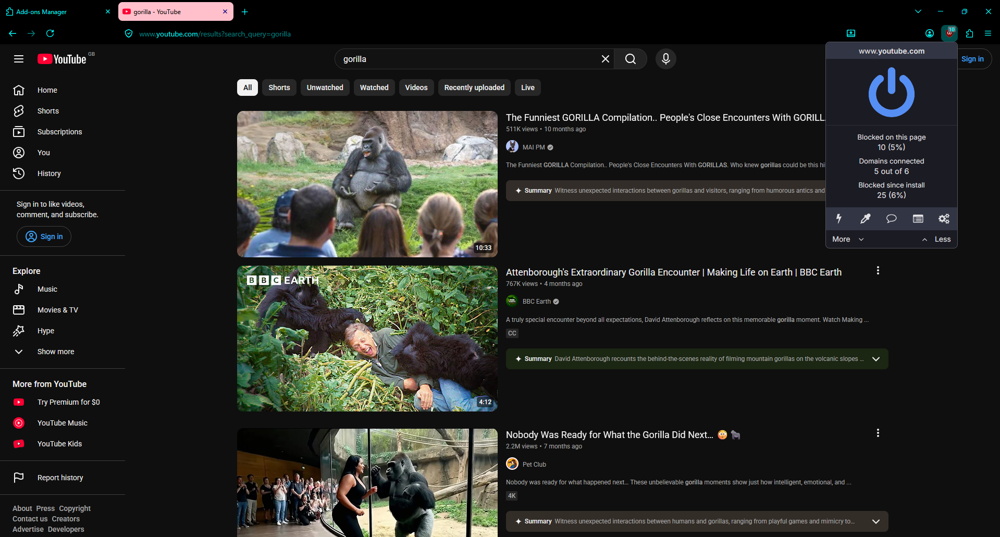

# 🦍 Gorilla Firefox

<!-- WHO-THIS-IS-FOR: managed block, do not edit by hand -->

**Firefox with the telemetry stripped out and hardware video decoding forced on, for laptops the web has given up on.**

Tracks current Firefox. Latest build: **157.0 for Windows** ([release notes, plain-language guide and developer guide](releases/157.0/)); **155.0.1** for Linux.

Built for the people every other tool prices out: kids with no credit
card, 15-year-old laptops, data sold by the megabyte. Free forever, by
design, not as a trial.
Why, with the numbers: [PHILOSOPHY.md](https://github.com/gorillanobakaa-dot/Gorilla.Opencode/blob/main/PHILOSOPHY.md)

<!-- /WHO-THIS-IS-FOR -->

**A faster, quieter Firefox for old and cheap laptops.**
No telemetry. No AI chatbots. No "experiments". No sponsored tiles. It wakes up
the hardware your old machine already has, and it runs fine on 2 GB of RAM.
Linux (.deb) and Windows (installer).

---

## 🛡 uBlock Origin is already inside. You cannot add anything else.

Two things are true at once, and both matter:

**1. uBlock Origin ships built in.** Nothing to install, nothing to configure.
It is on the toolbar from first launch and already blocking.



**2. You still cannot install add-ons.** No password manager, no themes,
nothing from the add-ons site. The extension-installing code is removed from
the browser and there is no setting to turn it back on. The reasoning:

> *A browser you can't extend is a browser strangers can't quietly extend
> either.*

uBlock Origin is here because it was **built in**, not installed — the same way
Mullvad Browser ships it and Tor Browser ships NoScript. That is also why
nothing can remove it behind your back.

**Right now the browser does not tell you** when it refuses an install.
Clicking **Add to Firefox** on the add-ons site makes the button go pale and
then nothing happens, with no message. That is the block working, silently.

If you need an extension other than uBlock Origin, this is the wrong browser —
and that is a fair conclusion to reach.

- **[Using uBlock Origin here](windows/USING-UBLOCK-ORIGIN.md)** — where it is, what you can change
- **[Why add-ons are blocked](THE-SEALED-APPLIANCE.md)** — the reasoning and the cost
- **[How to bundle an extension yourself](docs/HOWTO-BUNDLE-AN-EXTENSION.md)** — Linux + Windows, for developers and LLMs
- **[WhatsApp calls on Windows](windows/WHATSAPP-CALLS-ON-WINDOWS.md)** — broken before v155.0.1-win64.4; what was wrong and how it was found

---

# 👉 START HERE — which one are you?

|  | 🐧 Linux — just give me the browser | 🪟 Windows — just give me the browser | 🔧 I want to build it myself |
|---|---|---|---|
| **You get** | A ready-to-install file. ~5 minutes. | A ready-to-install file. ~2 minutes. | A version compiled for *your exact* CPU. |
| **You need** | Debian / Ubuntu / Mint, 64-bit | Windows 10 or 11, 64-bit | ~25 GB free disk + a few hours |
| **Go to** | **[Part 1](#part-1--just-give-me-the-browser)** ⬇ | **[windows/README.md](windows/README.md)** ⬇ | **[Part 2](#part-2--build-it-yourself)** ⬇ |

> 📖 **Want the whole rationale?** The changes, grouped by topic, in plain
> language *and* in technical detail, with the honest cost of each (its
> patch counts describe an earlier set, not the 157 one below): **[WHAT-WE-CHANGED-AND-WHY.md](WHAT-WE-CHANGED-AND-WHY.md)**

> 🪟 **Windows users:** Windows will block the download and then block the
> install, and hides the "carry on" button both times. Nothing is wrong with
> the file. **[Here is exactly what to click.](windows/WINDOWS-WILL-TRY-TO-STOP-YOU.md)**

---

## Part 1 — "Just give me the browser"

### ⚠ First, the trap that catches everybody

Near the top of this page there is a **big green `< > Code` button**.

> ## 🚫 DO NOT CLICK THE GREEN BUTTON
> It gives you the **recipe**, not the **cake**. It downloads a folder of
> instructions for programmers. It will not install a browser.

The actual browser lives somewhere else, in a section called **Releases**.

### Step 1 — Get the file

**Easiest way — click this direct link:**

### ➡ **[DOWNLOAD THE BROWSER (101 MB)](https://github.com/gorillanobakaa-dot/gorilla-firefox/releases/latest)**

That opens the **Releases** page. On it you'll see a small heading called
**`Assets`** (you may need to click the little ▸ triangle to open it).
Under Assets, click the file ending in **`.deb`**:

```
gorilla-unleashed_<version>_amd64.deb     ← click this one
```

Ignore the files called "Source code (zip)" and "Source code (tar.gz)" — those
are the recipe again, not the browser.

*(Prefer to find it yourself? Look down the right-hand side of this page for the
word **Releases**, and click it.)*

### Step 2 — Check it fits your computer

This file works on **Debian, Ubuntu, Linux Mint, Pop!\_OS, MX Linux** and similar,
on a **64-bit** computer. It does **not** work on macOS, Chromebooks,
Raspberry Pi, or Fedora/Arch.

**On Windows?** There is a separate installer — see
**[windows/README.md](windows/README.md)**.

Not sure? Open a terminal and paste this — if it answers `x86_64`, you're good:

```sh
uname -m
```

### Step 3 — Install it

**The clicking way:** open your **Downloads** folder, double-click the `.deb`
file. Your system's software installer opens — click **Install**, type your
password.

**The terminal way** (more reliable, and it tells you what went wrong):

```sh
cd ~/Downloads
sudo apt install ./gorilla-unleashed_*_amd64.deb
```

When it asks for your password, the screen shows **nothing** as you type — that's
normal, not a broken keyboard. Press Enter, and answer `Y` if it asks.

### Step 4 — Open it

Look in your applications menu for **Gorilla Unleashed** — the big gorilla
icon. That's it. You're done. 🎉

### If something goes wrong

| It said… | Do this |
|---|---|
| `unmet dependencies` / `dependency problems` | `sudo apt --fix-broken install` |
| `not a Debian format archive` | The download was cut short. Download it again. |
| Nothing happens when I double-click | Use the terminal way in Step 3. |
| `Illegal instruction` when it starts | Your CPU is older than the one it was built on → build your own in **Part 2**. |
| Videos won't play on some sites | Expected: this build prefers the codecs your old chip can decode in hardware. See `patches/01.MEDIA`. |

Still stuck? [Open an Issue](https://github.com/gorillanobakaa-dot/gorilla-firefox/issues)
— no question is too basic. That's what it's for.

---

## Part 2 — Build it yourself

The ready-made file above was compiled on **my** laptop (a 2012 Intel machine).
It runs elsewhere, but it's tailored to mine.

Build it yourself and it gets compiled for **your** processor — using every
instruction your CPU actually has, instead of the safe lowest-common-denominator
settings that any shared download is forced to assume. Same browser, fitted to
your machine.

**What it costs:** about **25 GB** of free disk and **1.5 to 12 hours** of
compiling, depending on your computer's speed. The laptop will be busy and warm.
Plug it in.

**How:** open a terminal and paste these three lines:

```sh
git clone https://github.com/gorillanobakaa-dot/gorilla-firefox.git
cd gorilla-firefox
./recreate.sh
```

The script **inspects your computer before it starts** and tells you the truth:
how much disk and memory you have, roughly how long it will take, and exactly
which build tools are missing — with the copy-paste commands to install them. If
your machine can't handle it, it says so plainly and sends you back to Part 1
rather than wasting four hours of your life.

> ⚠ **Build it on the machine you'll actually run it on.** A browser compiled for
> a new laptop may refuse to start on an older one (`Illegal instruction`).

---

## What's actually in here (for the curious)

Every change is a **patch** — a small, readable file showing exactly what was
changed — and beside each group sits a document explaining it **twice**: once in
plain English, once for developers. Nothing is hidden.

The groups are applied in this order. Counts are what the folder holds now
(patches · new files · byte-exact replacements · deletions).

| Folder | What it changes | Contents |
|---|---|---|
| `patches/01.MEDIA` | Video & audio for the Linux stack — VA-API hardware decoding, PulseAudio tuning. **Not applied to the 157 Windows build** (Linux-only); still cut against 154 | 20 · 0 · 0 · 0 |
| `patches/02.GPU` | The graphics blocklist: old Intel/AMD/NVIDIA chips are no longer refused GPU features (`GfxInfoBase.cpp`, `GfxDriverInfo.cpp`, `gfxPlatform.cpp`) | 3 · 0 · 0 · 0 |
| `patches/03.NETWORKING` | Network tuning in C++: DNS resolver pool and negative cache, HTTP/3 socket buffer sizes, upload chunk size | 3 · 0 · 0 · 0 |
| `patches/04.PERFORMANCE` | Cycle-collector/GC scheduling tightened for low-core machines, telemetry compiled out of the JS stencil code, a `Maybe` build-compatibility fix | 4 · 0 · 0 · 0 |
| `patches/05.PREFS` | The settings baked into the browser (`firefox.js`, `all.js`, `StaticPrefList.yaml`, locale default) | 4 · 0 · 0 · 0 |
| `patches/06.QUOTA` | Storage quota | 1 · 0 · 0 · 0 |
| `patches/07.TOOLKIT` | Removes AI, suggestion and remote features: context-menu AI, Quick Suggest and search suggestions, Merino, Nimbus experiments, translations, add-on and theme install paths, the search config dump | 13 · 0 · 0 · 0 |
| `patches/08.Look` | The black theme, the gorilla branding (`browser/branding/gorilla`, installer artwork) and the reworded English strings | 232 · 82 · 1 · 0 |
| `patches/09.REMOTE` | Locks out remote control / automation (Marionette, Remote Agent) | 2 · 0 · 0 · 0 |
| `patches/10.OVERRIDES` | `user.js` for the profile only; nothing in the source tree | 0 · 1 · 0 · 0 |
| `patches/11.FONT.SYSTEM` | Font list handling (DirectWrite, fontconfig, FreeType, platform font list) | 4 · 0 · 0 · 0 |
| `patches/12.MOZAMBIQUE.DRILL` | Normandy recipe runner and Nimbus Remote Settings loader neutralised, plus `distribution/policies.json` | 2 · 1 · 0 · 0 |
| `patches/13.TELEMETRY.KILL` | Glean telemetry switched off in `glean-core`, FOG and memory telemetry | 22 · 0 · 0 · 0 |
| `patches/14.EGRESS.LOCKDOWN` | Documents only (the forensic audit and hardening plan); no source changes | 0 · 0 · 0 · 0 |
| `patches/16.SNAPSHOT.DELTA.2026-08-12` | Every file the August 2026 build changed that groups 01–14 do not name: browser chrome JS/CSS, urlbar, tabs, sidebar, settings, ASRouter, theme tokens | 84 · 0 · 0 · 0 |
| `patches/20.SNAPSHOT.DELTA.155.0.1` | Everything else the 155.0.1 build changed: bundled uBlock Origin (656 files), the AI Window stub, built-in extension registration, the AI excision (432 deleted files: vendored `llama.cpp`/ggml, `aiwindow`, `genai`, urlbar ML, Firefox View chats), the Windows installer's 7-Zip stub (`7zSD.Win32.sfx`) replaced | 8 · 659 · 1 · 432 |
| `patches/21.PORT.FIXES.157` | Repairs needed to carry the set onto Firefox 157: IPDL preprocessing, a misplaced hunk, a broken override, the Windows sandbox level, the About-window branding | 10 · 0 · 2 · 0 |
| `patches/22.EGRESS.LOCKDOWN.157` | Every network caller, identifier and helper executable cut at the source for 157 (telemetry, Remote Settings, Normandy, Merino, GMP on demand, Safe Browsing lists, captive portal, push, geolocation, AMO, new-tab feeds, MITM priming, search partner codes, translations, extra themes, offline OneCRL, the never-calls-home pref block) | 64 · 0 · 0 · 0 |

Each patch in 21 and 22 starts with a comment giving its reason, and each of
those folders has a `README.md` listing them. For the older groups, open the
folder and read the file whose name starts with **`MASTER_PROJECT_LOG`** — the
story of that part, written when it was first made (for Firefox 154).

### Which Firefox `patches/` is for

`patches/` is cut against **Firefox 157.0** (tag `FIREFOX_157_0_RELEASE`,
commit `fdd757a2e09c9471cddf383e64e631e4ce178499`) and is exactly what the
Windows 157.0 build was made from. Every patch applies there with
`patch -p1 --forward --fuzz=0`; no fuzz is needed.

It was checked by replaying it: start from pristine 157.0, apply groups 02–22
in the order above (patches, then `NEW_FILES/`, then `REPLACE_FILES/`, then
`DELETED_FILES.manifest.txt`), and the resulting git tree is
`e33d7eb7e60f954e8007cc17fbe606b571f104ca`, the same tree hash as the source
that was compiled. See `patches/BASELINE.txt`.

Two things have not caught up yet: `patches/apply.sh` copies `NEW_FILES/` but
does not yet write `REPLACE_FILES/` or remove the files in
`DELETED_FILES.manifest.txt`, and `recreate.sh` (the Linux builder) still
expects the 154 nightly baseline for `patches/`. For a Linux build, use the 155
set:

| Folder | Baseline | Builds |
|---|---|---|
| `patches/` | Firefox 157.0 release, pinned commit | the 157 Windows build |
| `patchset-155.0b4/` | Firefox 155.0b4, pinned by SHA256 | `155.0-3` and later (Linux) |

They are cut against different upstream sources and must never be applied to
the same tree.

```bash
GORILLA_PATCHSET="$PWD/patchset-155.0b4" ./recreate.sh ~/firefox-src
```

The 155 set was checked by rebuilding from it: a pristine 155.0b4 tarball plus
that set plus the two fetch steps comes out **byte-identical** to the tree that
compiled the shipped `.deb`. See `patchset-155.0b4/BASELINE.txt`.

### The release gate

Some fixes in this browser are invisible when they are missing. It looks
completely normal without them, right up until a WhatsApp call fails. That is
exactly how they get dropped during an upgrade to a new Firefox version, and
it has already happened once.

`scripts/release_gate.py` checks the finished browser for them and is wired
into `scripts/build_deb.sh`, so a package that has lost one **cannot be built
by accident**. It needs nothing outside this repository, so a clone and a
future port inherit it.

```bash
scripts/release_gate.py --deb gorilla-unleashed_155.0-3_amd64.deb
scripts/release_gate.py --dist <objdir>/dist/bin --src <source tree>
```

| gate | refuses to ship when |
|---|---|
| `PREF-001` | a proven pref is missing or wrong **in the package** |
| `PREF-002` | the package and the source disagree, so the build is stale |
| `CODE-001` | an explicitly requested audio sample rate is not honoured |
| `STALE-001` | `libxul.so` is older than the source it claims to contain |
| `EXT-001` | uBlock Origin is missing, unregistered, or registered where it cannot be seen |
| `EXT-002` | the bundled uBlock version drifts from the one this repo pins |
| `FONT-001` | a required font is missing |

Every entry is a real failure that cost real time, and the gate prints what it
cost when it fires. Override with `GORILLA_SKIP_RELEASE_GATE=1`, never
silently.

`recreate.sh` = the builder · `patches/`, `patchset-155.0b4/` = the changes ·
`scripts/` = helpers · `mozconfig` = build settings

**A note on fonts:** the build can bundle Microsoft fonts (Segoe UI, Yu Gothic,
Consolas) using the established `ttf-ms-win-auto` method — fetched from
Microsoft's own Windows evaluation edition, the same approach mainstream Linux
distributions use. See `scripts/fonts-microsoft.sh`.

---

## Why this exists

Open source gave the world the recipe but forgot to teach people how to cook.
Publishing code isn't real access if only engineers can read it.

This browser is for the person who saved for a year to buy a laptop somebody in a
richer country threw away. Every background service, every "helpful" feature
quietly phoning home, is memory and mobile data taken from that person. So it's
stripped out — and **everything done to it is written down in plain language**, so
the owner of the laptop can read it, understand it, and decide for themselves.

---

*Not affiliated with Mozilla. "Firefox" is a trademark of the Mozilla Foundation;
this is an unofficial modified build. Free and open source.*
