<!-- generated by fieldkit build-harness hidden-pages-doc from the maintainer's source; edit the source -->

# 🦍 The hidden `about:` pages: every page `about:about` does not show you

**Mapped on 8 October 2026, on the Gorilla 157.0 candidate (build 28) for Windows and in its source code. Every
page was opened in a fresh, throwaway copy of the browser with its network cut off, so that any attempt to reach
the internet was recorded and none could get out. The changes described here are in the source; the build that
carries them is being built and checked now. Until it is, every line marked "to be confirmed" says so, and this
page will name the build once it has been checked.**

This page is written twice: once in plain language, once with the details. Each page below has both.

### In plain words

Type `about:about` in the address bar and Gorilla shows a list of its own built-in pages. We went through that
list in [the companion page](ABOUT-PAGES.md). Then the maintainer typed an address that was **not** on the list,
`about:fingerprintingprotection`, and a page opened. The question that followed started this work: *why does a
page exist that the list of pages does not show?*

Think of the directory board in the lobby of an office building. It lists the companies on each floor. It does
not list the boiler room, the lift machinery, the cleaners' cupboard or the fire exits. Those rooms are real,
they have doors, and some of them hold the most important equipment in the building. Firefox works the same
way: each built-in page can carry a mark that tells `about:about` to leave it off the board. The page still
exists, and typing its address still opens it. Where the comparison stops: a building's service rooms are
usually locked, and these pages were not. Anyone who knew the address could open them.

So we mapped every one. The Firefox source code names **84** built-in pages. The Gorilla build we started from
registered **70** of them: **40** on the board and **30** hidden. We opened each hidden page, took its picture,
and read the code behind it: who it serves, what it does, and whether it can talk to anyone.

**What we found.** Most hidden pages are plumbing the browser needs: the page you see when a site cannot be
reached, the page that brings back your tabs after a crash, the blank page every new tab starts as. Others were
there for Mozilla, not for you:

- a measuring page for a Mozilla study that fingerprints your computer (`about:fingerprintingprotection`);
- the control desk and the preview screen of Mozilla's in-browser promotions and messages
  (`about:asrouter`, `about:messagepreview`);
- a redirect to Mozilla's referral programme carrying a code that identifies your profile (`about:referrals`);
- four addresses that crash the browser, a tab, the graphics or every add-on the moment you type them;
- pages for features Gorilla does not have, and second names for pages that already have one.

**What we did.** **16** hidden pages are gone from the browser, and where something fed them, that was cut too.
**14** stay, each for a reason written down. The reason for each page, kept or removed, is below.

**What it costs you:** you can no longer crash a tab on purpose to test the crash screen; and if a page does not
load, Gorilla no longer guesses a `www.` name for you. Nothing else you would use is lost. Each page says what
it costs.

**Why it matters.** A browser is the program you trust with everything you read and type. The company that
makes it is the party best placed to reach into it: through updates, studies, messages, measurements. Gorilla
is built on one rule: every channel that can carry code in or data out is a door, and every door is either
justified or closed. Hidden pages are doors nobody checks, because almost nobody knows they are there. Now you
know where they are, and what was behind each one.

### The details: how the pages were found and checked

- **Four ways a page gets in.** A built-in page can be registered (1) in the C++ redirect tables
  (`docshell/base/nsAboutRedirector.cpp`, `browser/components/about/AboutRedirector.cpp`), (2) in the page lists
  of the matching `components.conf` files, (3) as a component contract `@mozilla.org/network/protocol/about;1?what=<name>`
  anywhere in the tree, and (4) by script at run time (DevTools, the new tab page). `about:about` lists only
  pages registered without the `nsIAboutModule::HIDE_FROM_ABOUTABOUT` flag.
- **The map.** `fieldkit build-harness about-registry` reads all four routes in the Gorilla tree and in pristine
  upstream, adds what a built browser actually registered (read inside the running browser), and prints one
  table with the verdict for each page.
- **The pictures and readings.** `fieldkit build-harness about-pages` opens every registered page in a
  throwaway copy of the browser with a fresh profile and a dead proxy (`127.0.0.1:9`), records its text, the
  pictures it draws, script errors and every request it tries; with `shots=` it saves a picture of each page
  drawn by the browser itself. Error pages are empty when opened by their address, so the probe `error-pages`
  produces each one by its real cause on this machine: a refused connection, a port the browser refuses, a
  self-signed certificate, an `about:` address nothing registers, and a plain-HTTP site under HTTPS-Only (on a
  made-up name resolved locally: HTTPS-Only never upgrades an address that points back at this computer).
- **The source reading.** Each hidden page was traced in the code: its registration and flags, what opens it,
  what it can contact, and what depends on it. The notes are kept with the maintainer's harness.
- **The register.** Every one of the 84 names has a verdict, keep or remove, with its reason, in the
  maintainer's register (decision D-157-40). It is enforced twice: **before** every build (a page the source
  can register that the register does not know, or a removed page that came back, stops the build) and
  **after** it (the pages the built browser registers must match the register). When Firefox adds a new hidden
  page, the build stops until someone reviews it, and this document fails its own check until the page is
  explained here.

## The pages at a glance

| Page | What it is | Talks to | What we did |
|---|---|---|---|
| [`about:fingerprintingprotection`](#about-fingerprintingprotection) | The hidden page that measured your computer | none from the page; it fed Mozilla's user-characteristics ping | Removed (D-157-40) |
| [`about:asrouter`](#about-asrouter) | Mozilla's in-browser messaging control desk | on click (Mozilla's Remote Settings and documentation; message images from Mozilla's CDN) | Removed (D-157-40) |
| [`about:messagepreview`](#about-messagepreview) | The preview stage for Mozilla's messages | conditional (message images from Mozilla's CDN; message buttons run privileged actions) | Removed (D-157-40) |
| [`about:referrals`](#about-referrals) | The forwarding address for Firefox referrals | conditional (www.firefox.com/invite with a per-profile referral code) | Removed (D-157-40) |
| [`about:blocked`](#about-blocked) | The red 'dangerous site' warning | on click (Google and Mozilla report links carrying the blocked address) | Removed (D-157-40) |
| [`about:restricted`](#about-restricted) | The parental controls 'restricted content' page | none | Removed (D-157-40) |
| [`about:crashparent`](#about-crashparent) | The address that crashed the whole browser | none | Removed (D-157-40) |
| [`about:crashcontent`](#about-crashcontent) | The address that crashed a tab | none | Removed (D-157-40) |
| [`about:crashgpu`](#about-crashgpu) | The address that crashed the graphics process | none | Removed (D-157-40) |
| [`about:crashextensions`](#about-crashextensions) | The address that stopped every add-on | none | Removed (D-157-40) |
| [`about:profilemanager`](#about-profilemanager) | The new profile switcher's main panel | none in Gorilla (blank page) | Removed (D-157-40) |
| [`about:newprofile`](#about-newprofile) | The first page of a new profile | none in Gorilla; in Firefox a tour loaded Mozilla CDN images and themes came from addons.mozilla.org | Removed (D-157-40) |
| [`about:editprofile`](#about-editprofile) | The page for editing a profile | none in Gorilla; in Firefox the theme picker used addons.mozilla.org | Removed (D-157-40) |
| [`about:deleteprofile`](#about-deleteprofile) | The page for deleting a profile | none | Removed (D-157-40) |
| [`about:settings`](#about-settings) | A second name for Settings | as about:preferences | Removed (D-157-40) |
| [`about:performance`](#about-performance) | An old second name for the process manager | none | Removed (D-157-40) |
| [`about:neterror`](#about-neterror) | The 'problem loading page' screen | on click (Learn more to Mozilla's support site) | Kept, changed (D-157-40) |
| [`about:certerror`](#about-certerror) | The 'this site may be an impostor' warning | on click (support links) | Kept |
| [`about:httpsonlyerror`](#about-httpsonlyerror) | The 'no secure version available' page | on click (Continue to the plain-HTTP site; support links) | Kept |
| [`about:tabcrashed`](#about-tabcrashed) | The 'your tab crashed' page | none | Kept |
| [`about:framecrashed`](#about-framecrashed) | The icon for a crashed frame | none | Kept |
| [`about:sessionrestore`](#about-sessionrestore) | The page that offers your tabs back | on click (restored tabs load) | Kept |
| [`about:welcomeback`](#about-welcomeback) | Your old tabs back after a Refresh | on click (support link; restored tabs load) | Kept |
| [`about:restartrequired`](#about-restartrequired) | The page that asks for a restart | none | Kept |
| [`about:reader`](#about-reader) | Reader View, the clean reading page | automatic (the images and media the article names, from any host; a re-fetch of the article with its cookies when it is not cached) | Kept |
| [`about:opentabs`](#about-opentabs) | Split View's 'choose a tab' pane | none | Kept |
| [`about:devtools-toolbox`](#about-devtools-toolbox) | The frame that holds the developer tools | when used (the inspected site and its source maps) | Kept |
| [`about:cache-entry`](#about-cache-entry) | The detail view of one cached item | on click (the cached address) | Kept |
| [`about:blank`](#about-blank) | The empty page every tab starts as | none | Kept |
| [`about:srcdoc`](#about-srcdoc) | The label for frames without an address | none | Kept |

## Removed

### `about:fingerprintingprotection`: The hidden page that measured your computer

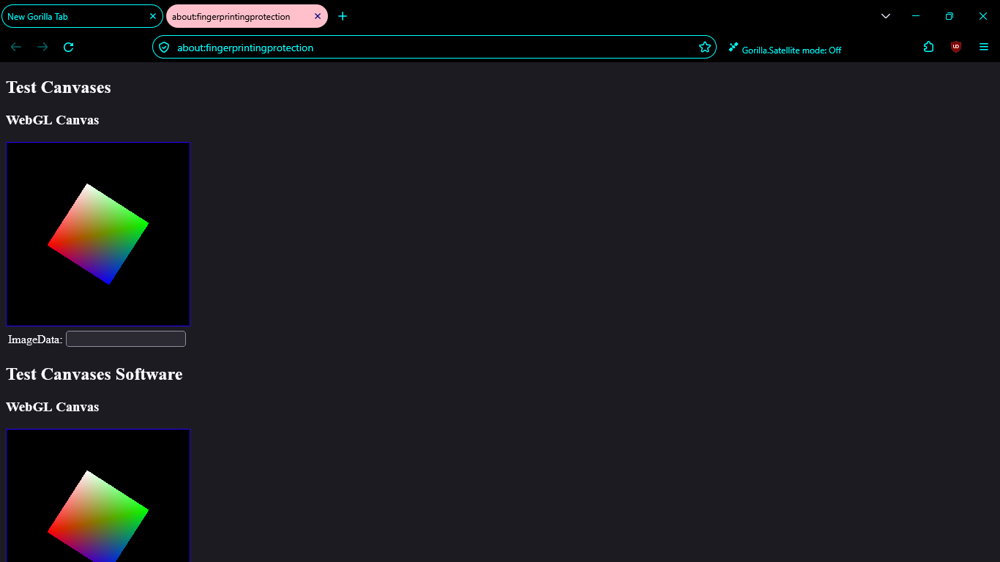

**Removed (D-157-40).** **Talks to:** none from the page; it fed Mozilla's user-characteristics ping

#### In plain words

**What it is.** about:fingerprintingprotection was a measuring page. It worked like the measuring room of a clinic that runs a research study: a nurse records your height, reach, eyesight and hearing, not to treat you, but so that researchers can learn how much people differ from one another. This page did the same to your computer, for a study Mozilla calls "user-characteristics". It measured how this copy of the browser draws pictures, which fonts and voices it has, what its screen, processor and keyboard are, and much more, so that Mozilla's researchers could tune Firefox's protection against fingerprinting. Where the comparison stops: you walk into a clinic's measuring room knowingly, and you see the nurse. This page was opened by the browser itself, in a browser window that is never drawn on the screen, and nothing told you it had run.

Fingerprinting means recognising a browser by describing it, with no cookie needed: its screen, its fonts, the exact way it draws a shape, its time zone. To learn how to protect people from being recognised this way, Mozilla's study collected those same details from its own users.

**When you would meet it.** Never, unless you typed its address. You would not have found it by looking: about:about, the browser's own list of its built-in pages, did not show it. That is how this page started the whole audit. The maintainer came across it while customising Gorilla's pages and asked why about:about did not list it.

The answer is a flag in the source code called `HIDE_FROM_ABOUTABOUT`. Think of the directory board in the lobby of an office building: it lists the offices and leaves out the boiler room, the cleaning cupboard and the post room. The flag puts a page among the service rooms. Where the comparison stops: in a real building the service rooms are usually locked, and a hidden page is not locked at all. Anyone who types its exact address walks straight in. The flag takes the name off the board and does nothing else.

That question led us to every page the source can register. The source names 84 about: pages; the build registered 70; about:about listed 40 and hid 30. We opened and pictured every hidden page and read each one in the source, and 16 pages were removed. This document is the result.

The browser opened this page out of sight. During start-up, once three things had happened (the start-up work was finished, the graphics system was ready and the list of fonts was ready), the browser checked whether a measurement was due. If it was, it loaded this page in an invisible browser and measured. A measurement was due once per "wave" of the study: each time Mozilla raised the study's version number above the last one this copy had sent. A person could also force one collection by hand, with a setting named `toolkit.telemetry.user_characteristics_ping.send-once`.

**What you see.** The picture was taken on the Gorilla build that still had the page, opened by typing its address. At the top is the heading "Test Canvases", then "WebGL Canvas" and a black square holding a tilted square whose corners shade from white to red, green and blue. Under it is an empty box labelled "ImageData:". Then comes "Test Canvases Software" and the same drawing again. Further down, out of the picture, the page draws about 30 mathematical formulas. There are no buttons and nothing to choose.

The drawings are not decoration. The same shape is drawn once with the graphics card and once without it, because the tiny differences in how two computers draw the same picture are part of a fingerprint. A fingerprint works like describing a stranger by height, accent, coat and walk: no single detail names them, but together the details often pick one person out of a crowd. Where the comparison stops: a person can change coat in a minute, while a computer cannot change its graphics card or its fonts on a whim, so the description stays useful for a long time.

Opened by hand, the page worked out all its measurements and gave them to nobody, because the part of the browser that receives them only exists while a real collection is running.

A collection measured, as listed in the source:

- Graphics: drawings made with and without the graphics card (WebGL versions 1 and 2), flat drawings and drawn text, the newer WebGPU graphics system, and the exact sizes of drawn shapes, emoji and text.
- Sound and speech: the voices the computer can speak with, which audio and video formats it can play, an "audio fingerprint" (how the computer processes a test sound), the properties of its audio devices, and the audio and video devices attached.
- Screen and input: screen and window details, zoom, pointer and touch abilities, game controllers, motion sensors.
- Text: installed and missing fonts, font settings, how text is smoothed and drawn, how mathematical formulas are laid out, the system colours and the display preferences that pages can ask about.
- The machine: how many processors it reports, the processor model, the keyboard layout, the languages, the time zone, how much storage the browser may use, security-key (WebAuthn) abilities, the browser's identification string, the exact results of some mathematical calculations, which media features are switched off, and a selection of other settings.
- Network: the page asked the browser's video-call system (WebRTC) to list this computer's own network connection points, and the list of formats it supports for calls. No outside server was involved, so only local addresses were gathered.

Not all the measuring happened inside the invisible page. While a collection ran, the browser registered two helpers that were allowed into ordinary web tabs, and it took the window and screen details and the flat drawings inside the tabs you had open.

**Does it talk to anyone?** The page itself contacts no one. Its security rules let it load only the browser's own files, and its network test used no outside server. Its job was to fill in a report, the "user-characteristics" ping, which the browser would send to Mozilla. The report left out the identifier that ordinary telemetry uses, but it carried one of its own: a random code stored in your profile (the folder where the browser keeps your settings). It was meant to travel through OHTTP, a relay designed to hide which computer sent it. Picture a letter sent through a forwarding service that removes the return address. Where the comparison stops: the relay hides where the letter came from, not what it says, and here the letter is a detailed description of the computer, signed with the same made-up name every time, so letters from one computer can still be matched to each other.

In Gorilla the report could not leave, even before our change, for two separate reasons.

1. The wave never came. The version number that starts a wave begins at 0, and only Nimbus, Mozilla's system for running experiments on users from a distance, ever raises it. Gorilla enrols no one in Nimbus: its experiment checks all answer no, and its experiment loader is locked off.
2. The post box is bricked up. If a person forced a collection with the send-once setting, the full measurement would have run on their computer, but the finished report goes to Glean, Mozilla's data-collection library. Gorilla never starts Glean, and its upload switch is locked off. Nothing would have left the machine.

**What we did, and why.** Removed, and the collection that used it can no longer start. The browser no longer registers the page, so the address no longer opens anything. There was a second way in: Firefox lets you open a page's own file directly by its internal address, one that starts with chrome://. The page's files are no longer packed into the browser, so that way is closed too. The start-up check that launched a collection is cut out of the source. The study's opt-out setting is locked on, and the send-once setting is locked off. The rest of the measuring code is still in the source, but nothing in a normal run of the browser can reach it.

Why remove something that could not send anything? Because a door that is closed only by a setting is still a door. A setting is a latch, not a wall: whoever can change settings can open it, whether that is you, an add-on, a company policy, a future update, or a remote-configuration system such as Nimbus, which existed to raise exactly this number. We design against the company that ships a browser and anyone who can lean on that company, and we close every channel that can carry data out unless it earns its place. This one served Mozilla's researchers, not the person at the keyboard. A hidden page is a door nobody checks.

Two more reasons. First, the browser gave this address special treatment by name: a page loaded at it could play sound without a click, receive motion-sensor readings while in the background, and use drawing features that ordinary web pages are refused. A name that carries privileges is worth keeping only if something you need uses it. Second, removing the page alone would have left a trap: had anyone forced a collection afterwards, the invisible browser would have waited for ever for a page that no longer exists. So the start of the collection is cut as well.

**What it costs you.** Nothing you would notice. You lose the chance to give your computer's measurements to Mozilla's fingerprinting research, which in Gorilla could never be sent anyway.

**The lesson.** Protection research and tracking can use the same measurements. To learn how browsers can be recognised, this study measured the very details a tracker would use. That does not make it sinister, but it does make it a channel. The useful question about any browser is not "does it collect?" but "what decides whether it sends, and who can change that?" Here the answer was a handful of settings and a number that only a remote system could raise. Hidden from the list did not mean locked; it meant unchecked.

#### For developers

Line numbers are those of the source before the D-157-40 change.

**Registration**

- `docshell/base/nsAboutRedirector.cpp:124-129`, listed in `docshell/build/components.conf:16`. The page is `usercharacteristics.html` with its script `usercharacteristics.js` (resistfingerprinting `jar.mn:7-12`).
- Flags (upstream): `URI_SAFE_FOR_UNTRUSTED_CONTENT | HIDE_FROM_ABOUTABOUT | ALLOW_SCRIPT | URI_MUST_LOAD_IN_CHILD | URI_CAN_LOAD_IN_PRIVILEGEDABOUT_PROCESS`. It loads in the privileged about content process; the collection's `UserCharacteristics` window actor is registered for remote type `privilegedabout` only.
- `HIDE_FROM_ABOUTABOUT` only drops the entry from about:about's list. It does not restrict loading: typing the address opened the page (see the picture).

**What opened it**

1. `toolkit/components/resistfingerprinting/nsRFPService.cpp:466-479`: fires once three observer topics have been seen (idle start-up tasks done, compositor created, font list initialised).
2. `nsUserCharacteristics::MaybeSubmitPing` (`nsUserCharacteristics.cpp:1455-1464`), gated by `ShouldSubmit`.
3. `PopulateDataAndEventuallySubmit` (lines 1467-1536), then `ContentPageStuff` (lines 159-197).
4. `createContentPage` in `UserCharacteristicsPageService.sys.mjs:80-146` loads the page in a hidden browser (`HiddenBrowserManager.withHiddenBrowser`) and awaits the page's data event.

**The gate (`ShouldSubmit`, `nsUserCharacteristics.cpp:1379-1452`)**

- `toolkit.telemetry.user_characteristics_ping.opt-out` wins over everything (line 1390).
- Resist Fingerprinting on, or any fingerprinting-protection overrides set, blocks it (lines 1394-1416).
- `toolkit.telemetry.user_characteristics_ping.send-once` forces it (line 1418). Upstream it is not locked (`modules/libpref/init/all.js:597`).
- Otherwise `current_version` must exceed `last_version_sent`. `current_version` defaults to 0 (`all.js:589`); only the Nimbus feature `userCharacteristics` raises it (`FeatureManifest.yaml:4226-4236`). One "wave" is one raise.

**What it measured**

- Page script (`usercharacteristics.js:1641-1661`): WebGL renders (hardware and forced-software); speech voices, media codec capabilities, an audio fingerprint, audio device properties; pointer and touch; WebRTC ICE host-candidate foundations and the SDP codec list; WebAuthn capabilities, storage quota, motion sensors; MathML layout, CSS media queries, system colours, system fonts; element rectangles and SVG/emoji text sizes; navigator properties and time zone.
- Service (`UserCharacteristicsPageService.sys.mjs:160-180`): locale and zoom, disabled media prefs, Math function results; gamepads, client and CPU information; screen, pointer and window information; WebGL parameters (versions 1 and 2, hardware and software); 2D canvas and font renders, WebGPU, user agent.
- C++ (`nsUserCharacteristics.cpp:1488-1513`): media devices, time zone; fingerprinted and missing fonts, font prefs, anti-aliasing, smoothing and rendering settings, math font; CSS and system preferences, screen, selected prefs; keyboard layout, languages; processor count, CPU model, miscellaneous.
- The page offers no actions: two canvases and about 30 MathML formulas.

**Network**

- Page CSP: resource: and chrome: only (`usercharacteristics.html:9-12`).
- WebRTC: `media.peerconnection.default_iceservers` is `"[]"` (`all.js:305`): no STUN or TURN, host candidates only.
- Ping `user-characteristics` (`toolkit/components/resistfingerprinting/pings.yaml:8-16`): no telemetry client ID, but its own UUID pref (`nsUserCharacteristics.cpp:1341-1354`); uploaded through OHTTP. Submitted at lines 1539-1543.
- Why nothing could leave Gorilla even before D-157-40: `FOG::InitializeFOG` returns before doing anything (`toolkit/components/glean/xpcom/FOG.cpp:155-158`); `datareporting.healthreport.uploadEnabled` is false and locked (`browser/app/profile/firefox.js:3925`); Nimbus studies, rollouts and Labs all return false (`toolkit/components/nimbus/ExperimentAPI.sys.mjs:469-479`) and the Remote Settings experiment loader is locked off (`firefox.js:4067`). With `send-once` set by hand, the whole collection still ran locally and the submit call went into a Glean that was never started.

**Surprising**

- The address is privileged by name. `nsContentUtils.cpp:1241-1248` creates an about:fingerprintingprotection principal; documents with it get autoplay without a click (`AutoplayPolicy.cpp:121-125`), motion-sensor events while in the background (`nsDeviceSensors.cpp:213-217`) and chrome-only WebIDL (`CanvasRenderingContext2D.webidl:39, 79`; `WebGLRenderingContext.webidl:55`; `WebGPU.webidl:131`; gate at `nsRFPService.cpp:2618-2632`).
- During a collection two window actors (`UserCharacteristicsWindowInfo`, `UserCharacteristicsCanvasRendering`) are registered with no address filter and `safeForUntrustedWebProcess: true` (`UserCharacteristicsPageService.sys.mjs:316-329, 687-697`). Window and screen information and the 2D canvas renders are taken inside the user's open web tabs.
- Opened by hand, the page computes everything and the result goes nowhere: the receiving actor is registered only during a collection (`UserCharacteristicsPageService.sys.mjs:84-98`).
- Removing only the about: entry would leave a hang: with `send-once` set, the hidden browser waits for ever for data from a page that cannot load (`UserCharacteristicsPageService.sys.mjs:100-131`).

**What Gorilla changed (D-157-40)**

- The entry is gone from `docshell/base/nsAboutRedirector.cpp` and `docshell/build/components.conf`; the address no longer opens anything.
- `toolkit/components/resistfingerprinting/jar.mn`: the six usercharacteristics files (`usercharacteristics.html`, `usercharacteristics.js`, `usercharacteristics.css`, `usercharacteristics.woff`, `gl-matrix.js`, `ssdeep.js`) are not packaged. In Firefox a page file's chrome:// address opens directly from the address bar, a second way into a page whose about: entry is gone; for this page that way is closed too.
- `toolkit/components/resistfingerprinting/nsRFPService.cpp`: the start-up hook no longer calls `nsUserCharacteristics::MaybeSubmitPing()` (marker comment `GORILLA D-157-40 (2026-10-08): no user-characteristics collection.`).
- `modules/libpref/init/all.js`: `toolkit.telemetry.user_characteristics_ping.opt-out` is true and locked; `toolkit.telemetry.user_characteristics_ping.send-once` is false and locked.
- Left in the source, unreachable: `nsUserCharacteristics.cpp`, `UserCharacteristicsPageService.sys.mjs`, the actors, the metrics, the ping definition and the Nimbus feature entry. No normal start-up path reaches them. The one remaining caller is the test observer topic `user-characteristics-testing-please-populate-data`, which `nsRFPService.cpp` honours only when `xpc::IsInAutomation()` is true.

---

### `about:asrouter`: Mozilla's in-browser messaging control desk

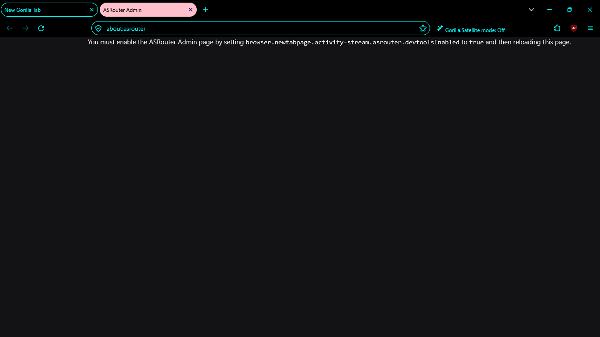

**Removed (D-157-40).** **Talks to:** on click (Mozilla's Remote Settings and documentation; message images from Mozilla's CDN)

#### In plain words

**What it is.** about:asrouter was the control desk of Mozilla's messaging system inside the browser. That system, called ASRouter, decides which messages the browser shows you: the "recommended feature" pop-ups, the large "spotlight" windows in the middle of the screen, information bars across the window, speech-bubble tours that point at a button, badges on toolbar buttons, system notifications, promotions in private windows, and the welcome pages for new users. The page worked like the control desk behind a department store's announcements and in-store posters: staff choose which announcement plays and which poster goes where, can play any announcement at once to test it, can see the rules that decide which customers hear what, and can reset the count of how often each customer has heard each one. Where the comparison stops: in a shop, the announcements belong to the shop you chose to walk into; here the shop floor is your own computer, the announcer is the company that made the browser, and the desk sat inside your copy of the browser.

**When you would meet it.** Never, unless you typed its address. The browser never opens it. The only link to it was on another page for developers, the admin page of the Discovery Stream feed on the new tab page.

**What you see.** The picture was taken on the Gorilla build that still had the page. The tab is titled "ASRouter Admin". The page shows a single line and nothing else: it tells you to set the preference `browser.newtabpage.activity-stream.asrouter.devtoolsEnabled` to true and reload the page. That preference was the page's switch, and it was off. With the switch on, the page became a full console. It could:

- list every message and every message source, and block or unblock any message;
- force any message onto the screen, including one whose text had been edited by hand;
- copy a message as a link to about:messagepreview (described next in this document);
- turn message sources on or off by rewriting their settings;
- test the targeting rules (the conditions that decide who sees a message) and show every fact those rules can read;
- reset or edit the record of how many times you have seen each message;
- force the browser's "install attribution", the note of where its download came from, by writing the file that holds it on Windows.

Turning the switch on also added a set of test messages.

**Does it talk to anyone?** The page fetched nothing by itself. It held links you could click: to firefox.settings.services.mozilla.com, Mozilla's Remote Settings service, which sends data to browsers, and to Mozilla's documentation for developers. Pressing "Show" on one of the built-in messages could load its pictures from firefox-settings-attachments.cdn.mozilla.net, Mozilla's file server; the spotlight window's security rules allow that address.

In Firefox, messages come from three places: Remote Settings (Mozilla's servers), Nimbus (Mozilla's experiment system) and a set of welcome messages built into the browser. In Gorilla only the built-in messages can exist. Remote Settings never contacts a server and carries no packaged copy of these message lists; the loader that would fetch messages from a plain web address is disabled; and Nimbus enrols no one. The messaging system itself still starts every time the browser starts. It is the console that is gone.

**What we did, and why.** Removed. The browser no longer registers the page, so the address no longer opens anything. Its files are no longer packed into the browser either, so its internal chrome:// address, a second way in, does not open it. Its switch is locked off, so it cannot be turned on from about:config. The same switch also brought the message preview page's helper to life and added the test messages, so those stay off too.

The console's commands are now refused whoever sends them. That matters because the console was never the only page that could send them. The part of the browser that carries them out never checked which page a command came from, so the welcome page (about:welcome), the new tab page (about:newtab), the home page (about:home) and the private-window page (about:privatebrowsing) could send the same commands: force or edit a message, unblock every message, switch message sources on and off, force the install attribution. Now each of those commands is refused unless the console's switch is on, and the switch is locked off.

The messaging system is a channel from Mozilla to your screen. It decides what to show you, when, and on the strength of what it knows about your browser. Gorilla already keeps Mozilla's servers out of it. The console served Mozilla's messaging and marketing staff and its developers, never the person using the browser, and with its switch on it could force messages, rewrite settings and write a file to your disk. We design against the company that ships the browser and anyone who can lean on it, so a control desk for a channel aimed at you has no place here.

**What it costs you.** Nothing you would notice. You lose a tool for testing Mozilla's messages, which only the people who write those messages use.

**The lesson.** The "did you know?" pop-ups in a browser are not random tips. They come from a rule engine with its own console, its own message sources and its own record of what you have already seen, and the rules choose who sees what from facts about the browser. Once you know that machinery exists, you can ask where its messages come from. We asked: in Gorilla, only the messages built into the browser are left.

#### For developers

Line numbers are those of the source before the D-157-40 change.

**Registration**

- `browser/components/about/AboutRedirector.cpp:51-55`, listed in `browser/components/about/components.conf:8`. The page is `browser/components/asrouter/content/asrouter-admin.html`, a React page built from `content-src/components/ASRouterAdmin/ASRouterAdmin.jsx`.
- Flags (upstream): `URI_SAFE_FOR_UNTRUSTED_CONTENT | URI_CAN_LOAD_IN_PRIVILEGEDABOUT_PROCESS | URI_MUST_LOAD_IN_CHILD | ALLOW_SCRIPT | HIDE_FROM_ABOUTABOUT`: privileged about content process, not listed in about:about.
- Nothing in the browser opens it. The only link is "Click here" in the new tab Discovery Stream admin page (`browser/extensions/newtab/content-src/components/DiscoveryStreamAdmin/DiscoveryStreamAdmin.jsx:1384`).

**Behaviour**

- Unless `browser.newtabpage.activity-stream.asrouter.devtoolsEnabled` is true the page renders only "You must enable…" (`ASRouterAdmin.jsx:1577-1588`). Default false (`ASRouterPreferences.sys.mjs:242-249`).
- With the pref on: list messages and providers, block and unblock; force-show any message, including edited JSON (`ASRouterParentProcessMessageHandler.sys.mjs:133-138`); copy a message as an about:messagepreview link (`ASRouterAdmin.jsx:582-593`); switch providers by rewriting their prefs (`ASRouterPreferences.sys.mjs:145-168`); evaluate targeting expressions and show all targeting parameters; reset or edit impression counts (`ASRouter.sys.mjs:2427`); force install attribution, which writes the Windows attribution file (`ASRouter.sys.mjs:2520-2542`).
- The pref also adds the PanelTestProvider test messages (`ASRouterPreferences.sys.mjs:76-83, 132-138`).
- ASRouter itself starts on every launch (`browser/components/BrowserGlue.sys.mjs:1238-1240`) and carries on without the page.

**Message sources and network**

- Upstream providers (`browser/app/profile/firefox.js:2039-2042`): `cfr` and `message-groups` (Remote Settings collections), `onboarding` (local), `messaging-experiments` (Nimbus).
- In this tree only the local messages can exist: the plain URL loader is stubbed (`ASRouter.sys.mjs:226-230`); Remote Settings has a dummy server URL and skips every remote action (`services/settings/Utils.sys.mjs:107-125`, sync guard `RemoteSettingsClient.sys.mjs:653-657`), loads only packaged dumps (`Utils.sys.mjs:146-156`) and has no dump for `cfr`, `message-groups` or `ms-language-packs` (`services/settings/dumps/main/moz.build`); Nimbus has no enrolments.
- The page fetches nothing automatically. The old preview endpoint is already dead upstream (`asrouter-utils.mjs:104-106`).
- On click: links to firefox.settings.services.mozilla.com (`ASRouterAdmin.jsx:956, 971`) and to the developer docs (`ASRouterAdmin.jsx:1650`). "Show" on a local message can load images from firefox-settings-attachments.cdn.mozilla.net (for example `OnboardingMessageProvider.sys.mjs:554`), which the spotlight CSP allows (`browser/base/content/spotlight.html:11`).

**Surprising**

- Upstream, the parent process does not check which page sends the admin messages: about:welcome, about:newtab, about:home and about:privatebrowsing can send them too (`DesktopActorRegistry.sys.mjs:804-810`; `ASRouterChild.sys.mjs:90-112`). Only editing impression state checks the devtools pref (`ASRouter.sys.mjs:2428`). Removing the page alone would not shrink this surface; Gorilla now refuses the commands themselves (below).
- Forcing attribution sets the test-only environment variable `XPCSHELL_TEST_PROFILE_DIR` inside a normal browser process (`ASRouter.sys.mjs:2535`).

**What Gorilla changed (D-157-40)**

- The entry is gone from `browser/components/about/AboutRedirector.cpp` and `browser/components/about/components.conf`; the address no longer opens anything.
- `browser/components/asrouter/jar.mn`: `asrouter-admin.html`, `asrouter-admin.bundle.js` and `ASRouterAdmin.css` (`jar.mn:9-11` before the change) are not packaged, so the page's chrome:// address does not open either.
- `browser/app/profile/firefox.js`: `browser.newtabpage.activity-stream.asrouter.devtoolsEnabled` is false and locked. That also keeps the PanelTestProvider messages out.
- `browser/components/asrouter/modules/ASRouterParentProcessMessageHandler.sys.mjs`: a `CONSOLE_COMMANDS` set holds the console's commands (`ADMIN_CONNECT_STATE`, `UNBLOCK_MESSAGE_BY_ID`, `UNBLOCK_ALL`, `BLOCK_BUNDLE`, `UNBLOCK_BUNDLE`, `DISABLE_PROVIDER`, `ENABLE_PROVIDER`, `EVALUATE_JEXL_EXPRESSION`, `EXPIRE_QUERY_CACHE`, `FORCE_ATTRIBUTION`, `FORCE_PRIVATE_BROWSING_WINDOW`, `OVERRIDE_MESSAGE`, `MODIFY_MESSAGE_JSON`, `RESET_PROVIDER_PREF`, `SET_PROVIDER_USER_PREF`, `RESET_GROUPS_STATE`, `RESET_MESSAGE_STATE`, `RESET_SCREEN_IMPRESSIONS`, `EDIT_STATE`). `handleMessage` rejects any of them unless `devtoolsEnabled` is true, and that pref is locked false. The commands are refused whoever sends them, which closes the about:welcome, about:newtab, about:home and about:privatebrowsing path described above.
- Left in place: the `about:asrouter` entries in `DesktopActorRegistry.sys.mjs` (lines 512 and 805) and the Discovery Stream link, which now points at an address that opens nothing.

---

### `about:messagepreview`: The preview stage for Mozilla's messages

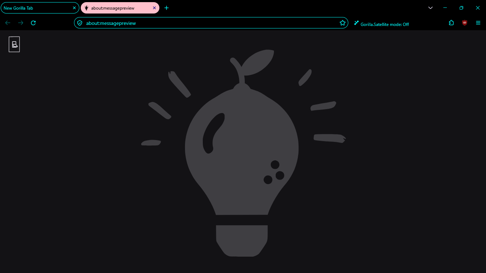

**Removed (D-157-40).** **Talks to:** conditional (message images from Mozilla's CDN; message buttons run privileged actions)

#### In plain words

**What it is.** about:messagepreview showed one message from Mozilla's messaging system (the about:asrouter entry explains that system) on the real part of the browser where it would appear: a spotlight window, an information bar, a recommendation pop-up and so on. The whole message travelled inside the page's address, written in a coded form after `?json=`. It worked like a theatre's dress rehearsal: you hand the stage manager a script and the scene is played on the real stage with the real props, so you see exactly what the audience will see. Where the comparison stops: stage props are harmless, while here the props were real buttons, and pressing one did the real thing: open a web address, install an add-on from a web address, or change a browser setting.

**When you would meet it.** Never, unless you typed its address or opened a link to it. The browser never opens it. The only links to it were made by the Share button of about:asrouter. It served Mozilla's messaging and marketing staff, developers, and an add-on called nimbus-devtools that is not part of Gorilla.

**What you see.** The picture was taken on the Gorilla build that still had the page, opened with no message. It shows a large grey drawing of a light bulb with a leaf on top and short strokes around it like rays, and in the top-left corner a small drawing of a light switch. The tab carries a light-bulb icon. Nothing else happens. The page's helper only existed while the messaging console's switch, `browser.newtabpage.activity-stream.asrouter.devtoolsEnabled`, was on; with the switch off, as here, the page was an empty shell whose functions did nothing.

With the switch on, a link carrying a message put that message on screen. The page could show information bars, spotlight windows, recommendation pop-ups, the private-window new tab promotion, the sidebar chatbot promotion, speech-bubble feature tours and a button on the bookmarks toolbar. Two of these changed your browser on the way: the feature tour first cleared the record of which tours you had seen, and the bookmarks-toolbar message made the bookmarks toolbar visible. The light switch in the corner swapped the browser to its built-in compact dark or compact light theme, to show the message both ways. It did so by switching the real theme add-on, a lasting change rather than a preview; the page put your previous theme back when it closed. The browser also checked each message against a description of what a valid message looks like, and showed it even when the check failed, noting the error only in a log.

**Does it talk to anyone?** The page itself fetched nothing: its security rules allowed only the browser's own files. With the switch on, a message it showed could load pictures from Mozilla's file server, firefox-settings-attachments.cdn.mozilla.net, which the spotlight window's security rules allow. And a message's buttons ran their actions when clicked: opening a web address, installing an add-on from a web address, or setting a preference.

**What we did, and why.** Removed. The browser no longer registers the page, so the address no longer opens anything. Its whole folder is no longer built, so the page's files are not in the browser at all, and its internal chrome:// address, a second way in, does not open it either. Its helper has been taken out of the browser's list of helpers, and the switch that brought the helper to life is locked off.

The danger was in the design. Once the switch was on, anyone who could get you to open a link could stage a message on your screen, inside the browser's own windows, with buttons that carry privileged actions. A message dressed as the browser itself carries the browser's authority. That is a door aimed straight at you, and it served Mozilla's marketing work, not you.

**What it costs you.** Nothing you would notice, unless you write messages for Mozilla's messaging system and want to see them on screen.

**The lesson.** In a browser, an address is not always a place; it can be an instruction. This one carried a whole message, buttons included, and the browser's own windows displayed it. Whenever an address can make the browser do something rather than show something, ask who is able to send you that address.

#### For developers

Line numbers are those of the source before the D-157-40 change.

**Registration**

- `browser/components/about/AboutRedirector.cpp:89-94`, listed in `browser/components/about/components.conf:17`. The page is `messagepreview.html` with `messagepreview.js`, built from `browser/components/messagepreview/` (`browser/components/moz.build:48`).
- Flags (upstream): `URI_MUST_LOAD_IN_CHILD | URI_CAN_LOAD_IN_PRIVILEGEDABOUT_PROCESS | URI_SAFE_FOR_UNTRUSTED_CONTENT | ALLOW_SCRIPT | HIDE_FROM_ABOUTABOUT`.
- The `AboutMessagePreview` actor is registered only when `browser.newtabpage.activity-stream.asrouter.devtoolsEnabled` is true (`DesktopActorRegistry.sys.mjs:133-146`, specifically 144-145). With default prefs the page is an empty div whose functions are undefined.
- Nothing in the browser opens it. The only links come from the admin page's Share button (`ASRouterAdmin.jsx:512, 582-593`). The external nimbus-devtools add-on also uses it (`AboutMessagePreviewParent.sys.mjs:140`).

**Behaviour**

- `messagepreview.js:21-46` decodes Base64 JSON from `?json=`. The child calls the show function only if the devtools pref is on (`AboutMessagePreviewChild.sys.mjs:41-46`).
- The parent checks the message against a local schema, logs a failure and shows the message anyway (`AboutMessagePreviewParent.sys.mjs:181-192`).
- Message types handled (`AboutMessagePreviewParent.sys.mjs:63-130`): infobar, spotlight, CFR doorhanger, private-window newtab, sidebar chatbot promo; feature callout, which first clears tour prefs (lines 80-83); bookmarks-bar button, which forces the bookmarks toolbar visible.
- The light switch turns on the built-in compact dark or light theme (lines 218-223); when the page closes it re-enables the previous theme (lines 147-160). It is a lasting add-on change, not a preview.

**Network**

- Automatic: none from the page. Its CSP allows only chrome: and resource: (`messagepreview.html:11-14`).
- Conditional: with the pref on, a shown message can pull images from firefox-settings-attachments.cdn.mozilla.net (spotlight CSP).
- On click: buttons run built-in message actions such as opening a URL, installing an add-on from a URL or setting a pref (`SpecialMessageActions.sys.mjs:870, 928, 1102`).

**Surprising**

- Once the pref is on, a pasted link from anyone can stage a message whose buttons carry privileged actions.

**What Gorilla changed (D-157-40)**

- The entry is gone from `browser/components/about/AboutRedirector.cpp` and `browser/components/about/components.conf`; the address no longer opens anything.
- `browser/components/moz.build`: the `messagepreview` directory (line 48 before the change) is no longer built, so `messagepreview.html`, `messagepreview.js` and both actors are not in the browser; the page's chrome:// address does not open either.
- `DesktopActorRegistry.sys.mjs`: the `AboutMessagePreview` actor entry (lines 133-146 before the change) is gone.
- The pref that gated the actor is false and locked in `browser/app/profile/firefox.js`.

---

### `about:referrals`: The forwarding address for Firefox referrals

**Removed (D-157-40).** **Talks to:** conditional (www.firefox.com/invite with a per-profile referral code)

#### In plain words

**What it is.** about:referrals was a forwarding address. When it worked, it sent you on to Mozilla's "Share Firefox" invitation page, https://www.firefox.com/invite/, with a referral code added to the address. The code is made once for your profile (the folder where the browser keeps your settings, bookmarks and history): 16 random characters, stored in a setting named `browser.referrals.code` and then locked so that it cannot be changed. It worked like the "refer a friend" card from a gym or a phone shop, printed with your own member number, so that the shop knows who sent each new customer. Where the comparison stops: you decide where a printed card goes, while here the code went to Mozilla's website the moment you opened the share page, and it was the same code every time, so the website could tell that every visit came from the same profile. A code that never changes and travels with you is what this document calls a lasting identifier.

**When you would meet it.** Never in Gorilla. In Firefox the ways in are a button in the main menu, an item in the Help menu (and in the application menu on a Mac), a "Share Firefox" item in the account menu, a section of Settings and a link in the About window. All of them go through one piece of code, which does nothing unless the switch `browser.referrals.enabled` is on. That switch is off by default, and Gorilla never turned it on. A test message for developers could also build the address, but never opened it.

**What you see.** The picture shows what happened when we typed about:referrals into the Gorilla build that still had the page: an empty black page. The tab is titled about:referrals and the address bar still holds the typed text. There was no error message and no network request. Here is why. The forwarding code checked the switch before doing anything. The switch was off, so it refused to build the forwarding address at all and answered only "not available". The browser draws an error page for many kinds of failure, but not for this one, so it drew nothing, and the tab stayed on the empty page every tab starts with, about:blank. Gorilla's network locks played no part: the request was never built.

**Does it talk to anyone?** Only with the switch on. Then opening it made a secure (https) request to www.firefox.com carrying your referral code, and the browser noted the click in Glean, Mozilla's data-collection library, which Gorilla never starts. The switch was not locked, so it could be turned on from about:config or by an enterprise policy (rules an organisation sets for the browsers on its computers).

**What we did, and why.** Removed. The browser no longer registers the page, so the address no longer opens anything; the code that built the forwarding address is gone; and the switch is locked off, which keeps every referral menu item hidden.

The referral programme is marketing. Its one technical product is a code that identifies your profile, made to be sent to Mozilla's website. In Gorilla it could not fire unless someone first flipped the switch, but a switch is a latch, not a wall: anything that can change settings can flip it. We would rather not carry a feature whose job is to send an identifier at all. Because the switch was never on, no Gorilla profile ever made a referral code.

**What it costs you.** Nothing. The page invited your friends to Firefox, not to Gorilla. If you want to recommend Gorilla, tell people about it; no code is needed.

**The lesson.** A friendly "share with a friend" button can carry an identifier. The code itself is a string of random characters; what makes it matter is that it never changes and goes to the same company every time. And an empty page is not always a block: sometimes the browser refused before it ever reached the network. Telling the two apart is how you read what a browser really did.

#### For developers

Line numbers are those of the source before the D-157-40 change.

**Registration**

- `browser/components/about/AboutRedirector.cpp:118-121`, listed in `browser/components/about/components.conf:25`. Target https://www.firefox.com/invite/. Flags (upstream): `URI_SAFE_FOR_UNTRUSTED_CONTENT | URI_MUST_LOAD_IN_CHILD | HIDE_FROM_ABOUTABOUT`.
- If `browser.referrals.enabled` is false, the redirector returns `NS_ERROR_NOT_AVAILABLE` before it builds any URL (`AboutRedirector.cpp:210-213`).
- With the pref on, the query is copied onto the target (`AboutRedirector.cpp:244-251`). Because the target is not a chrome page, the redirector tags the channel with its real web address (`AboutRedirector.cpp:263-278`): it becomes an ordinary www.firefox.com page in a content process.

**Who opens it**

- Only `Referrals.openReferralsTab` (`browser/components/referrals/Referrals.sys.mjs:77-88`), which does nothing unless `browser.referrals.enabled` is true.
- Entry points: app menu button (`appmenu-viewcache.inc.xhtml:200-205` to `browser-sets.js:136-137`); Help menu and macOS app menu `menu_referralsPage` (defined at `browser-menubar.inc.xhtml:461-464, 482-484`, handled by `browser-menubar.js:111-114` to `utilityOverlay.js:442-443`, hidden at `utilityOverlay.js:569-570`); account menu "Share Firefox" (`appmenu-viewcache.inc.xhtml:796`; `browser-sync.js:4029-4036, 4106-4109`); Settings section (`preferences/config/account-sync.mjs:822-833, 1138-1147`); About dialog link (`aboutDialog.xhtml:137`; `aboutDialog.js:142-164`).
- A devtools-only test callout (`PanelTestProvider.sys.mjs:36-75`): its button runs `GET_REFERRAL_CODE`, which builds an about:referrals URL but never opens it (`SpecialMessageActions.sys.mjs:1184-1199`).

**Behaviour**

- Generates a 16-character random code, stores it in `browser.referrals.code` and locks that pref (`Referrals.sys.mjs:49-67, 95-104`); the lock is re-applied at every window start (`browser-init.js:688`). `getReferralCode()` returns an empty string while the pref is false.
- Records a Glean event (`Referrals.sys.mjs:81`).
- Opens `about:referrals?ref_key=CODE`.

**Why the probe landed on about:blank with no request**

1. `browser.referrals.enabled` defaults to false (`firefox.js:3835`). Gorilla did not change it and had no diff anywhere in the referrals code.
2. The redirector returned `NS_ERROR_NOT_AVAILABLE` before building any URL (`AboutRedirector.cpp:210-213`).
3. The about: protocol handler passes that error through unchanged; only "factory not registered" becomes "malformed URI" (`nsAboutProtocolHandler.cpp:162-170`).
4. The docshell's error-page filter has no case for `NS_ERROR_NOT_AVAILABLE` and returns OK (`nsDocShell.cpp:6182-6261`). No error page is drawn, so the tab keeps its initial about:blank.

No Gorilla network lock was involved.

**Network**

- Conditional: only with the pref true, an https request to www.firefox.com carrying the code. The pref was not locked, so about:config or an enterprise policy could switch it on.
- Separate and not tied to this page: the attribution "referrals" Glean ping (`AttributionCode.sys.mjs:182-193`).

**Surprising**

- If it is ever enabled, every share sends a persistent per-profile identifier to Mozilla's site.

**What Gorilla changed (D-157-40)**

- The entry is gone from `browser/components/about/AboutRedirector.cpp`, together with its pref gate and query-forwarding code, and from `browser/components/about/components.conf`; the address no longer opens anything.
- `browser/app/profile/firefox.js`: `browser.referrals.enabled` is false and locked. Every entry point stays hidden and `openReferralsTab` stays a no-op, so no Gorilla profile has generated a code.
- Left in place: `browser/components/referrals/` and the entry points, inert behind the locked pref.

---

### `about:blocked`: The red 'dangerous site' warning

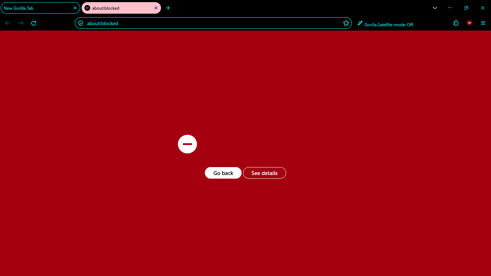

**Removed (D-157-40).** **Talks to:** on click (Google and Mozilla report links carrying the blocked address)

#### In plain words

**What it is.** about:blocked was the full-screen red warning Firefox shows when a site you open is on a list of known dangers: phishing sites (fakes built to steal passwords), sites spreading malicious software, sites pushing unwanted software, or harmful add-ons. The checking service behind it is called Safe Browsing, and it works from block lists that come from outside the browser. Think of the "condemned: do not enter" notice a council inspector nails to a door. The notice is only paper; the inspection decides where it goes. Where the comparison stops: you could tear this notice down yourself, and some of its links would have told the people who keep the lists which address you were visiting.

**When you would meet it.** In Gorilla, never. Malware and phishing checking is locked off, the harmful-add-on list is never downloaded, and no copy of it is built in, so nothing could ever send you to this page. Since decision D-157-40 the page is gone as well: the address no longer opens anything.

**What you see.** The picture (about-blocked.png) was taken on the build before this change (build 28), by typing about:blocked with no blocked site behind it. The whole page is red. In the middle sits a white circle with a red bar across it, a no-entry sign, and below it two buttons: **Go back**, which took you to your home page, and **See details**, which showed the explanation. Because no site was blocked, there is no heading and no text. With a real block a third choice, **Ignore the risk**, let you through for the rest of the session: it reloaded the site past the check and showed a warning bar.

**Does it talk to anyone?** It contacted no one on its own. When clicked, several of its links went out, and some carried the blocked site's address with them:

- a Google page with a diagnosis of the site;
- "report a mistake" links to Mozilla (addresses under phish-error.mozilla.com and malware-error.mozilla.com) or to Google (safebrowsing.google.com);
- information pages at antiphishing.org, Google's unwanted-software policy, Mozilla's support site (support.mozilla.org) and Google's developer site (developers.google.com).

**What we did, and why.** Removed (decision D-157-40). Safe Browsing depends on lists that someone outside your computer compiles and the browser fetches, which makes it a channel controlled by whoever keeps the lists; it was locked off in Gorilla before this change. That left a page that could never appear but was still in the browser: anyone could open it by typing its address, and its links pointed at Google and Mozilla. A door that leads nowhere is still a door, so it is gone. Its own files (the page, its script and its styling) are no longer packaged either. That closes a second way in: in Firefox a page's file can be opened directly by its internal chrome:// address. Only its text file remains, and nothing uses it. From the new build on, typing about:blocked is expected to bring up the network error page's "Hmm. That address doesn't look right." screen, the one for addresses that no page answers to (see about:neterror); this is still to be confirmed on that build. If Safe Browsing ever came back, this page would have to come back with it.

**What it costs you.** Nothing from removing the page: it could not appear. The real cost was paid earlier, when the checking was switched off: Gorilla does not warn you, from these lists, before you open a known phishing or malware site, and does not check add-ons against the harmful-add-on list.

**The lesson.** A warning page is the visible end of a list someone else keeps. Whoever keeps the list decides what you are warned about, and the warning's own links lead back to them. When you switch such a service off, remove what it leaves behind as well: a page that can no longer be triggered is still code that runs when someone types its address.

#### For developers

Line numbers below are those of the source before the D-157-40 change.

- **Registration (until D-157-40).** `browser/components/about/AboutRedirector.cpp` and `browser/components/about/components.conf`, flags `URI_SAFE_FOR_UNTRUSTED_CONTENT | URI_CAN_LOAD_IN_CHILD | ALLOW_SCRIPT | HIDE_FROM_ABOUTABOUT` (as in the unpatched Firefox 157 source).
- **What opened it.** Docshell switches to `blocked` for phishing, malware, unwanted, harmful and harmful-add-on errors (`docshell/base/nsDocShell.cpp:3496-3526`; `modules/libpref/init/all.js:3413`) and adds `&o=1` when overriding is allowed (`nsDocShell.cpp:3848-3851`).
- **Why it could not appear in Gorilla.** Malware and phishing checking is locked off (`browser/app/profile/firefox.js:4092-4093`, gating `netwerk/url-classifier/UrlClassifierFeaturePhishingProtection.cpp:26-30`). The harmful-add-on list (`all.js:3364`) can never be downloaded (`toolkit/components/url-classifier/nsUrlClassifierStreamUpdater.cpp:277-280`), and there is no built-in copy (`services/settings/dumps/main/`).
- **Controls.** Go back loads the home page (`browser/actors/BlockedSiteParent.sys.mjs:152-159`). See details shows the explanation (`browser/base/content/blockedSite.js:77-80`). Ignore the risk grants a session permission, reloads past the check and shows a warning bar (`BlockedSiteParent.sys.mjs:173-297`).
- **Network, on click only; several links carry the blocked URL.** Google diagnostic link (`browser/actors/BlockedSiteChild.sys.mjs:53-61`; `all.js:3458`). Report a mistake via `*.phish-error.mozilla.com` / `*.malware-error.mozilla.com` or safebrowsing.google.com (`BlockedSiteChild.sys.mjs:65-92`; `all.js:3459-3460`). antiphishing.org, Google's unwanted-software policy, SUMO and a developers.google.com advisory (`BlockedSiteChild.sys.mjs:76-144`). The help link opens support.mozilla.org (`:96-102`).
- **Other code.** Only checks the URL prefix (`browser/base/content/browser-safebrowsing.js:14,86`; `browser/actors/ClickHandlerChild.sys.mjs:80`).
- **Gorilla change (D-157-40).** Registration removed from `browser/components/about/AboutRedirector.cpp` and `browser/components/about/components.conf`. The research classed the page removable as configured, and essential again if Safe Browsing returned.
- **Gorilla change (D-157-40, second round).** The page's own files are no longer packaged: `blockedSite.xhtml` and `blockedSite.js` (`browser/base/jar.mn`) and `blockedSite.css` (`browser/themes/shared/jar.inc.mn`). Their chrome:// addresses, a second way into the page from the address bar, therefore open nothing either. `blockedSite.ftl` remains as inert text.
- **After the change.** about:blocked is expected to land on about:neterror with `malformedURI`, like any unregistered about: address; still to be confirmed on the build carrying both rounds.

---

### `about:restricted`: The parental controls 'restricted content' page

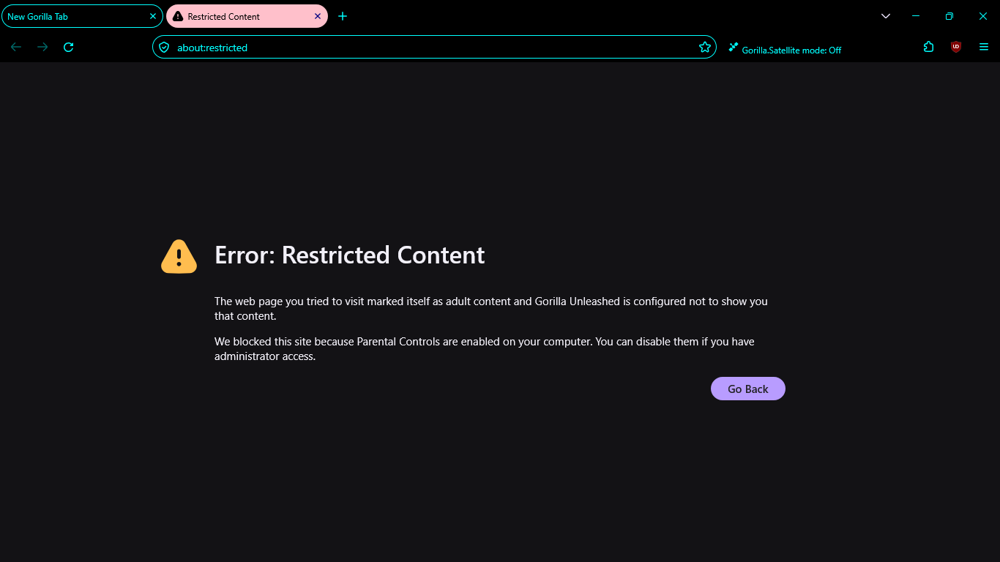

**Removed (D-157-40).** **Talks to:** none

#### In plain words

**What it is.** about:restricted was the "Restricted Content" page of parental controls. Some websites label themselves as adult content with a hidden tag in the page. When parental controls were in force, Firefox stopped such a page and showed this one instead. Think of a cinema usher turning away anyone under age from a film rated for adults only. Where the comparison stops: a film is rated by a board, whereas here each website rates itself, so only the sites that chose to carry the label were ever stopped; a site without the label went straight through.

**When you would meet it.** In Gorilla, never in normal use. It could appear only if parental controls were enforced, which Firefox does in one of two ways: a hidden preference, security.restrict_to_adults.always, switched on by hand in about:config; or the operating system's own parental controls, read through a part of the browser that Gorilla is built without. Since decision D-157-40 nothing enforces parental controls at all, and the page is gone: the address no longer opens anything.

**What you see.** The picture (about-restricted.png) was taken on the build before this change (build 28), by typing about:restricted. A yellow warning triangle sits beside the heading "Error: Restricted Content". Two sentences follow: the page you tried to visit marked itself as adult content and Gorilla Unleashed is set not to show you that content; and the site was blocked because parental controls are on, which you can switch off if you have administrator access. One button: **Go Back**. With a real block, the page also named the site.

**Does it talk to anyone?** It contacts no one. The page could load only the browser's own built-in files, and it had no links.

**What we did, and why.** Removed (decision D-157-40), together with the code that decided whether to enforce parental controls. Gorilla is built without parental controls, so the page served a feature that is not there. Reading the code, the research also found a worse problem upstream: if one hidden preference, security.restrict_to_adults.respect_platform, was switched on in a build without parental controls (such as Gorilla's), the browser asked for the parental-controls part, got nothing back, and used that nothing without checking. That code runs every time the browser creates a new top-level browsing context (the container a tab's page lives in), so the main browser process would crash. This was found by reading the code, not by running it. In Gorilla the check now always answers "do not enforce", so that path is gone. The page's own files (the page, its script, its styling and its draft text) are no longer packaged either, so its internal chrome:// address, a second way in that Firefox allows from the address bar, cannot open it. From the new build on, typing about:restricted is expected to bring up the network error page's "Hmm. That address doesn't look right." screen (see about:neterror); this is still to be confirmed on that build.

**What it costs you.** If you had switched on security.restrict_to_adults.always, it no longer blocks anything. Otherwise, nothing: Gorilla offers no parental controls of its own.

**The lesson.** A label that a website puts on itself is a request, not a guarantee: filtering that relies on sites rating themselves stops only the honest ones. And code for a feature you do not use does not become harmless by sitting idle: here, one setting could have turned idle code into a crash of the whole browser.

#### For developers

Line numbers below are those of the source before the D-157-40 change.

- **Registration (until D-157-40).** `docshell/base/nsAboutRedirector.cpp` and `docshell/build/components.conf`, flags `URI_SAFE_FOR_UNTRUSTED_CONTENT | URI_CAN_LOAD_IN_CHILD | ALLOW_SCRIPT | HIDE_FROM_ABOUTABOUT` (as in the unpatched Firefox 157 source).
- **What opened it.** A `<meta name="rating">` declaring adult content (`dom/base/Document.cpp:12122-12136`) stops the load (`docshell/base/nsDocShell.cpp:4117-4126,3557-3562`), but only when parental controls are enforced. `docshell/base/CanonicalBrowsingContext.cpp:3837-3851` decides: either `security.restrict_to_adults.always` (default false, `modules/libpref/init/StaticPrefList.yaml:19469-19472`) or the operating system's parental-controls service, which is not built into Gorilla (`toolkit/components/build/components.conf:174-182`; `--disable-parental-controls` in the Gorilla repository's `config/mozconfig.win64:152`, confirmed by the build's `config.status:60`).
- **Page.** Shows the host (`toolkit/content/aboutRestricted/aboutRestricted.mjs:16-29`) and a single Go Back button (`:35-37` → `toolkit/actors/AboutRestrictedParent.sys.mjs:14-15`). Chrome resources only (`aboutRestricted.html:7-10`); no links. Network: none.
- **Latent upstream crash.** With `security.restrict_to_adults.respect_platform` set true, the service lookup returns nothing in this configuration and the result is used without a check (`CanonicalBrowsingContext.cpp:3843-3845`); `nsHttpHandler.cpp:552-554` does check. The code runs whenever a top-level browsing context is created (`docshell/base/BrowsingContext.cpp:500-508`), so the parent process would crash. Found by reading the code, not by running it.
- **Gorilla change (D-157-40).** Registration removed from `docshell/base/nsAboutRedirector.cpp` and `docshell/build/components.conf`. `CanonicalBrowsingContext::ShouldEnforceParentalControls()` now returns false unconditionally (marker `GORILLA D-157-40 (2026-10-08): Gorilla is built --disable-parental-controls`), which also removes the null dereference.
- **Gorilla change (D-157-40, second round).** The page's own files are no longer packaged: `aboutRestricted.html`, `aboutRestricted.mjs` and `aboutRestricted.css` (`toolkit/content/jar.mn`) and `locales-preview/aboutRestricted.ftl` (`toolkit/locales/jar.mn`). Their chrome:// addresses therefore open nothing either.
- **After the change.** about:restricted is expected to land on about:neterror with `malformedURI`; still to be confirmed on the build carrying both rounds.
- **Side effect.** `security.restrict_to_adults.always` no longer blocks anything.

---

### `about:crashparent`: The address that crashed the whole browser

*No picture: No picture exists: opening about:crashparent would have crashed the whole browser that was taking the pictures, so it was never opened.*

**Removed (D-157-40).** **Talks to:** none

#### In plain words

**What it is.** about:crashparent was one of four test addresses that broke part of the browser on purpose: about:crashparent, about:crashcontent, about:crashgpu and about:crashextensions. Mozilla uses them in its automated tests, to check that the browser and its tools cope when something fails. Think of a car maker's crash test: a real car is driven into a wall, on purpose, to prove that the airbags and the safety cage work. Where the comparison stops: a crash test uses a car nobody is riding in, while these addresses wrecked the browser you were using, with your own tabs in it, and anyone at the keyboard could start one by typing an address. Nothing asked "are you sure?".

How the four worked, explained once for all of them:

- **One mechanism.** All four went through one small piece of code in the browser, the crash channel. When one of these addresses was loaded, that code did not fetch a page; it broke the part of the browser the address named.
- **Who could trigger them.** A website could not: the code refused every load that did not come from the browser itself. But an address typed into the address bar counts as coming from the browser, so a person at the keyboard could.
- **What happened afterwards.** Gorilla is built without the crash reporter, the part of Firefox that writes a crash report and offers to send it to Mozilla. So these crashes produced no report, no report window and no upload. One thing we did not check: Windows has its own error reporting, and whether Windows itself records or uploads such a crash is decided by Windows, not by Gorilla.
- **Why they existed.** For Mozilla's automated test suites. Gorilla is built without tests.

**When you would meet it.** Never by accident; only if you typed about:crashparent into the address bar. Since decision D-157-40 the address no longer opens anything.

**What you see.** There is no picture: opening it would have crashed the browser that was taking the pictures. From the code: the main browser process, the one in charge of all the others, stopped at once. Every Gorilla window closed without a question, and on the next start you depended on session restore to get your tabs back.

**Does it talk to anyone?** It contacted no one.

**What we did, and why.** Removed, with the other three and with the crash channel that did the breaking (decision D-157-40). In our threat model every piece of code that can be set off is a door, and it must earn its place or be closed. These four served Mozilla's test machines, not the person at the keyboard, and Gorilla is built without tests; the most this one could do for you was close every window you had open. The four had no files of their own, so nothing else had to go. From the new build on, typing any of the four addresses is expected to bring up the network error page's "Hmm. That address doesn't look right." screen, the one for addresses that no page answers to (see about:neterror); this is still to be confirmed on that build.

**What it costs you.** Nothing you would notice, unless you test browsers: you can no longer crash Gorilla on purpose to check that session restore brings your tabs back.

**The lesson.** Products often ship with their test tools still inside, hidden rather than removed. Hidden is not gone: an address that is listed nowhere still works for anyone who knows it. Looking for what a program hides, and asking whom it serves, is a habit worth keeping.

#### For developers

Line numbers below are those of the source before the D-157-40 change. This entry holds the shared facts for all four crash pages; the other three refer back to it.

- **Registration (until D-157-40).** `docshell/base/nsAboutRedirector.cpp` and `docshell/build/components.conf:14`. about:crashparent carried only `HIDE_FROM_ABOUTABOUT` and cannot load in a child process (`nsAboutRedirector.cpp:226`).
- **Shared mechanism.** All four use `CrashChannel` (`nsAboutRedirector.cpp:30-78`). Loads are refused unless triggered by the system principal and not from outside the browser (`:256-273`), so web pages cannot use them. Address-bar loads carry the system principal (`browser/components/urlbar/UrlbarParentController.sys.mjs:833,861` → `browser/modules/URILoadingHelper.sys.mjs:843-847`), so a user can type them.
- **This page.** `MOZ_CRASH` in the main (parent) process (`nsAboutRedirector.cpp:39-41`): the whole browser dies, and the next start relies on session restore.
- **No crash report is produced.** The crash reporter is not built (the Gorilla repository's `config/mozconfig.win64:150`; the build's `mozinfo.json:13`); on Windows upstream it would be on by default (`toolkit/moz.configure:3459-3478`). A dummy handler is compiled instead (`toolkit/crashreporter/moz.build:31,138-141`), and about:crashes is not registered (`nsAboutRedirector.cpp:114-117`). So there is no minidump, no report dialog and no upload.
- **Windows.** `MOZ_CRASH` on Windows is a `__debugbreak` (`mfbt/Assertions.h:241-245`). Firefox's own Windows Error Reporting module is not registered (`mozglue/misc/RuntimeExceptionModule.cpp:50-55`), so whether Windows itself logs or uploads the crash is operating-system policy, outside this tree. Not verified.
- **Who used them.** webdriver, marionette, puppeteer and mochitests (`testing/web-platform/mozilla/tests/webdriver/harness/detect_crash.py:14-42`), and GeckoView tests. Gorilla builds with `--disable-tests` (`config/mozconfig.win64:148`); the layout debugger that also uses about:crashparent is not built.
- **Network.** None.
- **Gorilla change (D-157-40).** The four entries are removed from `docshell/base/nsAboutRedirector.cpp` and `docshell/build/components.conf`, and the `CrashChannel` class with them (the decision's check requires `class CrashChannel final` to be absent). Android's about:crashcontentjava was removed with them. The crash pages had no files of their own, so nothing needed unpackaging. From the D-157-40 build on, the four addresses are expected to land on about:neterror with `malformedURI`; still to be confirmed on that build.
- **Surprising.** One typed address closed every window without asking.

---

### `about:crashcontent`: The address that crashed a tab

**Removed (D-157-40).** **Talks to:** none

#### In plain words

**What it is.** about:crashcontent was the second of the four test addresses explained under about:crashparent: the same mechanism, the same absence of crash reports, the same purpose. This one crashed the process behind the tab you typed it in, one of the separate programs that run web pages (see about:tabcrashed). Every tab served by that process crashed with it. The car crash test comparison from about:crashparent applies. Where it stops for this page: only one part of the car was wrecked, and the rest of the browser carried on, so the damage was one tab or a few, not everything.

**When you would meet it.** Only if you typed about:crashcontent. Since decision D-157-40 the address no longer opens anything.

**What you see.** The picture (about-crashcontent.png) was taken on the build before this change (build 28). It shows the result rather than a page of its own: the tab crashed, and about:tabcrashed took its place. The address bar still reads about:crashcontent, the tab's icon carries a small red warning mark, and the page announces that your Gorilla tab has crashed, with the buttons **Close Gorilla Tab** and **Restore This Gorilla Tab**. There is no crash-report form, because Gorilla writes no crash reports.

**Does it talk to anyone?** It contacted no one.

**What we did, and why.** Removed with the other three (see about:crashparent). It was a handy way to test the crashed-tab page by hand, but it served testers, not people browsing, and a typed address that kills part of your browser is a door with no reason to stay open. From the new build on, typing it is expected to bring up the "Hmm. That address doesn't look right." screen (see about:neterror); still to be confirmed on that build.

**What it costs you.** A crashed tab can no longer be provoked by hand for testing. If you never test the crashed-tab page, nothing.

**The lesson.** Testing how a program recovers is good engineering. Leaving the trigger for that test inside the product you ship is a separate decision, and it should be taken on purpose. In Gorilla it was: the trigger is gone, the recovery stays.

#### For developers

Line numbers below are those of the source before the D-157-40 change. The shared mechanism (`CrashChannel`, the system-principal gate, the missing crash reporter, the test users) is under about:crashparent.

- **Registration (until D-157-40).** `docshell/base/nsAboutRedirector.cpp` and `docshell/build/components.conf:14`; it had to load in a content process (`nsAboutRedirector.cpp:227-231`).
- **Mechanism.** DocumentChannel is deliberately bypassed so that the crash happens in that content process (`netwerk/ipc/DocumentChannel.cpp:169-180`); `MOZ_CRASH` at `nsAboutRedirector.cpp:49-51`. Every tab in that process then shows about:tabcrashed without a report form. `browser/modules/URILoadingHelper.sys.mjs:581-584` lets it load in a pinned tab.
- **Network.** None.
- **Gorilla change (D-157-40).** As for about:crashparent.
- **Picture.** about-crashcontent.png is the about:tabcrashed page this address produced on build 28.

---

### `about:crashgpu`: The address that crashed the graphics process

*No picture: No picture exists: opening about:crashgpu would have crashed the graphics process of the browser that was taking the pictures, so it was never opened.*

**Removed (D-157-40).** **Talks to:** none

#### In plain words

**What it is.** about:crashgpu was the third of the four test addresses explained under about:crashparent. It told the graphics process to crash. The graphics process is a separate program the browser can use to draw the screen with your computer's graphics chip (the GPU); if the browser was not using one, the address did nothing. The car crash test comparison from about:crashparent applies. Where it stops for this page: the tab you typed it in did not even show a wreck; its own load failed silently, and the damage happened out of sight, in the part that draws.

**When you would meet it.** Only if you typed about:crashgpu. Since decision D-157-40 the address no longer opens anything.

**What you see.** There is no picture: we never opened it, because it would have crashed the graphics process of the browser taking the pictures. What a person sees when the graphics process crashes was not measured. From the code, the tab itself shows no error page.

**Does it talk to anyone?** It contacted no one.

**What we did, and why.** Removed with the other three (see about:crashparent): a test tool for Mozilla's test machines, of no use to a person browsing. From the new build on, typing it is expected to bring up the "Hmm. That address doesn't look right." screen (see about:neterror); still to be confirmed on that build.

**What it costs you.** Nothing you would notice.

**The lesson.** A modern browser is not one program but a small team of programs, each with its own job: one in charge, one drawing, others running pages and add-ons. Each can fail on its own, and each is a separate thing to protect and to audit.

#### For developers

Line numbers below are those of the source before the D-157-40 change. The shared mechanism is under about:crashparent.

- **Registration (until D-157-40).** `docshell/base/nsAboutRedirector.cpp` (`HIDE_FROM_ABOUTABOUT`) and `docshell/build/components.conf:14`.
- **Mechanism.** From the parent process it asks the GPU process to crash (`nsAboutRedirector.cpp:43-47`; `gfx/ipc/GPUProcessManager.cpp:1227-1233`; `gfx/ipc/GPUProcessHost.cpp:343`), which then runs `MOZ_CRASH("Deliberate GPU process crash")` (`gfx/ipc/GPUParent.cpp:730-733`). It does nothing if there is no GPU process. The tab's own load then fails silently (`nsAboutRedirector.cpp:72-73`).
- **Network.** None.
- **Gorilla change (D-157-40).** As for about:crashparent.
- **Picture.** None: never opened during the picture run.

---

### `about:crashextensions`: The address that stopped every add-on

**Removed (D-157-40).** **Talks to:** none

#### In plain words

**What it is.** about:crashextensions was the fourth of the four test addresses explained under about:crashparent. Despite its name it did not crash anything: it forcibly shut down every process that runs add-ons (the extra programs you add to a browser, such as uBlock Origin, the content blocker built into Gorilla). Gorilla's add-on system treats this as an abnormal shutdown and counts it towards its limit on how often it restarts add-on processes. The car crash test comparison from about:crashparent applies. Where it stops for this page: a crash test leaves a wreck you can see, while this left the screen unchanged, with nothing to tell you that your add-ons had stopped.

**When you would meet it.** Only if you typed about:crashextensions. Since decision D-157-40 the address no longer opens anything.

**What you see.** The picture (about-crashextensions.png) was taken on the build before this change (build 28), right after typing the address. The tab is black and empty, and its title is the address itself. Nothing on the screen says that every add-on process has been stopped; the uBlock Origin button is still in the toolbar.

**Does it talk to anyone?** It contacted no one. In Firefox the forced shutdown can write crash files if a crash reporter exists, and it is counted in Glean, Mozilla's data-collection library. In Gorilla there is no crash reporter, and Glean never starts, so nothing is written or sent.

**What we did, and why.** Removed with the other three (see about:crashparent). Only Mozilla's GeckoView tests used it (GeckoView is Mozilla's browser engine for Android apps). It also stopped uBlock Origin until its process was started again. How uBlock Origin behaves in that gap was not measured. A typed address that can switch off your protection without a word is a door we close. From the new build on, typing it is expected to bring up the "Hmm. That address doesn't look right." screen (see about:neterror); still to be confirmed on that build.

**What it costs you.** Nothing you would notice.

**The lesson.** Names can mislead: "crash" here meant "stop every add-on". Protection that runs as an add-on lives on top of the browser, and the browser underneath can switch it off without telling you. Know which layer your protection lives in.

#### For developers

Line numbers below are those of the source before the D-157-40 change. The shared mechanism is under about:crashparent.

- **Registration (until D-157-40).** `docshell/build/components.conf:14` and `docshell/base/nsAboutRedirector.cpp:240`; implemented at `nsAboutRedirector.cpp:59-70`.
- **Mechanism.** Not a crash: it force-kills every live extension process. The kill would create crash dumps only if a crash reporter existed (`dom/ipc/ContentParent.cpp:4360-4385,4428-4429`); its Glean count (`:4433`) is inert. The add-on framework treats it as an abnormal shutdown and counts it towards its respawn limit (`toolkit/components/extensions/Extension.sys.mjs:809-853`).
- **Who used it.** GeckoView tests only.
- **Network.** None.
- **Not verified.** How the bundled uBlock Origin behaves until the extension process is respawned.
- **Gorilla change (D-157-40).** As for about:crashparent.

---

### `about:profilemanager`: The new profile switcher's main panel

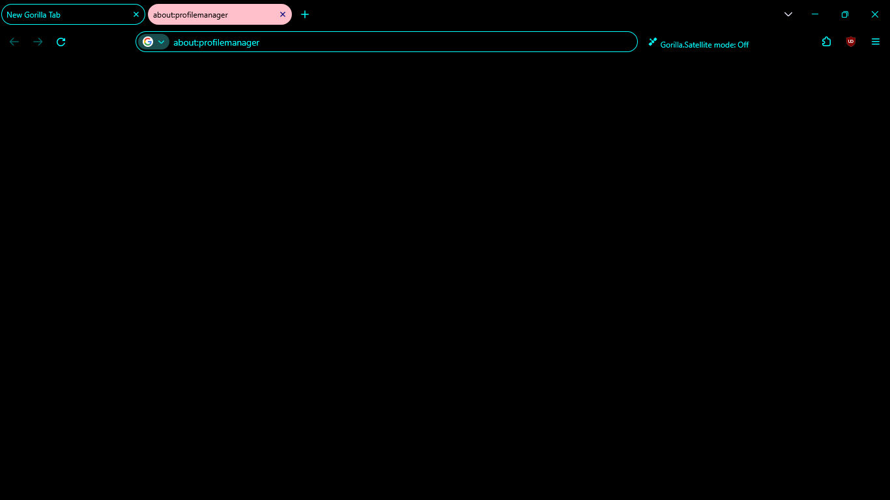

**Removed (D-157-40).** **Talks to:** none in Gorilla (blank page)

#### In plain words

**What it is.** A profile is a complete, separate set of what the browser keeps for you: open windows and tabs, bookmarks, history, cookies, saved addresses and cards, and saved passwords. Gorilla, like Firefox, has a plain manager for profiles, about:profiles, and it stays. Firefox is also introducing a newer "profile switcher", made of four hidden pages, and this entry explains what they share:
- **about:profilemanager**, the main panel: it lists your profiles, lets you open one, create one or delete one, and has a "show at startup" tick box that makes it appear every time the browser starts;
- **about:newprofile**, the first page of a newly created profile;
- **about:editprofile**, the same card for the profile you are using;
- **about:deleteprofile**, the delete confirmation.

Each of the other three has its own entry below, which refers back here. Picture the panel of lockers at a swimming pool, each with a name tag and a colour: you pick a locker, rent a new one and decorate its tag, or empty one for good. The analogy stops at the wall. A locker panel is a board on a wall; Firefox's switcher also reached out to Mozilla. Choosing a theme that was not installed downloaded it from addons.mozilla.org, Mozilla's add-on site; in one configuration the list of themes itself was looked up there; and after you finished making a new profile, a guided tour loaded two pictures from Mozilla's servers.

**When you would meet it.** In Gorilla, never by accident. The switcher has been switched off since an earlier decision (D-157-20), and the menu items that lead to it are hidden. Before this change, two paths were left. A profile list (the profiles.ini file) asking for the switcher at start-up could still open the panel when Gorilla started. And a profile list copied over from Firefox that carries the switcher's own identifier (a "store ID") switched the switcher back on by itself, whatever Gorilla's locked setting said, and brought its menu items back. After this change neither happens: the panel does not open at start-up, and with the setting locked off, a profile list from Firefox no longer brings the menu items back.

**What you see.** The pictures of all four pages were taken on the build before this change, by typing each address into a fresh profile. All four look the same: an empty black page, with the address in the tab and in the address bar. That emptiness is the off switch at work. With the switcher off, the browser refused to build the page and showed no error either, so the tab kept the empty page every tab starts as (about:blank). In Firefox, with the switcher on, about:profilemanager shows your profiles with their names, pictures and colours, buttons to open, create and delete them, and the "show at startup" tick box.

**Does it talk to anyone?** In Gorilla, no one: the pages did not open. In Firefox, the four pages load no pictures from the internet themselves, but:
- **when you click:** choosing a theme that is not installed downloads it from addons.mozilla.org; in one configuration the theme picker looks themes up there as well; the "Explore more themes" link opens that site;
- **automatically:** after you press Done on a new profile, a guided tour loads two pictures from firefox-settings-attachments.cdn.mozilla.net, a server Mozilla uses to hand out files.

**What we did, and why.** All four removed (decision D-157-40). Gorilla had already switched the switcher off, because its tour loaded pictures from Mozilla's servers (D-157-20). But switched off is not gone: the pages stayed registered, a start-up path could still open the panel, and the code waited for one setting to change. In the Gorilla threat model, the company that ships the browser, and anyone who can lean on that company, is the adversary to design against, and every channel that can carry code or data is a door. A tour that fetches pictures from the vendor at a moment the vendor chooses is such a door, and so is a theme shop wired into a profile page. We removed the four pages from the browser, together with the code that only they used, and closed the two paths that were left: Gorilla no longer shows the switcher when it starts, whatever the profile list says, and it no longer switches the switcher back on when a profile list from Firefox carries the switcher's identifier, so the locked setting has the last word. about:profiles, the classic profile manager, stays.

**What it costs you.** No profile switcher with names, pictures and colours, and no built-in profile backup (D-157-20): to keep a copy of a profile, copy its folder by hand. A profile list from Firefox that asks for the switcher at start-up now starts straight into the default profile, and the profile menu items stay hidden. The four addresses no longer open anything: Gorilla shows its "Hmm. That address doesn’t look right." page for them, the same page any unknown about: address gets. Profiles are still managed in about:profiles, which can also delete them.

**The lesson.** A feature that is switched off is not gone. Its pages, its start-up path and its links to the vendor stay in the code, waiting for one setting to change, and here Firefox's code would even switch the feature back on by itself when it found a sign that it had been used before; we cut that too. Switching off is a promise. Removing is a fact.

#### For developers

*Line numbers are those of the source before the D-157-40 change; paths are relative to the Firefox 157 source tree. This entry carries the shared material for about:newprofile, about:editprofile and about:deleteprofile.*

- **Registration (before removal):** `browser/components/about/AboutRedirector.cpp:161-183`, inside an `#ifdef` on `MOZ_SELECTABLE_PROFILES`, which is always set (`toolkit/moz.configure:1098-1099`), and `browser/components/about/components.conf:40-46`. Hidden from about:about (register `was: hidden`).
  - newprofile, editprofile and deleteprofile run in the privileged about process through the Profiles actor (`DesktopActorRegistry.sys.mjs:643-654`).
  - profilemanager runs in the parent process with chrome privileges.
- **about:profilemanager** (`profile-selector.mjs`): lists the profiles in the group; launch one, create one (it then opens with about:newprofile, `:142-150`) or delete one (`:151-155`). The "show at startup" checkbox writes ShowSelector to profiles.ini (`:115-122`). Shown at start-up when ShowSelector=1 (`nsAppRunner.cpp:5692-5694`, `3179-3186`) and from the menus (`browser-profiles.js:350-357`; `preferences/main.js:1000-1007`).
- **Why the pictures are blank:** `browser.profiles.enabled` is false and locked (`firefox.js:3725`; D-157-20). `NewChannel` returned `NS_ERROR_NOT_AVAILABLE` for new, edit and delete when the pref is false (`AboutRedirector.cpp:215-219`), and for profilemanager unless the browser was still starting up (`:221-229`). Docshell does not turn that error into an error page (`nsDocShell.cpp:6182-6260` returns NS_OK, and `3695-3697` has no mapping for it), so the tab keeps its initial about:blank. The profile menus are hidden (`browser-profiles.js:82-96`).
- **Network in Firefox (none in Gorilla):** the pages load no remote images (CSP `img-src blob: chrome:` in all four HTML files).
  - On click: a theme that is not installed is downloaded as an XPI from addons.mozilla.org (`SelectableProfileService.sys.mjs:104-280`, `1055-1067`); with Nova (`firefox.js:2237`) the theme picker looks themes up through the addons.mozilla.org API (`ThemesList.sys.mjs:329-345`); the addons.mozilla.org themes link.
  - Automatic: after Done, the `NEW_PROFILE_APP_MENU_TOUR` callout loads two images from firefox-settings-attachments.cdn.mozilla.net (`FeatureCalloutMessages.sys.mjs:978-1042`, images at 1013-1015). These are the "CDN images" behind D-157-20.
- **Gorilla change (D-157-40):** the four registrations are deleted from `browser/components/about/AboutRedirector.cpp` and `browser/components/about/components.conf`, with the `NewChannel` gate that only they used; `nsToolkitProfile::GetShowProfileSelector` returns false (`toolkit/profile/nsToolkitProfileService.cpp`), so ShowSelector=1 no longer opens the selector at start-up. Earlier Gorilla change: the logo in `profile-selector.mjs:177` changed from `.svg` to `.png`.
- **Not changed:** `MOZ_SELECTABLE_PROFILES` stays on at build level, because about 17 modules import `SelectableProfileService`. The references left behind are harmless: `RemotePageAccessManager.sys.mjs:184-210`, `Policies.sys.mjs:471-475`, `DesktopActorRegistry.sys.mjs:525-527`, `652`, `671-672`. The service still initialises on the first window (`BrowserComponents.manifest:168`).
- **Gorilla change, second round (D-157-40, recorded 2026-10-09):** upstream forced `isEnabled` to true when the profile group had a StoreID, whatever the pref said (`SelectableProfileService.sys.mjs:432-447`), so a profiles.ini from upstream Firefox brought the profile menus back. That forcing is removed in `#getEnabledState` ("GORILLA D-157-40 (2026-10-09): no forcing on."). With `browser.profiles.enabled` locked false, the menus stay hidden. Register: "a profiles.ini from upstream Firefox no longer forces it on".

---

### `about:newprofile`: The first page of a new profile

**Removed (D-157-40).** **Talks to:** none in Gorilla; in Firefox a tour loaded Mozilla CDN images and themes came from addons.mozilla.org

#### In plain words

**What it is.** about:newprofile was the first page a newly created profile opened with, in the profile switcher explained under about:profilemanager above. On it you named the profile; chose a picture (one of the pictures that come with the browser, or an image from your own computer, cropped to fit); chose a theme; chose whether to put a shortcut on the desktop; and then pressed Delete or Done. Picture filling in the name tag when you rent a new locker at the swimming pool. The analogy stops at Done: a name tag calls nobody, but in Firefox pressing Done here was followed by a guided tour that loaded pictures from Mozilla's servers.

**When you would meet it.** In Gorilla, never: it opened only after a profile was created in the switcher, which is off. See about:profilemanager.

**What you see.** The picture, taken on the build before this change, shows an empty black page with about:newprofile in the tab and in the address bar. The reason is the one explained under about:profilemanager: with the switcher off, the browser refused to build the page.

**Does it talk to anyone?** In Gorilla, no one. In Firefox:
- **automatically:** after you pressed Done, a guided tour of the menu loaded two pictures from firefox-settings-attachments.cdn.mozilla.net, a server Mozilla uses to hand out files;
- **when you click:** choosing a theme that was not installed downloaded it from addons.mozilla.org.

Inside the browser, pressing Done also raised a "profile created" signal for Mozilla's in-browser messaging system, the one behind its pop-ups and tours.

**What we did, and why.** Removed, with the other three switcher pages (decision D-157-40); the shared reasons are under about:profilemanager. This page is where the tour began: a message from the vendor, with pictures fetched from the vendor, at the moment you finish setting up. In the Gorilla threat model, where the company that ships the browser, and anyone who can lean on it, is the adversary to design against, that is exactly the kind of door to close.

**What it costs you.** Nothing you would notice in Gorilla: the page could not open before this change either. Now the address no longer opens anything: Gorilla shows its "Hmm. That address doesn’t look right." page instead, the same page any unknown about: address gets.

**The lesson.** First-run moments, such as welcome screens and tours, are where vendors place their messages, because that is when you are paying attention. A tour is a channel: it decides what to show you, and it can fetch what it shows from the vendor at that very moment.

#### For developers

*Line numbers are those of the source before the D-157-40 change; paths are relative to the Firefox 157 source tree. Registration, gating, the blank picture and the Gorilla change are shared: see about:profilemanager.*

- **Openers:** the first page of a newly created profile (`SelectableProfileService.sys.mjs:1853-1865`); profilemanager's create action (`profile-selector.mjs:142-150`).
- **Card:** name; avatar (bundled SVGs, or a local image cropped into a blob, `profile-avatar-selector.mjs:328-329`, `495-510`); theme; desktop shortcut (`ProfilesParent.sys.mjs:154-167`); Delete or Done.
- **Done** fires the ASRouter trigger `selectableProfileCreated` (`ProfilesParent.sys.mjs:263-286`).
- **Network in Firefox (none in Gorilla):**
  - automatic: after Done, the `NEW_PROFILE_APP_MENU_TOUR` callout loads two images from firefox-settings-attachments.cdn.mozilla.net (`FeatureCalloutMessages.sys.mjs:978-1042`, images at 1013-1015);
  - on click: an uninstalled theme is downloaded as an XPI from addons.mozilla.org (`SelectableProfileService.sys.mjs:104-280`, `1055-1067`).
- **Register:** `verdict: remove`, `network: none in Gorilla; in Firefox a tour loaded Mozilla CDN images and themes came from addons.mozilla.org`.

---

### `about:editprofile`: The page for editing a profile

**Removed (D-157-40).** **Talks to:** none in Gorilla; in Firefox the theme picker used addons.mozilla.org

#### In plain words

**What it is.** about:editprofile was the profile switcher's editing page (the switcher is explained under about:profilemanager above). It showed the same card as the new-profile page, but for the profile you were using: name, picture, theme and desktop shortcut, plus an "Explore more themes" link and a Delete button. Profile backup also led here: after a profile was restored or copied from a backup, the browser opened this page to show it. Picture the counter where you change the name tag and colour of a locker you already rent. The analogy stops at the catalogue: a locker counter sells no wallpaper, but this page's theme picker was wired to Mozilla's add-on site.

**When you would meet it.** In Gorilla, never: the switcher is off and the menu items that led here are hidden. See about:profilemanager.

**What you see.** The picture, taken on the build before this change, shows an empty black page with about:editprofile in the tab and in the address bar, for the reason explained under about:profilemanager.

**Does it talk to anyone?** In Gorilla, no one. In Firefox, only when you click: choosing a theme that was not installed downloaded it from addons.mozilla.org; in one configuration the theme picker looked themes up there as well; and the "Explore more themes" link opened that site.

**What we did, and why.** Removed, with the other three switcher pages (decision D-157-40); the shared reasons are under about:profilemanager. This page had one more reason of its own. Opening it would start the browser's backup service directly, going around the switch that keeps backup off in Gorilla. Backup is off because its default folder is OneDrive, a cloud storage service (decision D-157-20), and a cloud copy of your profile is exactly the kind of channel the Gorilla threat model closes: it puts your data where the vendor of that service, and anyone who can lean on it, can reach it. While the page could not open, this did not matter; with the page gone, it cannot happen from here.

**What it costs you.** Nothing you would notice in Gorilla: the page could not open before this change either. Now the address no longer opens anything: Gorilla shows its "Hmm. That address doesn’t look right." page instead, the same page any unknown about: address gets.

**The lesson.** A page can wake a feature that was switched off. Switches usually guard the front door of a feature; a side entrance, like this page starting the backup service on its own, goes around them. That is why we count pages, not only switches.

#### For developers

*Line numbers are those of the source before the D-157-40 change; paths are relative to the Firefox 157 source tree. Registration, gating, the blank picture and the Gorilla change are shared: see about:profilemanager.*

- **Card:** the same card as about:newprofile for the current profile, plus an "Explore more themes" link (`edit-profile-card.mjs:686-692`) and a Delete button (`ProfilesParent.sys.mjs:125-134`).
- **Profile backup links in here:** a restore or copy opens `#restoredProfile` or `#copiedProfileName` (`BackupService.sys.mjs:3997-4012`; `edit-profile-card.mjs:165-171`). The page waits for `BackupService.init().postRecoveryComplete` (`ProfilesParent.sys.mjs:111`).
- **Network in Firefox (none in Gorilla), on click:** an uninstalled theme is downloaded as an XPI from addons.mozilla.org (`SelectableProfileService.sys.mjs:104-280`, `1055-1067`); with Nova (`firefox.js:2237`) the theme picker looks themes up through the addons.mozilla.org API (`ThemesList.sys.mjs:329-345`); the addons.mozilla.org themes link.
- **Surprising:** `ProfilesParent.sys.mjs:111` calls `BackupService.init()`, which bypasses the `browser.backup.enabled` gate in BrowserGlue (`BrowserGlue.sys.mjs:1320-1325`). `browser.backup.enabled` is false and locked in Gorilla (D-157-20). This did not matter while the edit page was blocked; with the page removed, this path is gone.
- **Register:** `verdict: remove`, `network: none in Gorilla; in Firefox the theme picker used addons.mozilla.org`.

---

### `about:deleteprofile`: The page for deleting a profile

**Removed (D-157-40).** **Talks to:** none

#### In plain words

**What it is.** about:deleteprofile was the profile switcher's delete confirmation (the switcher is explained under about:profilemanager above). Before deleting, it counted what the profile held: windows and tabs, bookmarks, history and cookies, saved addresses and cards, and saved passwords. Pressing Delete closed the browser and removed the profile's files for good. Picture emptying a locker for the last time, with an attendant first reading out what is inside. The analogy stops at the bin: an emptied locker's contents go home with you, but a deleted profile is destroyed, with no lost-property office.

**When you would meet it.** In Gorilla, never: the switcher is off. See about:profilemanager.

**What you see.** The picture, taken on the build before this change, shows an empty black page with about:deleteprofile in the tab and in the address bar, for the reason explained under about:profilemanager.

**Does it talk to anyone?** It contacts no one, in Gorilla or in Firefox. The counts it showed were read from your own computer.

**What we did, and why.** Removed, with the other three switcher pages (decision D-157-40); the shared reasons are under about:profilemanager. This page carried nothing out by itself. It went because it belonged to a feature Gorilla does not run, and a page kept for a feature that is off is a page nobody checks. In the Gorilla threat model every channel is a door to be checked or closed, and a door nobody checks is the worst kind.

**What it costs you.** Nothing you would notice in Gorilla: the page could not open before this change either. The address no longer opens anything: Gorilla shows its "Hmm. That address doesn’t look right." page instead, the same page any unknown about: address gets. Profiles can still be deleted in about:profiles, the classic profile manager.

**The lesson.** A delete button deserves the same care as a network door, because it is the one action you cannot take back. A good delete page tells you exactly what will be lost before it acts, as this one did. When a feature goes, make sure a safe way to do its job stays; here, that is about:profiles.

#### For developers

*Line numbers are those of the source before the D-157-40 change; paths are relative to the Firefox 157 source tree. Registration, gating, the blank picture and the Gorilla change are shared: see about:profilemanager.*

- **Content:** counts of windows, tabs, bookmarks, history plus cookies, addresses plus cards, and logins (`ProfilesParent.sys.mjs:168-217`).
- **Delete:** quits and permanently removes the profile files (`SelectableProfileService.sys.mjs:1728` onwards, `removeProfileFiles`).
- **Network:** none (CSP `img-src blob: chrome:`). Register: `verdict: remove`, `network: none`; about:profiles still deletes profiles.

---

### `about:settings`: A second name for Settings

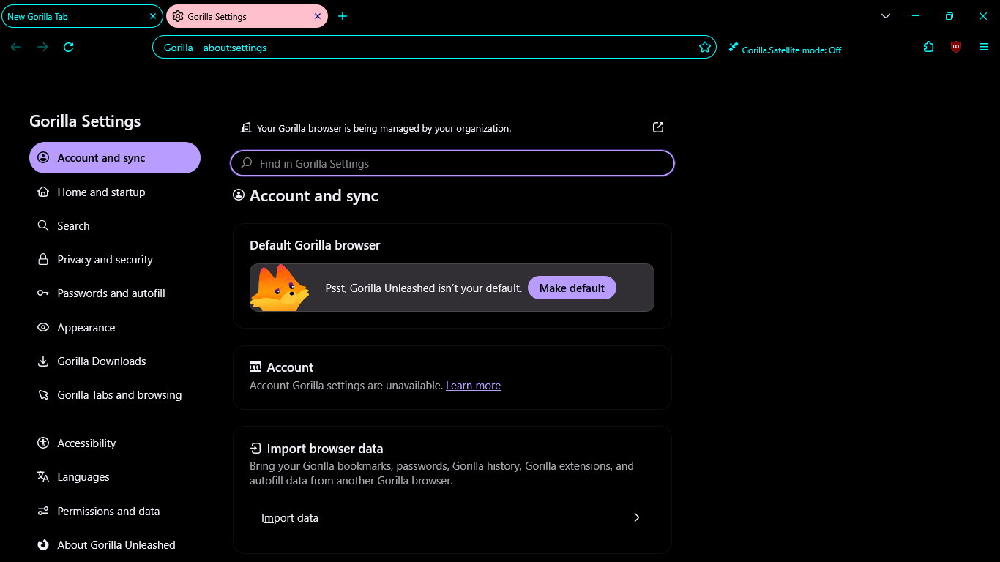

**Removed (D-157-40).** **Talks to:** as about:preferences

#### In plain words

**What it is.** about:settings was a second name for about:preferences, Gorilla's Settings page. Typing either address opened the same page. Picture a shop with two front doors, each with a different name painted above it, both opening into the same room. The analogy stops at safety. In a real building a second door is a second way in; here the room and its locks were the same whichever name you used, so the second name added no risk, and removing it takes none away.

**When you would meet it.** In Gorilla, only if you typed it. When Gorilla opens Settings itself, it opens about:preferences; it only switches to an about:settings tab if one is already open. The only other built-in feature that opened about:settings, IP Protection (a Mozilla feature), is locked off in Gorilla.

**What you see.** The picture, taken on the build before this change, shows the Settings page itself, with about:settings in the address bar and "Gorilla Settings" in the tab. On the left is the list of sections: Account and sync, Home and startup, Search, Privacy and security, Passwords and autofill, Appearance, Gorilla Downloads, Gorilla Tabs and browsing, Accessibility, Languages, Permissions and data, and About Gorilla Unleashed. At the top, a line says the browser is managed by your organisation. Below are a search box, "Find in Gorilla Settings", and the first cards: "Default Gorilla browser", with a cartoon fox and a "Make default" button; "Account", which says its settings are unavailable, with a "Learn more" link; and "Import browser data", with an "Import data" button.

**Does it talk to anyone?** Exactly what Settings itself can contact, and nothing more: both names opened the same page under the same rules. The companion page on the listed pages records that none of the pages about:about lists, Settings (about:preferences) among them, attempted a connection when it was opened. Its "Learn more" links open a web page only when you click them; which address each one opens was not part of this research.

**What we did, and why.** Removed (decision D-157-40). One page, one name. This closes no door, and we say so: the same page stays at about:preferences, so nothing an attacker could use has gone. The gain is in checking. Gorilla is designed against the company that ships the browser, and anyone who can lean on it; every channel is a door that must earn its place or be closed, and a door can only be checked if it can be found. Every name a page answers to is one more thing a reviewer has to find; our register of pages now has one entry per page.

**What it costs you.** If a bookmark or a saved tab points at about:settings, the address no longer opens anything: Gorilla shows its "Hmm. That address doesn’t look right." page instead, the same page any unknown about: address gets. Use about:preferences, or open Settings from the menu.

**The lesson.** Removing something is not always a security gain, and saying so matters. Here the gain is clarity: in a browser where each page has one name, the pages can be counted, and what can be counted can be checked.

#### For developers

*Line numbers are those of the source before the D-157-40 change; paths are relative to the Firefox 157 source tree.*

- **Registration (before removal):** `browser/components/about/AboutRedirector.cpp:136-138` and `browser/components/about/components.conf:30`. Hidden from about:about (register `was: hidden`). An alias that shows the same `preferences.xhtml` as about:preferences (`:100-101`).
- **Openers:** `openPreferences` only switches to an existing about:settings tab; otherwise it opens about:preferences (`utilityOverlay.js:491-511`). The only other built-in opener is IP Protection (`ipprotection-content.mjs:273`, `277`), which is locked off (`firefox.js:3751`). In Gorilla nothing opened it by itself.
- **Network and data:** identical to about:preferences: the same actors (`DesktopActorRegistry.sys.mjs:274`) and the same CSP exceptions (`nsContentSecurityUtils.cpp:1246-1257`). Register: `network: as about:preferences`.
- **Gorilla change (D-157-40):** the two registration lines are deleted from `browser/components/about/AboutRedirector.cpp` and `browser/components/about/components.conf`. This reduces attack surface by nothing, because the same document stays reachable as about:preferences; the reason is one page, one name.
- **Picture:** taken on build 28, before the change.

---

### `about:performance`: An old second name for the process manager

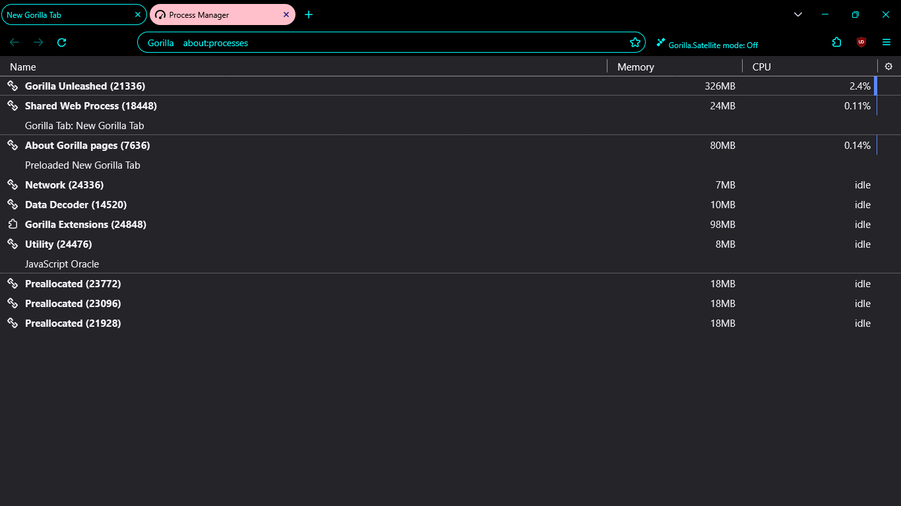

**Removed (D-157-40).** **Talks to:** none

#### In plain words

**What it is.** about:performance was a leftover second name for about:processes, Gorilla's process manager: the page that shows how much memory and processor time each part of the browser uses. It worked like an old street name still on a signpost after the street was renamed: follow the sign and you arrive in the same street, with the new name on the houses. The picture shows exactly that: the address bar reads about:processes. The analogy stops at usefulness. An old sign helps visitors with old maps; in Gorilla nothing used the old name, no link, button or menu, so the sign led nobody anywhere.

**When you would meet it.** Only if you typed it. Nothing in the browser linked to it.

**What you see.** The picture, taken on the build before this change, shows the process manager under a tab titled "Process Manager", with about:processes in the address bar. A table with the columns Name, Memory and CPU lists the parts of the browser: the main Gorilla Unleashed process; a shared web process holding the open tab; the process for Gorilla's own pages; the Network, Data Decoder, Gorilla Extensions and Utility processes; and spare processes started in advance ("Preallocated"). On the real page you can end a process or close a tab, and double-click a row to switch to its tab. The buttons that used to record a performance profile are gone in Gorilla (an earlier decision, D-157-36).

**Does it talk to anyone?** It contacts no one. It shows tab titles and the websites they come from, including private tabs, labelled as private, and all of that stays on your computer.

**What we did, and why.** Removed (decision D-157-40). The page itself stays, under its one name, about:processes. As with about:settings, removing the second name closes no door, since the same page is still there. Gorilla is designed against the company that ships the browser, and anyone who can lean on it; every channel is a door that must earn its place or be closed, and a door can only be checked if it can be found. A second name is one more place a reviewer has to know about.

**What it costs you.** The address about:performance no longer opens anything: Gorilla shows its "Hmm. That address doesn’t look right." page instead, the same page any unknown about: address gets. Type about:processes instead.

**The lesson.** Software collects leftovers: names outlive the reasons they were made. Each leftover is a place where a reviewer who checked the main name might not think to look. Fewer names, fewer places to miss.

#### For developers

*Line numbers are those of the source before the D-157-40 change; paths are relative to the Firefox 157 source tree.*

- **Registration (before removal):** `docshell/base/nsAboutRedirector.cpp:176-178` and `docshell/build/components.conf:24`. Hidden from about:about (register `was: hidden`). A leftover alias for about:processes; nothing in browser/, toolkit/ or devtools/ links to it.
- **Alias mechanics:** because about: is not a UI resource, the alias sets the result principal to about:processes (`nsAboutRedirector.cpp:280-309`). The picture shows about:processes in the address bar.
- **What the target does (about:processes):**
  - CPU and memory per process, tabs and subframes with titles and origins, and extensions; private tabs are shown, labelled as private (`aboutProcesses.js:559-575`);
  - kill process / close tab (`:1559-1570`);
  - double-click switches to the tab (`:1192-1206`);
  - profiler buttons hidden (`all.js:3751`); the pref is not locked, but the hand-off is refused (`devtools/.../shared/browser.js:96`);
  - Gorilla no longer draws the browser icon (`aboutProcesses.js:609-612`, D-157-35).
- **Network and data:** no network. Tab titles and origins, kept local. Register: `network: none`.
- **Gorilla change (D-157-40):** the two registration lines are deleted from `docshell/base/nsAboutRedirector.cpp` and `docshell/build/components.conf`.
- **Picture:** taken on build 28, before the change.

---

## Kept

### `about:neterror`: The 'problem loading page' screen

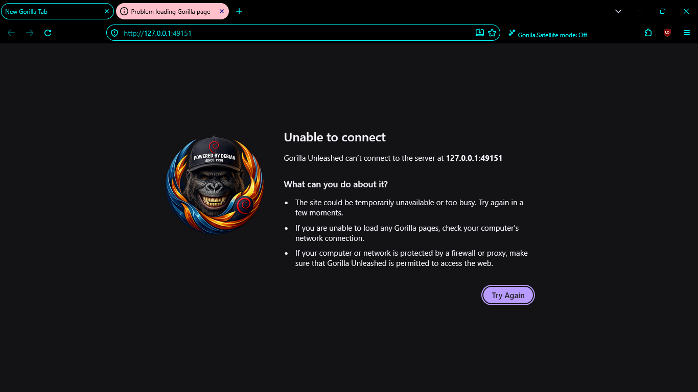

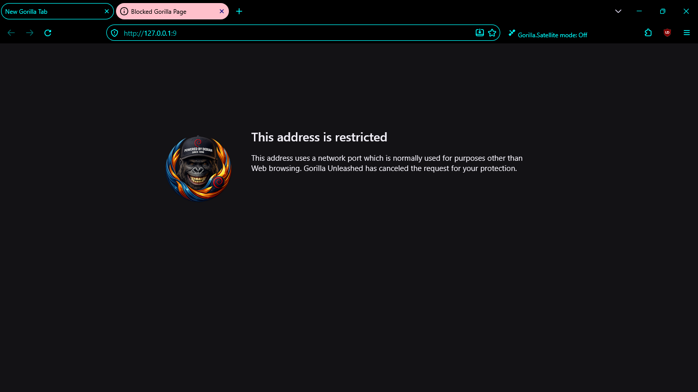

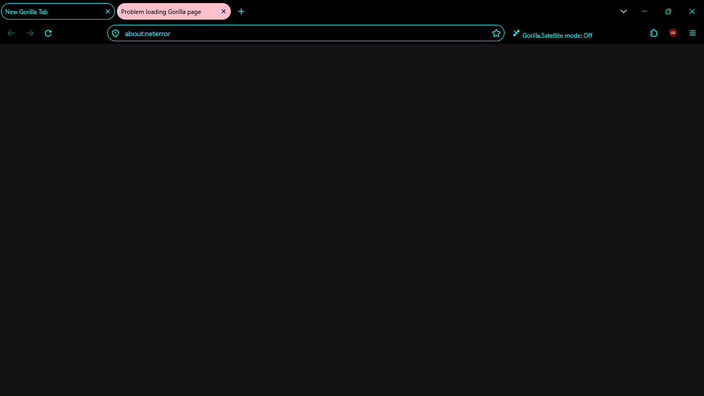

**Kept, changed (D-157-40).** **Talks to:** on click (Learn more to Mozilla's support site)

#### In plain words

**What it is.** about:neterror is the screen Gorilla draws when it could not fetch a page you asked for. Think of the slip the post office attaches to a letter it could not deliver: "addressee unknown", "refused", "no such street". The slip tells you that delivery failed and gives the most likely reason, so you can decide whether to correct the address, wait and try again, or give up. Where the comparison stops: the post office slip is written by someone else, far away, after the event; this screen is drawn by Gorilla itself, on your computer, from text it already carries, and nothing is fetched to show it.

**When you would meet it.** Whenever a page fails to load and no more specific error page applies. It is the default for every failed load: the site's name could not be found; the site refused the connection, cut it off or took too long to answer; you are offline; a proxy (a go-between computer that some networks send all traffic through) failed; the site sent you round in a loop of redirections; the site's own security rules forbade showing the page the way it was requested; or the encrypted connection could not be set up. Two kinds of failure have screens of their own instead: a bad certificate (about:certerror) and a failed HTTPS-Only upgrade (about:httpsonlyerror). Both have their own entries.

**What you see.** Four pictures. The first three show the real screen, produced by real failures on this computer; the fourth was taken by typing the address with no failure behind it.

- neterror-connection-refused.png: a program on this same computer refused the connection. On the left is the Gorilla emblem. On the right, the heading "Unable to connect" and a line naming the address that refused. Under a second heading, "What can you do about it?", come three suggestions: the site may be busy or down for a moment, so try again shortly; if no page loads at all, check your computer's network connection; if a firewall or proxy protects your computer or network, make sure Gorilla Unleashed is allowed to reach the web. Below them is one button, **Try Again**: it switches off offline mode if it was on, and loads the page again.
- neterror-restricted-port.png: the address used a port that Gorilla refuses. A port is the door number of a service on a computer: the address finds the building, the port finds the office inside it. Some door numbers belong to services that are not web pages, and Gorilla will not knock on them with a web request. The tab is titled "Blocked Gorilla Page", the heading reads "This address is restricted", and one sentence explains that the address uses a port normally used for things other than web browsing, so the request was cancelled for your protection. There is no button, because trying again would get the same answer.
- neterror-unknown-about-address.png: an about: address that no page answers to (here about:gorilla-no-such-page, made up for the test). Beside the Gorilla emblem, the heading reads "Hmm. That address doesn't look right.", a line says that Gorilla Unleashed can't connect to the server at about:gorilla-no-such-page, and under "What can you do about it?" the advice is to check that you typed the website address correctly. There is no button. This is also what you should see, from the new build on, when you type the address of a page that decision D-157-40 removed, such as about:crashparent; that is still to be confirmed on that build.
- about-neterror.png: the address about:neterror typed into the address bar, with no failure behind it. The tab is titled "Problem loading Gorilla page" and the page is empty and dark: it has no failure to describe.

Depending on the failure, the same screen can carry other controls that these pictures do not show: a **Restore default settings** button that puts the browser's encryption settings back to their defaults, and on some failures a **Learn more** link. The code also holds buttons for encrypted name lookups (DNS over HTTPS) and for the sign-in page of a café or hotel Wi-Fi network, but both of those features are locked off in Gorilla, so those buttons cannot appear. A Search button exists only in Mozilla's nightly development builds, not in Gorilla.

**Does it talk to anyone?**

- **On its own: in Gorilla, no one.** Until decision D-157-40 it did. When a site's name could not be found, the page made up a guess and looked it up without asking you: for a one-word address it tried www.<word>.com, and for other names the same name with www. in front (www.<host>). If the guess existed, the page offered it as a suggestion. The lookup was a DNS query. DNS is the internet's directory enquiries: you give a name, and it gives back the number of the computer that answers to it. Where that comparison stops: the directory you ask is whichever one your computer or network is set to use, and you never see the question being asked. The guess was a question, not a visit, but the directory, and anyone who watches it or can demand its records, learned a name you never typed. Gorilla no longer asks.
- **Only when you click.** **Learn more**, on the failures that show it, opens a page on Mozilla's support site. Its address is built from https://support.mozilla.org/1/firefox/%VERSION%/%OS%/%LOCALE%/, and Gorilla fills in the three blanks before the link opens, so the address itself tells Mozilla your browser's version, your operating system and your language. Nothing is sent unless you click it, and Gorilla has not changed this link. Some failures link instead to Mozilla's developer documentation at developer.mozilla.org, also only when clicked. **Try Again** contacts the site that failed, which is what you asked for in the first place.

**What we did, and why.** Kept, and changed. The Gorilla project designs against the company that ships a browser and against anyone who can lean on that company: every channel that can carry data out is a door that must earn its place or be closed. This page earns its place. Every failed load depends on it: it is the only way you learn why a page failed, the details of the failure can be read only from this page, and the site-information area at the left of the address bar recognises it by its address. Its one automatic door, the guessed lookup, is closed (decision D-157-40): a question you did not ask should not be asked in your name. The Learn more link stays because it opens only when you click it; its address still carries your version, operating system and language.

**What it costs you.** One hint. When a short address fails, the page no longer suggests the www. version (the "did you mean www.<word>.com" hint). You can still type the full address yourself. Nothing else changes.

**The lesson.** An error page is not a passive notice. In a modern browser it is a small program with privileges: it can reset settings, switch modes and, as here, make network requests while you are reading it. Helpfulness is the most common reason a program talks behind your back: the guess was made to save you some typing, and the price was telling a third party a name you never chose to reveal. When you judge a browser, watch what it does when things go wrong, not only when they go right.

#### For developers

Line numbers below are those of the source before the D-157-40 change.

- **Registration.** `docshell/base/nsAboutRedirector.cpp` (listed in `docshell/build/components.conf`), flags `URI_SAFE_FOR_UNTRUSTED_CONTENT | URI_CAN_LOAD_IN_CHILD | ALLOW_SCRIPT | HIDE_FROM_ABOUTABOUT`: hidden from about:about, scripted, may load in a content process.
- **What opens it.** `nsDocShell::DisplayLoadError` (`docshell/base/nsDocShell.cpp:3303`) chooses the error page. neterror is the default (`:3332`) for DNS failure, refused, reset or timed-out connections, offline, proxy errors, redirect loops, CSP/XFO, COOP/COEP and TLS failures (`:3335-3665`). `LoadErrorPage` builds `about:neterror?e=…&u=…&d=…` (`:3841-3876`) and loads it with the system principal (`:3904`).
- **Rendering.** `security.certerrors.felt-privacy-v1` is true (`browser/app/profile/firefox.js:3143`), so the newer error card is drawn (`toolkit/content/net-error-card.mjs:98-132`, `aboutNetError.mjs:1311-1335`); otherwise the older layout (`aboutNetError.mjs:398-631`).
- **Controls.** Try Again leaves offline mode and reloads (`aboutNetErrorHelpers.mjs:74-77`; `toolkit/actors/NetErrorParent.sys.mjs:601-605`). Restore default settings resets TLS prefs (`NetErrorParent.sys.mjs:616-625`). TRR (DNS-over-HTTPS) and captive-portal buttons (`:606-608`, `:659-683`). The page's privileged calls are limited by `toolkit/modules/RemotePageAccessManager.sys.mjs:108-159`.
- **Network, automatic (removed by D-157-40).** On a DNS failure the page called `RPMCheckAlternateHostAvailable` (`toolkit/actors/NetErrorChild.sys.mjs:127-199`; callers `aboutNetError.mjs:357-361` and `net-error-card.mjs:208,333-337`), which used URI fix-up and `checkHost` (`docshell/base/URIFixup.sys.mjs:578-634,1299-1314`) to resolve a guessed name: `www.<word>.com` for a one-word host, or `www.<host>`. A DNS query only, not an HTTP connection, and made with no user action.
- **Network, on click.** Learn more uses `app.support.baseURL` = `https://support.mozilla.org/1/firefox/%VERSION%/%OS%/%LOCALE%/` (`firefox.js:1653`, unchanged in Gorilla), so the URL discloses version, OS and locale to Mozilla. Some errors link to developer.mozilla.org (`toolkit/content/errors/net-errors.mjs:12-17`).
- **Unreachable in Gorilla.** Captive-portal login needs `&captive=true` (`nsDocShell.cpp:3858-3863`), but the captive-portal service is locked off (`firefox.js:4103`). The TRR-only panel and its firefox-source-docs link: TRR mode is locked to 5 (`firefox.js:4158`). The Search button is Nightly-only (`firefox.js:1449-1453`).
- **Why it cannot go.** `getNetErrorInfo` works only on this page (`dom/base/Document.cpp:1682-1690`), and the identity box keys off its URL (`browser/base/content/browser-siteIdentity.js:923`). If an error page's registration is missing, the load fails and no page is shown (`nsDocShell.cpp:3765-3770`).
- **Gorilla change (D-157-40).** `toolkit/actors/NetErrorChild.sys.mjs`: `RPMCheckAlternateHostAvailable` returns at once (marker `GORILLA D-157-40 (2026-10-08): no guessed lookups.`), so `checkHost` is never reached; the comment names both guesses (`www.<word>.com` for a single word, `www.<name>` for a name with one dot). The Glean events the page records are inert: Glean never starts (`toolkit/components/glean/xpcom/FOG.cpp:155-158`) and its upload pref is locked off (`firefox.js:3923`).
- **Unregistered about: addresses.** An about: address that nothing registers lands on this page with error code `malformedURI` (picture: about:gorilla-no-such-page). From the D-157-40 build on, the removed pages are expected to land here too; still to be confirmed on that build.
- **Surprising.** The guessed lookup ran on page load, without the user asking.

---

### `about:certerror`: The 'this site may be an impostor' warning

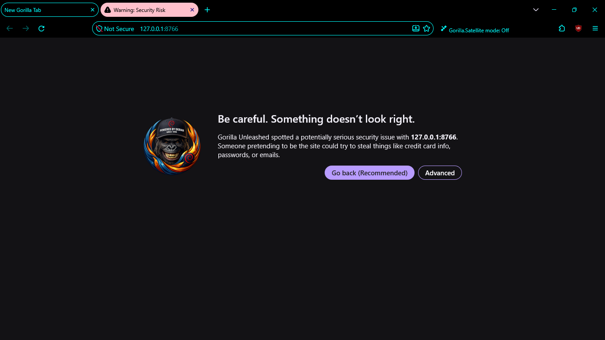

**Kept.** **Talks to:** on click (support links)

#### In plain words

**What it is.** When you open an address that starts with https, the site proves who it is with a certificate: a digital identity card, signed by an organisation that your browser trusts to check identities (a certificate authority). about:certerror is the warning Gorilla shows when that card fails the check. Think of a border officer examining a passport: if it has expired, is made out to a different name, or was issued by no country the officer recognises, the officer stops you and says why. Where the comparison stops: a border officer can phone the issuing country to ask; Gorilla checks only against the list of authorities it carries on your computer, and phones no one. And unlike at a border, you can overrule the officer yourself.

**When you would meet it.** When a site's certificate has expired, was issued for a different name than the one you typed, was signed by no authority Gorilla trusts, or was signed by the site itself (self-signed: an identity card printed at home). It can also appear when something on the path between you and the site presents its own certificate in place of the site's, which is called interception. For sites that have told browsers in advance to accept nothing less than a valid certificate (HSTS), or that fix which certificates they use (pinning), a stricter version appears with no way to continue.

**What you see.** Two pictures.

- certerror-self-signed.png shows the real warning, produced by a test site on this computer whose certificate was signed by itself. The tab is titled "Warning: Security Risk", with a warning triangle, and the address bar shows a crossed-out shield and "Not Secure". Beside the Gorilla emblem, the heading reads "Be careful. Something doesn't look right." The text says that Gorilla Unleashed spotted a potentially serious security issue with the site, and that someone pretending to be the site could try to steal things such as card details, passwords or emails. Two buttons: **Go back (Recommended)**, highlighted, which returns to the previous page or, if there is none, to your home page; and **Advanced**, which opens the details.
- about-certerror.png was taken by typing about:certerror, with no failed site behind it. The address bar shows the crossed-out shield and "Not Secure", the tab reads "Problem loading Gorilla page", and the page is empty and dark.

The warning has more controls than the first view shows. **Accept the Risk and Continue** stays inactive for a short pause after the page appears, so that a page cannot trick you into clicking it by surprise. Once clicked, it adds an exception: Gorilla will accept this certificate for this site from then on, permanently, unless you are in a private window. **View Certificate** opens the certificate in Gorilla's own certificate viewer (about:certificate), on your computer. **Copy** puts the technical details on your clipboard.

**Does it talk to anyone?**

- **On its own: no one.** Firefox can check whether your connection is being intercepted by contacting Mozilla at mitmdetection.services.mozilla.com. In Gorilla that check is blocked twice: the code returns before making it, and the settings that would allow it are locked.
- **Only when you click.** The help links open pages on Mozilla's support site (support.mozilla.org) about insecure connections, security errors and wrong clocks. They are built from the same support address as the network error page's Learn more link, so they too carry your browser's version, operating system and language. When the certificate belongs to a slightly different name, the page can offer a link to that name; clicking it visits that site. **Accept the Risk and Continue** connects to the site you asked for, under the exception.

**What we did, and why.** Kept. This page is the only explanation you get of an untrusted certificate, and the only way to make an exception for one. Without it, a failed check would leave you with no explanation and no way forward. The door that mattered here, the automatic interception check that reported to Mozilla, was closed before this change and stays closed. What remains contacts no one unless you click.

**What it costs you.** Nothing new from this change. Two older effects remain. First, Firefox's special explanation for interception needs the check that contacted Mozilla, so Gorilla cannot show it; which general warning appears in its place was not measured. Second, one of the page's hints about a wrong clock on your computer relies on the time reported by Mozilla's settings server, which Gorilla never contacts; what the page shows in that case was not measured.

**The lesson.** The padlock is not a promise that a site is honest. It means only that the site holds an identity card signed by someone your browser trusts. That makes the list of trusted signers one of the most important things in a browser, and the override button one of the most dangerous: an exception, once made, is remembered. And a warning page that phones home to help you also tells someone where you were when it fired; in Gorilla, this one does not.

#### For developers

Line numbers below are those of the source before the D-157-40 change.

- **Registration.** Browser layer only: `browser/components/about/AboutRedirector.cpp:60-63` (listed in `browser/components/about/components.conf`), flags `URI_SAFE_FOR_UNTRUSTED_CONTENT | URI_CAN_LOAD_IN_CHILD | ALLOW_SCRIPT | HIDE_FROM_ABOUTABOUT`. It serves the same document as about:neterror.
- **What opens it.** `docshell/base/nsDocShell.cpp:3446-3492` chooses certerror for bad-certificate errors; HSTS or pinned sites get the no-override variant (`:3487-3490`).
- **Controls.** Go Back: back in history, or to the home page (`toolkit/actors/NetErrorParent.sys.mjs:98-115,626-628`). Accept the Risk and Continue becomes clickable only after `security.dialog_enable_delay` (`toolkit/content/net-error-card.mjs:1259-1311`) and adds a certificate override, permanent unless the window is private (`:1222-1233`; `browser/app/profile/firefox.js:1658`); only this page may call that API (`dom/base/Document.cpp:1819-1828`). View Certificate opens the local about:certificate (`NetErrorParent.sys.mjs:641-656`). Copy writes to the clipboard.
- **Network, automatic: none.** The upstream MITM-priming check that contacts mitmdetection.services.mozilla.com is blocked twice: an early return (`NetErrorParent.sys.mjs:152-157`) and locked prefs (`firefox.js:1659-1661`).
- **Network, on click.** SUMO pages connection-not-secure, security-error and time-errors (`aboutNetError.mjs:875-941`), built on `app.support.baseURL` (`firefox.js:1653`), so version, OS and locale are in the URL; and the domain-mismatch link to the suggested host (`aboutNetError.mjs:1185-1192`).
- **Gorilla change.** None in D-157-40; the interception check was cut earlier (above).
- **Surprising.** The clock-skew hint relies on Remote Settings server time (`aboutNetErrorHelpers.mjs:251-264`), which is inert because Remote Settings never syncs (`services/settings/Utils.sys.mjs:108-121`). The interception-specific text shows only on interception errors, which Gorilla can no longer detect.

---

### `about:httpsonlyerror`: The 'no secure version available' page

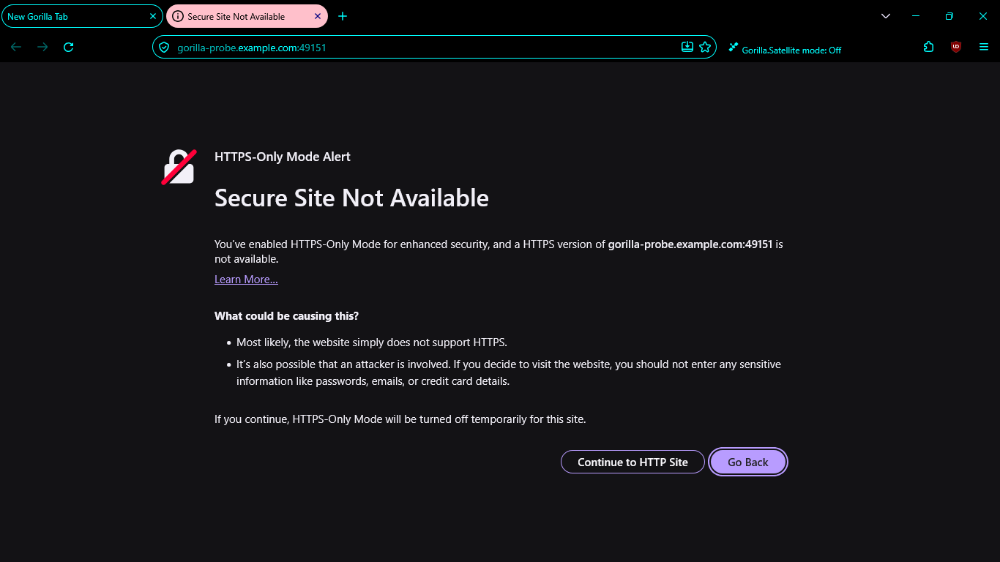

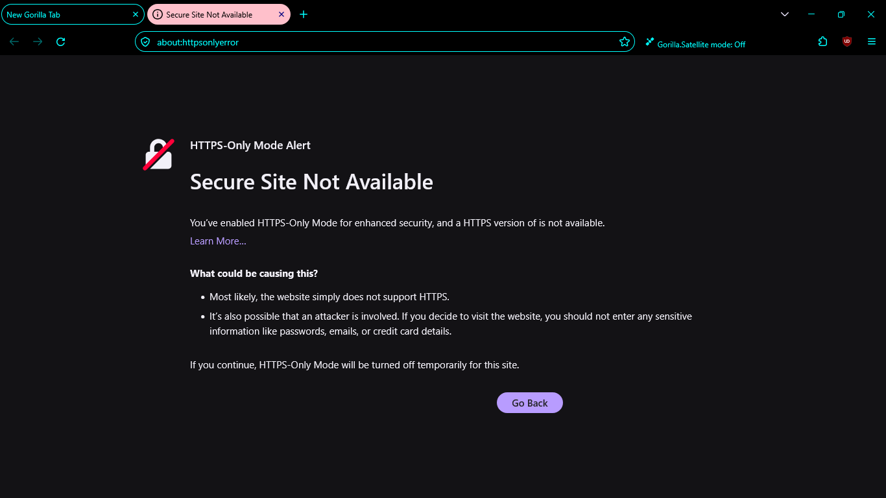

**Kept.** **Talks to:** on click (Continue to the plain-HTTP site; support links)

#### In plain words

**What it is.** A website can be reached two ways: https, where what you send and receive is sealed in transit, or plain http, where it travels open, readable and changeable by anyone on the path. Gorilla's HTTPS-Only mode, on from the start, tries the sealed way for every address. about:httpsonlyerror is the page you get when the sealed way fails. Think of telling your post room to accept sealed envelopes only: when a sender only ever sends postcards, the post room does not pass the postcard on; it stops and asks whether you want postcards from this sender. Where the comparison stops: the post room already holds the postcard, whereas Gorilla has fetched nothing over plain http yet, and asks before the open connection is made. And your yes is not for ever: the page says the mode is turned off for that site temporarily.

**When you would meet it.** When Gorilla upgraded an address from http to https and the https attempt failed in a way the upgrade could have caused. Most often the site does not offer https at all. Because HTTPS-Only is on in Gorilla, you meet this page on every site that still offers only plain http.

**What you see.** Two pictures.

- httpsonlyerror-plain-http-site.png shows the real page, produced by a real failure. A made-up test name was pointed at this same computer inside Gorilla's own settings, so no name lookup left the computer, and Gorilla was asked to open it over plain http. HTTPS-Only upgraded the address to https, and the https attempt was refused. (The test could not use an address such as localhost: HTTPS-Only never upgrades an address that points straight back at your own computer.) The tab is titled "Secure Site Not Available". Beside a padlock with a red line through it, a small heading, "HTTPS-Only Mode Alert", sits above the large heading "Secure Site Not Available". A sentence says that you have enabled HTTPS-Only Mode for enhanced security and that an HTTPS version of the test address is not available; in Gorilla you did not have to enable it, because the mode is on from the start. Then come a **Learn More…** link; the question "What could be causing this?" with two answers: most likely the website does not offer HTTPS at all, and it is also possible that an attacker is involved, so if you visit the site you should not enter sensitive information such as passwords, emails or card details; and the sentence "If you continue, HTTPS-Only Mode will be turned off temporarily for this site." Two buttons sit at the bottom: **Continue to HTTP Site** and **Go Back**. **Continue to HTTP Site** stays inactive for a short pause after the page appears, so that a page cannot trick you into clicking it; then it reloads the site over plain http, with an exception for that site. When the page appears inside a frame (a page embedded in another page), both buttons are removed.
- about-httpsonlyerror.png was taken by typing about:httpsonlyerror, with no failed site behind it. It shows the same text, but the space for the site's name is empty and only the **Go Back** button appears.

**Does it talk to anyone?**

- **On its own: no one.** Firefox has an option that, when the upgrade fails, quietly tries the same site with www. in front (https://www.<host>) and suggests it if it answers. That option is off by default, and Gorilla leaves it off.
- **Only when you click.** **Learn More…** opens a page about HTTPS-Only settings on Mozilla's support site (support.mozilla.org); inside frames, a second link goes to a page about mixed content (secure pages that load some of their parts over plain http). Like the other support links, their address carries your browser's version, operating system and language. **Continue to HTTP Site** makes a plain, unsealed http connection to the site: everything on that connection can be read and changed on the way.

**What we did, and why.** Kept. In the Gorilla threat model a plain http connection is an open channel: whoever carries it can read it and change it, and anyone who can lean on them can ask them to. HTTPS-Only closes that channel by default. With the mode on, this page is the only place that tells you why an http site failed, and the only way to make an exception for one site. Without it, those sites would fail with no explanation and no way through, and the temptation would be to switch the protection off altogether.

**What it costs you.** Nothing from the page itself. The mode it serves costs you one extra page and one click on each site that has no secure version.

**The lesson.** A protection is only as good as its escape hatch. A block with no explanation gets switched off by the first person who needs one old site, and from then on it protects no one. A good block says what happened, names the risk, makes you pause before you overrule it, and limits the overrule to one site. And remember that "secure" describes the journey, not the destination: a sealed envelope can still carry a scam.

#### For developers

Line numbers below are those of the source before the D-157-40 change.

- **Registration.** `docshell/base/nsAboutRedirector.cpp` (listed in `docshell/build/components.conf`), flags `URI_SAFE_FOR_UNTRUSTED_CONTENT | URI_CAN_LOAD_IN_CHILD | ALLOW_SCRIPT | HIDE_FROM_ABOUTABOUT`.
- **What opens it.** HTTPS-Only is on in Gorilla (`browser/app/profile/firefox.js:3935-3936`). When an upgraded load fails in a way the upgrade could have caused, this page replaces the normal error page (`docshell/base/nsDocShell.cpp:3667-3672`; `dom/security/nsHTTPSOnlyUtils.cpp:665-689,805-814`).
- **Controls.** Go Back (`toolkit/actors/AboutHttpsOnlyErrorParent.sys.mjs:14-15`). Continue to HTTP Site has a click-jacking delay (`toolkit/components/httpsonlyerror/content/errorpage.js:154-169`) and calls `document.reloadWithHttpsOnlyException()` (`:114-122`), which only this page may call (`dom/base/Document.cpp:1693-1702`). Inside frames the buttons are removed (`errorpage.js:36-43`).
- **Network, automatic: none.** The automatic fetch of `https://www.<host>` (`toolkit/actors/AboutHttpsOnlyErrorChild.sys.mjs:20-50`) needs `dom.security.https_only_mode_error_page_user_suggestions`, which defaults to false and which Gorilla leaves alone (`modules/libpref/init/StaticPrefList.yaml:5085-5088`).
- **Network, on click.** SUMO `https-only-prefs` and `mixed-content`, built on `app.support.baseURL` (`errorpage.js:28-34`), so version, OS and locale are in the URL. Continue makes a plain, unencrypted HTTP request to the site.
- **Why it stays.** With HTTPS-Only on, it is the only explanation of a failed upgrade and the only way to add a per-site exception; also used by `browser/base/content/browser-siteIdentity.js:185,919-921`.
- **Gorilla change.** None in D-157-40.
- **Surprising.** It dispatches neterror's `AboutNetErrorLoad` event (`errorpage.js:174-177`), for the test harnesses. In the direct-open picture the host is empty and Continue to HTTP Site is absent.
- **Pictures.** httpsonlyerror-plain-http-site.png: a made-up host resolved to this computer through `network.dns.localDomains` (no DNS query leaves the machine) and opened over http; the upgraded https load was refused, which produced this page. A loopback address cannot be used for this test: `nsHTTPSOnlyUtils::LoopbackOrLocalException` always exempts loopback addresses and localhost, whatever `dom.security.https_only_mode.upgrade_local` says. about-httpsonlyerror.png is a direct open.

---

### `about:tabcrashed`: The 'your tab crashed' page

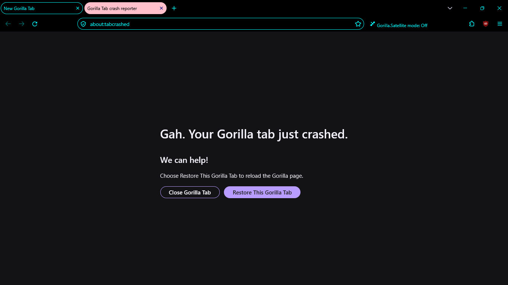

**Kept.** **Talks to:** none

#### In plain words

**What it is.** Gorilla, like Firefox, runs web pages in separate programs called processes, so that one misbehaving page cannot take the whole browser down with it. When the process behind a tab dies, about:tabcrashed takes the tab's place and offers to bring it back. Think of the fuse box in a house: when one circuit trips, only the rooms on that circuit go dark, the rest of the house stays lit, and you can switch the circuit back on. Where the comparison stops: a fuse trips to protect the house from a fault, while a process can die for many reasons, and this page only loads the page again; it does not find or fix the cause.

**When you would meet it.** When the process behind a tab crashes or is killed. One process can serve several tabs, so several tabs can crash together; those in the background show this page when you select them.

**What you see.** Two pictures.

- about-tabcrashed.png was taken by typing about:tabcrashed, with no real crash behind it. The tab is titled "Gorilla Tab crash reporter". A large heading announces that your Gorilla tab has crashed, followed by "We can help!" and a line inviting you to choose Restore This Gorilla Tab to load the page again. Two buttons: **Close Gorilla Tab**, which closes the tab, and **Restore This Gorilla Tab**, which loads it again through session restore (the part of the browser that remembers your open tabs).
- about-crashcontent.png shows the same page after a real crash of a tab's process, provoked with about:crashcontent on the build before decision D-157-40 (build 28). The address bar still shows the address that caused the crash, and the tab's icon carries a small red warning mark. Text and buttons are the same.

The code has a third button, **Restore All**, for bringing back every crashed tab at once; it is not in these pictures. Neither picture has a form for sending a crash report. That form appears only when a crash report file exists, and Gorilla is built without the crash reporter, so no such file is ever written.

**Does it talk to anyone?** It contacts no one. In Firefox this page can send a crash report to Mozilla. In Gorilla three things stop that: the crash reporter is not built, so no report exists; the code that would send a report gives up before sending when there is none; and the setting that allows sending is locked off (in Firefox it is on).

**What we did, and why.** Kept. It is the only page that brings back a crashed tab, and session restore depends on it. Its one door to the outside, the crash report, was closed three times over before this change: no reporter built, no report written, sending locked off.

**What it costs you.** Nothing. The unused report form and its text are still inside the browser, but they are never shown.

**The lesson.** A crash report is a snapshot of a program at the moment it failed, taken while it was busy with your pages. That makes crash reporting, however well meant, one of the richest channels a browser has. Recovery and reporting are separate things: Gorilla keeps the recovery and leaves out the reporting.

#### For developers

Line numbers below are those of the source before the D-157-40 change.

- **Registration.** `browser/components/about/AboutRedirector.cpp` (listed in `browser/components/about/components.conf`), flags `URI_SAFE_FOR_UNTRUSTED_CONTENT | ALLOW_SCRIPT | HIDE_FROM_ABOUTABOUT`; no `URI_CAN_LOAD_IN_CHILD`.
- **What opens it.** The frame loader fires a crash event (`dom/base/nsFrameLoader.cpp:3731-3750`); `browser/components/tabbrowser/Tabbrowser.sys.mjs:9802-9843` passes it to the tab-crash handler; `sendToTabCrashedPage` moves the tab to the parent process and shows the error (`browser/modules/ContentCrashHandlers.sys.mjs:542-556` → `docshell/base/nsDocShell.cpp:3527-3542`). Background tabs show it when selected (`ContentCrashHandlers.sys.mjs:487-519`).
- **Controls.** Close Tab, Restore This Tab and Restore All (`browser/actors/AboutTabCrashedParent.sys.mjs:43-58`, which calls `removeTab` or the session-restore functions).
- **Network: none.** The report form is hidden unless a crash dump exists (`browser/base/content/aboutTabCrashed.css:5-6`). `getDumpID` returns nothing without the crash reporter (`ContentCrashHandlers.sys.mjs:734-737`), and `maybeSendCrashReport` returns before submitting (`:579-582`). `browser.tabs.crashReporting.sendReport` is locked false (`browser/app/profile/firefox.js:2869`; upstream it is true).
- **Why it stays.** It is the only UI that restores crashed tabs, and SessionStore keys off its URL (`browser/components/sessionstore/SessionStore.sys.mjs:3031-3035`).
- **Gorilla change.** None in D-157-40.
- **Surprising.** The dormant report form and its strings still ship (`browser/locales/en-US/browser/aboutTabCrashed.ftl:13,15`). A harmless regular-expression bug at `aboutTabCrashed.js:35`: the replace never matches.
- **Pictures.** about-tabcrashed.png is a direct open; about-crashcontent.png is the page produced by a real content-process crash (about:crashcontent on build 28).

---

### `about:framecrashed`: The icon for a crashed frame

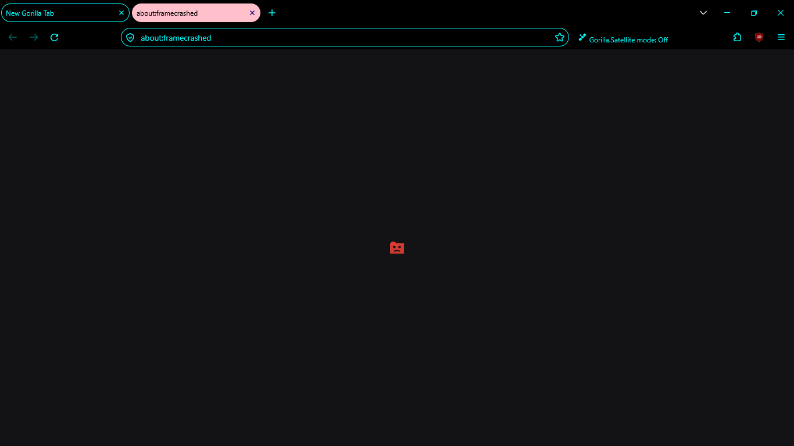

**Kept.** **Talks to:** none

#### In plain words

**What it is.** Many web pages hold other pages inside a rectangle: a video player, a map, an advert. Each embedded page is called a frame, and Gorilla may run a frame from another site in a process of its own. When that process dies, about:framecrashed fills the frame's rectangle with a small icon, so you can see that this part broke while the rest of the page carries on. Think of a shop window full of screens where one screen fails: the shop puts an "out of order" card on that screen and the rest of the window keeps playing. Where the comparison stops: this card has no words and nothing to press; it is a picture and nothing more.

**When you would meet it.** When the process running a frame from another site crashes or is killed, and the page around it survives.

**What you see.** The picture (about-framecrashed.png) was taken by typing about:framecrashed, so the page fills the whole tab instead of one rectangle inside a page. It is dark and empty apart from a small red icon in the centre: a folder shape with a sad face. There is no text and no button.

**Does it talk to anyone?** It contacts no one. The page runs no script at all. In Firefox a notification bar can appear alongside it, with a Learn more link to Mozilla's support site and a Submit report button; in Gorilla that bar never appears, because it needs the crash reporter, which is not built.

**What we did, and why.** Kept. It is harmless: a picture with no script and no network. Removing it would only leave a blank hole where the frame was, with nothing to tell you that something broke.

**What it costs you.** Nothing.

**The lesson.** Running parts of one page in separate processes keeps a failure in one part from spreading to the rest; this small icon is what that separation looks like when it works. It also shows the test every hidden page in this document goes through: a page with no script, no links and no network has nothing to hide, and earns its place by being useful.

#### For developers

Line numbers below are those of the source before the D-157-40 change.

- **Registration.** `browser/components/about/AboutRedirector.cpp:69-72` (listed in `browser/components/about/components.conf`), flags `URI_SAFE_FOR_UNTRUSTED_CONTENT | URI_CAN_LOAD_IN_CHILD | HIDE_FROM_ABOUTABOUT`. No `ALLOW_SCRIPT`, so no script runs.
- **What opens it.** Abnormal shutdown of an out-of-process iframe's process → `ShowSubframeCrashedUI` (`docshell/base/CanonicalBrowsingContext.cpp:3309-3346`, also `:2392`) → `dom/ipc/BrowserBridgeChild.cpp:202-208` → `dom/base/nsFrameLoaderOwner.cpp:328-354` → `docshell/base/nsDocShell.cpp:3543-3546`.
- **Page.** An empty body showing a centred crash icon (`browser/base/content/aboutFrameCrashed.html:7-31`; `browser/themes/shared/aboutFrameCrashed.css:5-12`).
- **Network: none.** The accompanying notification bar, with a SUMO Learn more (`browser/modules/ContentCrashHandlers.sys.mjs:48-49,411-430`) and Submit report, never appears without the crash reporter (`:319-322`).
- **If removed.** The result of the load is ignored (`nsFrameLoaderOwner.cpp:346-347`), so the frame would presumably stay blank. The research classed the page replaceable (cosmetic).
- **Gorilla change.** None in D-157-40.
- **Surprising.** The tooltip asks the user to "please submit a report" (`browser/locales/en-US/browser/contentCrash.ftl:10`), which Gorilla cannot do.

---

### `about:sessionrestore`: The page that offers your tabs back

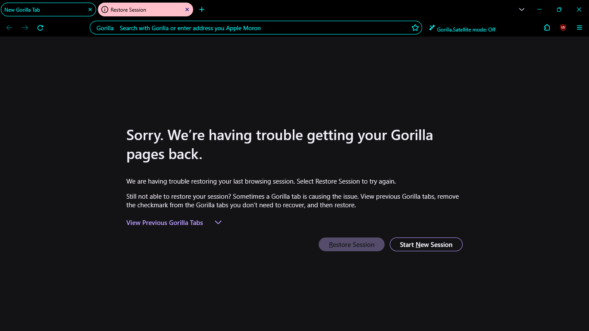

**Kept.** **Talks to:** on click (restored tabs load)

#### In plain words

**What it is.** If Gorilla crashes, it can put your tabs back when it starts again. Usually it does that by itself. In some cases it asks first, and this is the page that asks. Picture dropping your bag on the pavement: a passer-by gathers everything that spilled and holds it out, and you can take it all back, take only some of it, or leave it and start with an empty bag. If one thing in the bag is what made it split, you can leave that one behind. The analogy stops at what you can see. The visible items are your tabs, but the page also holds, out of sight, a full record of your last session: each tab's back-and-forward history, what you had typed into forms, and your session cookies (short-lived cookies a website sets for one visit, which normally vanish when the browser closes).

**When you would meet it.** After a crash, when Gorilla decides not to restore by itself:
- you started Gorilla in Safe Mode;
- the count of recent crashes is above the limit (the limit is 1);
- the crashed session is older than 6 hours.

Then your whole session is replaced by one tab holding this page. If the only thing open when Gorilla crashed was the "welcome back" page (about:welcomeback), that tab is turned into this page too. Otherwise you never see it, unless you type its address.

**What you see.** The picture was taken by typing the address in a fresh profile, so there was no crashed session to show. The tab is titled "Restore Session". The heading reads "Sorry. We’re having trouble getting your Gorilla pages back." Below it, two short paragraphs say that you can try to restore the session again and, if a tab is causing the problem, untick it first. "View Previous Gorilla Tabs" opens a list of your previous windows and tabs, each with a tick box; you can also restore a single tab from it. Two buttons follow: "Restore Session", dimmed in the picture because there was nothing to restore, and "Start New Session", which opens a blank page or your home page instead.

**Does it talk to anyone?** The page itself contacts no one: its own rules forbid it to fetch anything, and the small site icons in the list come from Gorilla's records on your computer, without a connection. Only when you press "Restore Session" do the restored tabs load their websites, as they would have if nothing had crashed.

**What we did, and why.** Kept, unchanged. It is the only way back to a crashed session: without it, the tab after a crash would show an error and the session could not be restored. The "welcome back" page uses the same code. In the Gorilla threat model, the company that ships the browser, and anyone who can lean on it, is the adversary, and every channel is a door; this page opens no channel to anyone, and everything it holds stays on your computer.

**What it costs you.** The safety net is also a record. To offer your tabs back, Gorilla keeps your whole session, including form contents and session cookies, and this page carries all of it. Anyone who can sit at your computer after a crash can see the titles and addresses of everything you had open.

**The lesson.** A browser that can put your tabs back after a crash must have written your session down before it crashed. Crash recovery and privacy pull in opposite directions, and every browser chooses where to stand. It is worth knowing that the record exists, and what is in it.

#### For developers

*Line numbers are those of the source before the D-157-40 change; paths are relative to the Firefox 157 source tree.*

- **Registration:** `browser/components/about/AboutRedirector.cpp:133-135`. Parent process, chrome privileges. Hidden from about:about (register `shown: hidden`).
- **Trigger:** `#needsRestorePage` (`SessionStore.sys.mjs:7249-7294`), when restoring after a crash, returns true in Safe Mode, when recent crashes exceed `browser.sessionstore.max_resumed_crashes` (1, `firefox.js:1588`), or when the session is older than 6 hours. The session is then replaced by a single tab carrying the crashed state (`:729-742`). A crashed lone about:welcomeback tab is converted to this page (`:743-753`). `browser.sessionstore.resume_from_crash` is true (`firefox.js:1535`).
- **Behaviour:**
  - reads the state from the hidden `#sessionData` field (`aboutSessionRestore.js:58-71`; `.xhtml:65`);
  - shows a tree of windows and tabs (`:82-129`);
  - restores all or selected tabs through `SessionStore.setWindowState` (`:138-198`), or a single tab (`:212-237`);
  - "Start New Session" loads about:blank or the home page (`:200-210`).
- **Network:** none from the page (CSP at `.xhtml:14`). Favicons come from the local store with no connection (`:112-116`). Network only on click, when restored tabs load.
- **Data:** all previous tab titles and URLs. The hidden field holds the whole session: back/forward history, form data (`browser.sessionstore.privacy_level` 0, `firefox.js:1579`) and session cookies (`SessionStore.sys.mjs:5525`), stored as an object (`SessionStoreUtils.cpp:345-351`).
- **Gorilla change:** none. Register: `verdict: keep`, `network: on click (restored tabs load)`. about:welcomeback shares the script (`aboutSessionRestore.js:47-53`). Setting `max_resumed_crashes` to -1 turns automatic restore on (`SessionStore.sys.mjs:7279-7282`), but Safe Mode still forces the page (`:7266-7269`).

---

### `about:welcomeback`: Your old tabs back after a Refresh

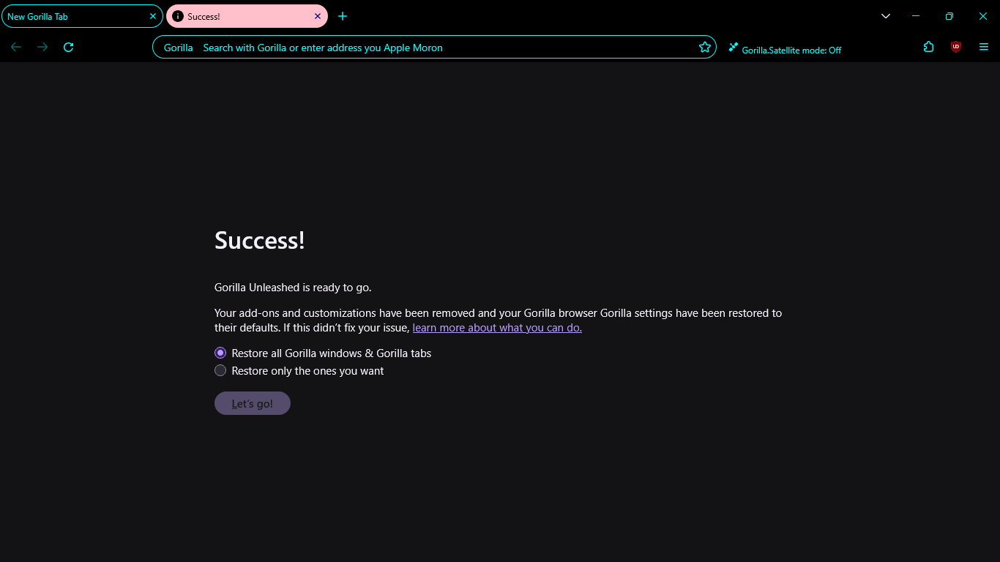

**Kept.** **Talks to:** on click (support link; restored tabs load)

#### In plain words

**What it is.** about:welcomeback is the page you see after "Refresh Gorilla", the repair that removes your add-ons and customisations and puts your settings back to their defaults. It offers you your old windows and tabs back. It works like coming home after a deep clean: the cleaners have packed everything that was on your desk into a labelled box, and the first thing they ask is whether to put it all back or only the things you pick. Where the comparison stops: the box holds only the address and title of each old tab, whether it was pinned or hidden, and its tab group; the pages themselves load again from the websites when you restore them, and the small site icons are not kept.

**When you would meet it.** Only after you start a Refresh yourself. You can start one from the Troubleshooting Information page (about:support), or from the notice the browser can show when a profile has gone unused. Both appear only where a Refresh is possible. After the Refresh, the browser turns your old session into a single tab holding this page, with the list of your old windows and tabs tucked inside the page.

**What you see.** The picture shows the page opened by typing its address, so there was nothing to restore. The tab is titled "Success!" and carries an information icon. The page says "Success!" in large type, then that Gorilla Unleashed is ready to go, then that your add-ons and customisations have been removed and your settings restored to their defaults. A link, "learn more about what you can do.", is there for when the Refresh did not fix your problem. Below are two choices: "Restore all Gorilla windows & Gorilla tabs", which is selected, and "Restore only the ones you want". Choosing the second shows a list of your old windows and tabs, each with a tick box. The "Let's go!" button restores what you chose.

**Does it talk to anyone?** Not by itself. Its security rules let it load only the browser's own files and pictures stored inside the page, and it runs in the browser's main process, not in the processes that run websites. Two things reach the network, both only when you click: the "learn more" link opens a help article on support.mozilla.org, and restoring your tabs loads your own websites again, as opening them would.

**What we did, and why.** Kept. It is the only way back to your tabs after a Refresh. Without it, a refreshed profile would open on an "address not understood" error and your old tabs would have to be recovered by hand. It serves you, it contacts no one by itself, and it sits unused until you ask for a Refresh. In principle about:sessionrestore, the page shown after a crash, could do the same job, because it uses the same script and the same hidden list; the gain would be small, so we left it as it is.

**What it costs you.** Nothing.

**The lesson.** Hidden does not mean suspicious. Many hidden pages exist because they make sense at one moment only: after a crash, after a reset, after an error. The useful test for any page is not whether it is listed, but whom it serves and whom it talks to. This one serves you and talks to no one unless you click.

#### For developers

Line numbers are those of the source before the D-157-40 change. D-157-40 did not change this page.

**Registration**

- `browser/components/about/AboutRedirector.cpp:151-153`, listed in `components.conf:34`. The page is `aboutWelcomeBack.xhtml` (`migration/jar.mn:6`).
- Flags (upstream): `ALLOW_SCRIPT | HIDE_FROM_ABOUTABOUT | IS_SECURE_CHROME_UI`. It runs in the parent process.

**What opens it**

- Only a reset started by the user. That sets `MOZ_RESET_PROFILE_SESSION=1` (`nsAppRunner.cpp:5721-5739`).
- The Firefox profile migrator then converts the old session into a one-tab session containing only about:welcomeback, with the old state kept in the page's form data (`SessionMigration.sys.mjs:31-99`; `FirefoxProfileMigrator.sys.mjs:293-331`, which also sets `resume_session_once`).
- The reset itself starts from about:support (`aboutSupport.js:2081-2115`) or from the unused-profile notification (`BrowserGlue.sys.mjs:521-565`). Both require `ResetProfile.resetSupported()` (`ResetProfile.sys.mjs:55-80`).

**Behaviour**

- `aboutWelcomeBack.xhtml` offers "restore all" or "choose", a tab tree (hidden until "choose" is selected) and a restore button.
- It is driven by `aboutSessionRestore.js`, shared with about:sessionrestore. The script reads the hidden `#sessionData` field (lines 21-76) and restores through `SessionStore.setWindowState` (lines 138-180).
- The migrated state keeps only URL, title, pinned and hidden flags and tab groups; favicons are dropped (`SessionMigration.sys.mjs:43-75`).
- Special-cased elsewhere: C++ form handling (`SessionStoreUtils.cpp:349-352`, `SessionStoreFormData.cpp:150`, `SessionStoreHelper.sys.mjs:62-66`); swapped for about:sessionrestore after a crash (`SessionStore.sys.mjs:743-753`); not wrapped again (`SessionStore.sys.mjs:7258-7262`); treated as an initial page (`browser.js:755`).

**Network**

- Automatic: none. CSP allows chrome:, resource: and data: only (`aboutWelcomeBack.xhtml:15-18`).
- On click: the troubleshooting link goes to support.mozilla.org (`app.support.baseURL`, `firefox.js:1653`); restoring reloads the user's own sites.

**Why it stays (register verdict: keep)**

- Essential for Refresh: without it a refreshed profile opens on an "address not understood" error and the old tabs must be recovered by hand.
- Replaceable in principle by pointing `SessionMigration.sys.mjs:90` at about:sessionrestore, which uses the same script and the same `sessionData` field. The registration (`AboutRedirector.cpp:151-153`, `components.conf:34`), `migration/jar.mn:6`, `aboutWelcomeBack.css`, the welcome-back strings and the about:welcomeback literals in the session-store code could then go. The gain is small.

**Surprising**

- Its telemetry counter (`SessionStore.sys.mjs:747`) is dead in Gorilla.
- Gorilla's only change in this flow is the migrator's icon.

---

### `about:restartrequired`: The page that asks for a restart

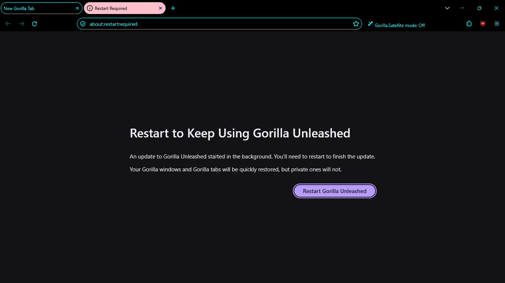

**Kept.** **Talks to:** none

#### In plain words

**What it is.** A browser is not one program but a team of separate programs, called processes, working together: one runs the window, others run the websites. They must all be the same version. If the browser's files on your computer are replaced while it is running, a newly started process comes from the new files and no longer matches the rest. Gorilla then refuses to use it and shows this page. Think of a choir handed new sheet music halfway through a concert: singers who arrive late carry the new edition, the others the old one, and the conductor stops and starts again so that everyone sings from the same page. The analogy stops at carrying on. A choir could struggle through with two editions; the browser will not run mismatched parts at all, so the tab that needed the new part shows this page instead.

**When you would meet it.** When a new Gorilla build is installed while Gorilla is still open, and a tab then needs a new process. The page's words speak of an update that "started in the background". Gorilla never updates itself: updates are pulled and installed when you decide, never pushed. So in Gorilla, the update this page speaks of is always a new build that was installed over the running one.

**What you see.** The tab is titled "Restart Required". The heading reads "Restart to Keep Using Gorilla Unleashed". Below it: "An update to Gorilla Unleashed started in the background. You’ll need to restart to finish the update." and "Your Gorilla windows and Gorilla tabs will be quickly restored, but private ones will not." There is one button, "Restart Gorilla Unleashed". It closes Gorilla and starts it again; after the restart, the tab goes back to the address it was trying to open.

**Does it talk to anyone?** It contacts no one. Its own rules allow it to load only the browser's built-in files.

**What we did, and why.** Kept, unchanged. It is rarely seen, but it is the only explanation the browser gives for this situation: without it, the tab would be left blank and marked as crashed, with no word of why. In the Gorilla threat model, the company that ships the browser, and anyone who can lean on it, is the adversary, and every channel that can carry code or data is a door to be closed unless it earns its place. This page carries nothing in or out, so it is no door at all.

**What it costs you.** Nothing, apart from the restart itself when it appears. Private windows are not restored, as the page says.

**The lesson.** In Gorilla, an update is something you do, not something done to you. This page is the one place where your own installation shows up inside the browser, and the response is a single restart button: no download, no account, no connection.

#### For developers

*Line numbers are those of the source before the D-157-40 change; paths are relative to the Firefox 157 source tree.*

- **Registration:** `browser/components/about/AboutRedirector.cpp:122-123`. Privileged, parent process. Hidden from about:about (register `shown: hidden`).
- **Trigger:** a new content process with a different build ID, because the files on disk changed under the running browser.
  - detection: `nsFrameLoader.cpp:3635-3660`, `3726-3745`;
  - handling: `Tabbrowser.sys.mjs:9821-9843` → `ContentCrashHandlers.sys.mjs:521-532`;
  - the docshell then builds `about:restartrequired?e=…&u=…` (`nsDocShell.cpp:3547-3549`, `3841-3856`).
  - `MOZ_FORCE_BUILDID_MISMATCH=1` forces it (`nsFrameLoader.cpp:3636-3641`).
  - Gorilla has updates disabled, so in Gorilla the trigger is a new build installed over a running one.
- **Behaviour:** one button, `Services.startup.quit(eRestart|eAttemptQuit)` (`aboutRestartRequired.js:21-36`). Session store puts the original URL back from `u=` (`TabState.sys.mjs:253-284`).
- **Network and data:** none (CSP `default-src chrome:`, `.xhtml:9-12`).
- **Gorilla change:** none. Register: `verdict: keep`, `network: none`. Classed ESSENTIAL as a rarely seen safety net: without it the error page fails and the tab is left blank and marked crashed, with no explanation. The only replacement would be changing `ContentCrashHandlers` to use about:tabcrashed.

---

### `about:reader`: Reader View, the clean reading page

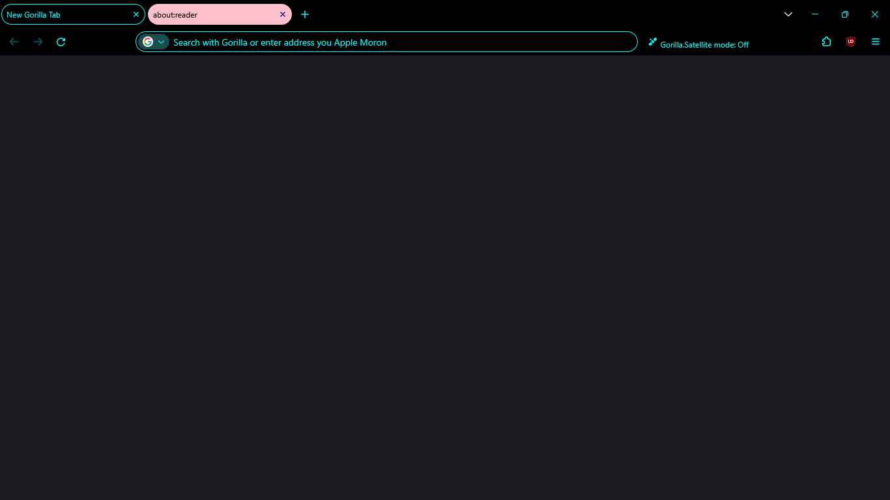

**Kept.** **Talks to:** automatic (the images and media the article names, from any host; a re-fetch of the article with its cookies when it is not cached)

#### In plain words

**What it is.** Reader View takes an article and shows only its text and pictures, in one clean column, without adverts, menus and side panels. It is like a large-print copy of a newspaper article: the same words and photographs, on plain paper, in print you choose. The analogy stops at where the copy comes from. A large-print copy is made once and handed to you. Reader View still loads the article's pictures from wherever the article keeps them, and when it has no copy to hand it goes back to the website and fetches the article again, showing that website your cookies for it, as a normal visit would.

**When you would meet it.** When you ask for it:
- the Reader View button in the address bar, which appears when a page looks like an article;
- the View menu, or Ctrl+Alt+R;
- an add-on that opens it;
- a tab that was in Reader View, brought back by session restore.

**What you see.** The picture was taken by typing the address with no article named, so there is nothing to show: an empty dark grey page under a tab titled about:reader. With an article, the page shows its title and text in one column, with controls to close Reader View, change the text and layout, change the theme and colours, and Read Aloud. Read Aloud uses the speech engine built into Windows, on your own computer.

**Does it talk to anyone?** Yes, but only the article's side of the web:
- **Automatically:** the article's pictures and media load from whatever addresses the article names, which may be other websites than the article's own.
- **Automatically:** when there is no copy of the article to hand (you reload it, you come back to it through history, the tab was restored, or an add-on opened it), Gorilla downloads the article again, with the cookies Gorilla keeps for that website and only those, and follows any redirects.
- **When you leave Reader View:** the original page is loaded again.

It contains no Mozilla addresses. It shows only the current article, in the same sealed-off part of the browser (the "process") as that website. The small site icon comes from Gorilla's own records on your computer.

**What we did, and why.** Kept. Reader View is a feature you choose, and it reaches only addresses the article itself names; it opens no channel to Mozilla. In the Gorilla threat model the adversary is the company that ships the browser, and anyone who can lean on it, and every channel is a door. Reader View's doors lead back to the website you chose to read and the places that website keeps its pictures, not to the browser's maker. We state its two network habits, the pictures and the re-download with cookies, instead of hiding them.

**What it costs you.** In the cases listed above, an extra download of the article with your cookies for that website, so the website sees you load the article again. Leaving Reader View reloads the page. Gorilla is also set to include addresses in Reader View's error messages, which go to the Browser Console, a log on your own computer.

**The lesson.** A feature that looks as if it only rearranges what is already on screen can still go back to the network. Ask of any feature: does it use what I already have, or does it fetch again, and with what about me attached? Reader View sometimes fetches again, with your cookies, from the article's own side of the web.

#### For developers

*Line numbers are those of the source before the D-157-40 change; paths are relative to the Firefox 157 source tree.*

- **Registration:** `browser/components/about/AboutRedirector.cpp:114-117` and `browser/components/about/components.conf:24`. Flags `URI_SAFE_FOR_UNTRUSTED_CONTENT` and `URI_MUST_LOAD_IN_CHILD`, without `MAKE_LINKABLE`, so websites cannot link to it. Hidden from about:about (register `shown: hidden`).
- **Openers:** the Reader View button (`navigator-toolbox.inc.xhtml:374-380`); View menu and Ctrl+Alt+R (`browser-menubar.inc.xhtml:182-183`, `browser-sets.inc.xhtml:250-251`); extensions (`ext-tabs.js:742-744`); session restore (`RestoreTabContentObserver.cpp:87-92`). Path: `AboutReaderParent.toggleReaderMode` (`:211-224`) → the child parses and caches the article (`AboutReaderChild.sys.mjs:39-55`) → the parent navigates to `about:reader?url=…` (`AboutReaderParent.sys.mjs:84-87`, `238-245`; `ReaderMode.sys.mjs:55-66`). The button appears when a page looks readable (`AboutReaderChild.sys.mjs:233-241`; `reader.parse-on-load.enabled`, `all.js:3530`).
- **Behaviour:** accepts only http, https and file URLs (`AboutReader.sys.mjs:86-103`) and falls back to about:blank otherwise (`:101`); shows the cached article or downloads it (`:1249-1290`); offers close, text and layout, theme and colours, and Read Aloud (`:415-416`). Read Aloud uses the local Windows speech engine (`dom/media/webspeech/synth/windows/SapiService.cpp`). The favicon comes from local Places data (`AboutReaderParent.sys.mjs:98-115`).
- **Network, automatic:**
  - CSP `img-src data: *; media-src *` (`aboutReader.html:10-11`): the article's images and media load from any host.
  - With no cached article (reload, restore, history, extension), an XHR fetches the page again **with cookies** (`mozAnon:false`, first-party isolated) and follows redirects (`ReaderMode.sys.mjs:224-245`; `AboutReader.sys.mjs:1266-1275`).
  - Leaving Reader View reloads the original page (`ReaderMode.sys.mjs:73-118`).
- **Scope:** no Mozilla URLs. It shows the current article only, in that site's process (`ProcessIsolation.cpp:192`, `436-460`). `reader.errors.includeURLs=true` (`firefox.js:2908`) writes URLs to the Browser Console.
- **Gorilla change:** none. Register: `verdict: keep`, `network: automatic (the images and media the article names, from any host; a re-fetch of the article with its cookies when it is not cached)`. Removal would take the whole feature: delete `AboutRedirector.cpp:114-117` and `components.conf:24`, set `reader.parse-on-load.enabled=false`, remove the AboutReader actor (`DesktopActorRegistry.sys.mjs:181-197`) and the menu entry and key (`browser-sets.inc.xhtml:48`, `250-251`). Print's "Simplify page" calls `ReaderMode.parseDocument` directly (`PrintingChild.sys.mjs:81-116`) and would keep working.
- **Surprising:** the cookie-bearing re-download described above.

---

### `about:opentabs`: Split View's 'choose a tab' pane

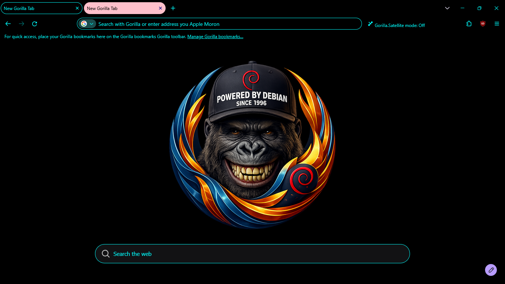

**Kept.** **Talks to:** none

#### In plain words

**What it is.** Split View shows two tabs side by side in one window. When you start a split, the second half needs a tab, and about:opentabs is the pane that lets you choose it. It works like laying papers side by side on a desk: one is in front of you, and you point at the pile to choose the one that goes next to it. The analogy stops at the pile. On a desk you can pick any paper in the room; this pane lists only the tabs of the current window that are not pinned and not already in a split.

**When you would meet it.** When you start a Split View: with the Add Split View command or its keyboard shortcut, or from the menu that opens when you right-click a tab.

**What you see.** Opened by typing its address, outside a split, it does not show its list: it sends you to the new tab page. That is what the picture shows: Gorilla's new tab page, with the Gorilla logo in the centre, a "Search the web" box below it, a line at the top about placing bookmarks on the bookmarks toolbar, and a tab titled "New Gorilla Tab". Inside a split, the pane lists the tabs you can choose, with a search box; clicking one puts it into the other half.

**Does it talk to anyone?** It contacts no one. Its rules allow pictures only from inside the browser, and the small site icons come from Gorilla's local cache without a connection. The tab titles and addresses it lists never leave your computer.

**What we did, and why.** Kept. Split View is switched on in Gorilla, and this pane is part of it. It could be replaced by sending its three openers to the new tab page and removing the checks for its address in several places, but nothing would be gained: it opens no channel to Mozilla or anyone else. In the Gorilla threat model, the company that ships the browser, and anyone who can lean on it, is the adversary, and a door is any channel that can carry code or data out; this pane has none. It does run with the browser's full privileges, because it reaches into the window to move tabs, and that is exactly why it matters that it touches nothing outside your computer.

**What it costs you.** Nothing.

**The lesson.** Some of what looks like the browser's own controls is built from web pages. Those pages run with full power over the browser, so the safe ones are those that touch nothing outside your computer. When you check a browser, the hidden pages that form part of its controls deserve as much attention as the ones that show websites.

#### For developers

*Line numbers are those of the source before the D-157-40 change; paths are relative to the Firefox 157 source tree.*

- **Registration:** `browser/components/about/AboutRedirector.cpp:95-97`. Parent process with the system principal; it reaches into the chrome window (`opentabs-splitview.mjs:36-44`). Hidden from about:about (register `shown: hidden`).
- **Openers:**
  - the Add Split View command and its shortcut (`browser-commands.js:85-101`; `browser-sets.inc.xhtml:375`);
  - the tab context menu (`tab-context-menu.js:1388-1392`);
  - the message action `OPEN_TAB_IN_SPLITVIEW` (`SpecialMessageActions.sys.mjs:902-906`).
- **Behaviour:** lists the window's unpinned, unsplit tabs, with a local search (`opentabs-splitview.mjs:117-141`); clicking a tab puts it into the split (`:106-115`); outside a split it redirects to about:newtab (`:153-166`), which is what the picture shows.
- **Network and data:** none. CSP `img-src data: chrome:` (`opentabs.html:9-12`); favicons come from the local cache without a connection (`PlacesUIUtils.sys.mjs:1737-1745`). Personal data: tab titles and URLs, local.
- **Gorilla change:** the branding favicon `<link>` was removed from `opentabs.html` (D-157-35). Split View is enabled (`browser.tabs.splitView.enabled`, `firefox.js:2884`). Register: `verdict: keep`, `network: none`.
- **Classed REPLACEABLE, kept:** to remove it, point the three callers at about:newtab and drop the URL checks in `Tabbrowser.sys.mjs:4474`, `10671`; `tabsplitview.mjs:364`, `399-401`; `split-view-footer.js:168`; `tab-context-menu.js:825`; `browser.js:751`.
- **Surprising:** the message action force-enables `browser.tabs.splitView.enabled` (`SpecialMessageActions.sys.mjs:903`).

---

### `about:devtools-toolbox`: The frame that holds the developer tools

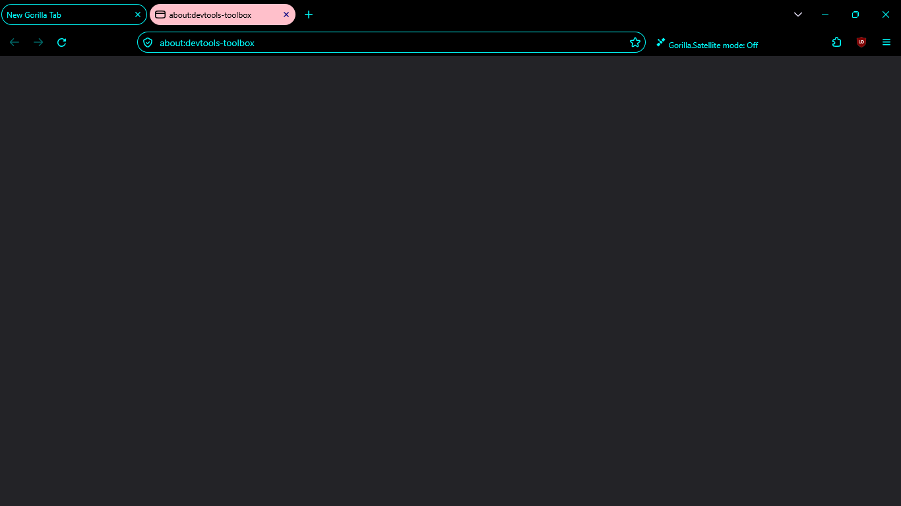

**Kept.** **Talks to:** when used (the inspected site and its source maps)

#### In plain words

**What it is.** about:devtools-toolbox is the page inside which the browser's developer tools run: the Inspector (the building blocks of a web page), the Console (messages and errors from the page's scripts), the Debugger (the page's code, step by step), the Network panel (every request the page makes) and the rest. You open them with the F12 key. It works like the workbench in a workshop that all the tools are mounted on: you never think about the bench, you use the tools, but take the bench away and no tool has anywhere to sit. Where the comparison stops: a bench is passive, while this page runs with the browser's own highest privileges, in its main process, and can read whatever the page you are inspecting exposes.

**When you would meet it.** Every time you open the developer tools, though you never see its address: each toolbox is loaded at it. It shows up as an address in a tab when you press "Inspect" on about:debugging, the page for debugging tabs, add-ons and background workers.

**What you see.** Typed by hand, as in the picture, it is an empty dark page with a small window-shaped icon on the tab. It was not told which tab or add-on to inspect, so it had nothing to show. Opened with F12, the same page fills with the toolbox.

**Does it talk to anyone?** The research found no automatic traffic to Mozilla. When you use the tools, they fetch what the page you are inspecting needs from that page's own site: its files and, where the site provides them, its "source maps" (files that turn a site's compressed code back into readable code). In the toolbox's menu, the Documentation and Community links open Mozilla's web pages when you click them.

Gorilla had already closed three doors around it: a performance recording can only be handed to a viewer running on your own computer (localhost); the Browser Toolbox, which points these tools at the browser itself, is locked off; and the server that lets another computer debug this browser is locked off. DevTools also has no Performance panel in Gorilla.

**What we did, and why.** Kept. Without this page there are no developer tools: removing it removes F12 entirely. The developer tools serve the person at the keyboard. They are how anyone, not only Mozilla, can see what a web page really does: which addresses it calls, which scripts it runs, what it stores. A browser that asks you to check its claims has to keep the instrument you check them with. It contacts no one on its own, and the doors around it that reached further are shut.

**What it costs you.** Not measured. The tools take space in the browser's files, and memory while they are open; we have not measured how much. If you never press F12, they stay closed. If you want no developer tools at all, an enterprise policy called DisableDeveloperTools blocks this page.

**The lesson.** A privileged page is not bad in itself; what matters is whom it works for. This page has more access than almost any other, and it points that access at the websites you choose to inspect, when you ask. Compare about:asrouter, also a console: that one pointed messages at you. The same kind of tool can face either way.

#### For developers

Line numbers are those of the source before the D-157-40 change. D-157-40 did not change this page.

**Registration**

- Not in the C++ redirector tables: a JS about-module component registered in `devtools/startup/components.conf:7-27`, only when `MOZ_DEVTOOLS == 'all'`, which browser builds turn on (`browser/moz.configure:17`).
- `AboutDevToolsToolboxRegistration.sys.mjs:12-31` maps it to chrome://devtools/content/framework/toolbox.xhtml with full chrome (system) privileges in the parent process. Flags: `ALLOW_SCRIPT | ENABLE_INDEXED_DB | HIDE_FROM_ABOUTABOUT`.

**What opens it**

- Every time DevTools opens: every in-window toolbox frame is pointed at it (`toolbox-host-manager.js:135-138`; `toolbox.js:453`; frames created at `toolbox-hosts.js:769-790`).
- about:debugging's "Inspect" opens it as a tab with `?type=…&id=…` (`debug-targets.js:109-111`).
- It reads whatever the debugged target exposes.

**Special-cased elsewhere**

- `ContextMenuChild.sys.mjs:846-857`; `QuickActionsLoaderDefault.sys.mjs:160-179`; `devtools-browser.js` (lines 180, 253 and 451-487); the data: and blob: image allow-list at `nsContentSecurityUtils.cpp:1345`.

**Network**

- Automatic: the research found no automatic traffic to Mozilla.
- On use: the inspected site's resources and source maps (`devtools.source-map.client-service.enabled`, `firefox.js:3467`).
- On click: the Documentation and Community links (`MeatballMenu.js:41-46`).

**Gorilla's existing changes around it**

- Performance profiles may only go to a viewer on localhost (`devtools/client/performance-new/shared/browser.js`); DevTools has no Performance panel.
- The Browser Toolbox (`devtools.chrome.enabled`) and the remote debugging server (`devtools.debugger.remote-enabled`) are locked off (`firefox.js:4116-4117`).

**Why it stays (register verdict: keep)**

- Essential while DevTools ships: removing the registration breaks F12 entirely.
- The only clean ways to drop it are to build without DevTools, or to use the `DisableDeveloperTools` policy, which already blocks this page (`Policies.sys.mjs:1160-1170`).

---

### `about:cache-entry`: The detail view of one cached item

**Kept.** **Talks to:** on click (the cached address)

#### In plain words

**What it is.** When Gorilla downloads a page, a picture or a script, it keeps a copy, so that it need not download the same thing again. That store of copies is the cache. about:cache, a listed page kept for people who look after networks, shows the cache's index; about:cache-entry is what opens when you click one entry in that index. Picture an office that photocopies every letter it receives and files the copies, so that nobody has to ask the sender again. about:cache is the filing index. about:cache-entry is one copy pulled out and laid on the desk: first the envelope details, then the whole letter. The analogy stops at what gets copied. An office photocopy shows the letter; the browser's copy also keeps the notes that travelled with it, including cookie values a website set, and this page prints them as plain text.

**When you would meet it.** Only if you open about:cache and click an entry. Gorilla never opens it by itself, and websites cannot link to it.

**What you see.** The picture was taken by typing the address with no entry named, so the page is empty: a black page, with about:cache-entry in the tab and in the address bar. Opened from about:cache, it shows:
- the entry's address (its "key"), as a link;
- how many times it was fetched, its dates, when it expires, its size, and whether it came over a secure connection;
- every piece of information stored with it (the "metadata"), including the headers: the short notes a website sends before the content itself, such as cookies it wants your browser to keep;
- the whole stored content, written out as raw numbers (a "hex dump": the bytes exactly as the computer keeps them).

There are no buttons. The only thing to click is the address.

**Does it talk to anyone?** It fetches nothing by itself: its own rules allow it to load only the browser's built-in files. If you click the address at the top, Gorilla opens that address, an ordinary visit to that website that you chose. Looking at an entry does not even change its fetch count, so it leaves no mark in the cache.

**What we did, and why.** Kept. Without it, every entry link on about:cache would fail, and about:cache is the page network administrators use to see what a browser has stored. It opens no channel to Mozilla or to anyone else, so in the Gorilla threat model, where the company that ships the browser and anyone who can lean on it are the adversary, it is not a door. We are plain about what it shows: cached addresses, the headers of requests and responses, and the stored content itself. Set-Cookie values from cached responses (the cookie values websites sent to your browser) can appear in plain text, because one of the stored copies of the headers keeps them. It can also be pointed at the private-browsing cache, which is kept in memory. All of this stays on your computer: the page shows what the cache already holds and collects nothing new.

**What it costs you.** No network and no speed. The cost is on your own computer: anyone who can sit at your Gorilla can open about:cache and read, entry by entry, which addresses you loaded, what the websites sent back, and cookie values from cached responses. Removing this page would not remove that data; the cache itself holds it.

**The lesson.** Your browsing leaves copies on your own computer, in more detail than most people expect. Privacy is not only about what leaves the machine; it is also about what stays on it, and who else can sit down at it. A browser that hides its diagnostic pages does not hold less data; it only shows you less of it.

#### For developers

*Line numbers are those of the source before the D-157-40 change; paths are relative to the Firefox 157 source tree.*

- **Registration:** `netwerk/build/components.conf:285-291`, main process only (line 290). Hidden from about:about (register `shown: hidden`). Its flags lack `MAKE_LINKABLE` (`nsAboutCacheEntry.cpp:108-111`), so web pages cannot link to it.
- **Opener:** only the entry links on about:cache (`nsAboutCache.cpp:368-395`). The browser never opens it by itself.
- **Behaviour:**
  - parses `?storage=&context=&eid=&uri=` (`nsAboutCacheEntry.cpp:201-262`);
  - opens the entry with `OPEN_READONLY|OPEN_SECRETLY`, so fetch counts are not updated (`:193-195`);
  - prints the key as a link, fetch count, dates, expiry, size and whether it is secure (`:315-430`);
  - prints every metadata element (`:437-438`, `482-514`);
  - prints a hex dump of the whole cached body (`:445-468`, `29-79`).
  - No actions apart from the key link.
- **Network:** nothing automatic; the page's CSP is `default-src chrome:` (`:150-151`). Clicking the key link opens the cached URL (`:342-350`).
- **Data:** cached URLs, request and response headers, response bodies. The `context` parameter can name the private-browsing memory cache (`nsAboutCache.cpp:210-232`, `nsAboutCacheEntry.cpp:254`). The values of request headers named in `Vary` are stored, with cookies hashed (`nsHttpChannel.cpp:6435`).
- **Surprising:** `response-head` is flattened with Set-Cookie removed (`nsHttpHeaderArray.cpp:414-425`), but `original-response-headers` is written without that removal (`nsHttpHeaderArray.cpp:454-476`, written at `nsHttpChannel.cpp:6478-6479`). The page prints both, so Set-Cookie values from cached responses can appear in plain text.
- **Gorilla change:** none. The research classes it REMOVABLE (delete `components.conf:285-291`, optionally `netwerk/protocol/about/moz.build:19`, ideally together with about:cache at `components.conf:278-284`). The register keeps it (`verdict: keep`, `network: on click (the cached address)`) as the detail view behind about:cache, which stays for network administrators.

---

### `about:blank`: The empty page every tab starts as

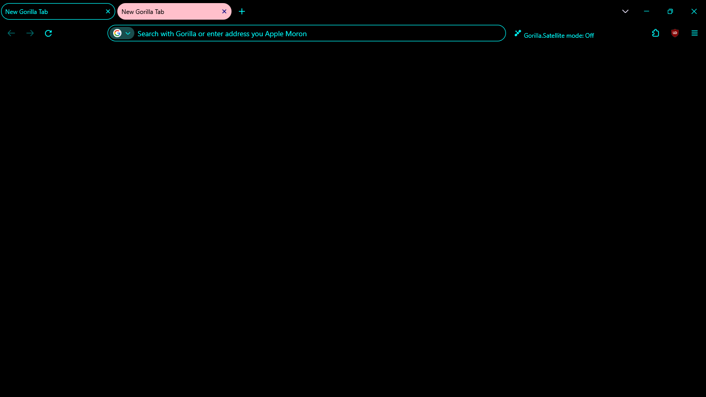

**Kept.** **Talks to:** none

#### In plain words

**What it is.** about:blank is a page with nothing in it. It works like the blank top sheet of a new notepad: before anyone writes a word, the sheet is already there. Every new tab, every new window and every empty frame inside a website starts as one of these sheets, and the real page is written over it. The analogy stops at ownership. A notepad belongs to whoever bought it; an about:blank page takes on the identity of whatever created it. If a website opens an empty window, that window counts as the website's own page, with the website's permissions and limits. It is not a page of Gorilla's.

**When you would meet it.** Mostly without noticing:
- for a moment, as the first page of every new tab and window, before the page you asked for arrives;
- as your start page, if Gorilla is set to start with a blank page;
- after a crash, when you press "Start New Session" on the restore page (about:sessionrestore);
- when Reader View is given an address it does not accept (it accepts only http, https and file addresses);
- when a website opens a new window with nothing in it, or puts an empty frame in its page.

**What you see.** Nothing, on purpose. The picture shows a black page under a tab titled "New Gorilla Tab". There is no heading, no text and no button. The address bar is empty, as it is for a new tab.

**Does it talk to anyone?** It contacts no one. The page has no content, so there is nothing in it that could fetch anything.

**What we did, and why.** Kept, unchanged. The HTML standard, the rulebook every browser follows, defines about:blank, and Gorilla's own code relies on it in many places: the rules that decide a tab's first page, the browser's list of "nothing loaded yet" pages, and the check that asks "is this page empty?". Gorilla is designed against the company that ships the browser, and anyone who can lean on that company; every channel that can carry code or data out is a door that must earn its place or be closed. about:blank is not a door. It carries nothing in or out. Removing it would break the browser and most websites, and close nothing.

**What it costs you.** Nothing.

**The lesson.** In a browser, even an empty page has an owner. Browser security follows who created a page, not what is written on it. That is why a blank window opened by a website is the website's window, with the website's limits. When you wonder whether something on your screen is "the browser" or "the site", ask who opened it.

#### For developers

*Line numbers are those of the source before the D-157-40 change; paths are relative to the Firefox 157 source tree.*

- **Registration:** `netwerk/build/components.conf:272-277`. Flags (`netwerk/protocol/about/nsAboutBlank.cpp:34-39`): `URI_SAFE_FOR_UNTRUSTED_CONTENT`, `URI_CAN_LOAD_IN_CHILD`, `MAKE_LINKABLE`, `HIDE_FROM_ABOUTABOUT`.
- **Channel:** `nsAboutBlank::NewChannel` returns an empty `text/html` stream (`nsAboutBlank.cpp:14-31`). The about: handler wraps it as a nested `moz-safe-about:` URI so that security checks treat it as safe (`nsAboutProtocolHandler.cpp:91-109`).
- **Openers:**
  - first document of new tabs and windows (`BrowserContentHandler.sys.mjs:385`);
  - start page when `browser.startup.page` is 0 (`BrowserContentHandler.sys.mjs:743-771`);
  - "Start New Session" on about:sessionrestore (`aboutSessionRestore.js:201-206`);
  - Reader View's fallback for a URL it refuses (`AboutReader.sys.mjs:101`);
  - web content, through `window.open()` and `<iframe>` without `src`.
- **Dependants:** `NS_IsAboutBlank` (`netwerk/base/nsNetUtil.cpp:2810`); the docshell initial-document logic (`nsDocShell.cpp:1122-1133`, `2501`); the browser's list of initial pages (`browser.js:747`).
- **Network and data:** none.
- **Gorilla change:** none. Register: `verdict: keep`, `network: none`. Classed ESSENTIAL: the HTML standard defines it.
- **Surprising:** the document takes the origin of whoever creates it (`dom/base/nsNodeInfoManager.cpp:341`, `caps/ContentPrincipal.cpp:134`). What it shows belongs to that page, not to the browser.

---

### `about:srcdoc`: The label for frames without an address

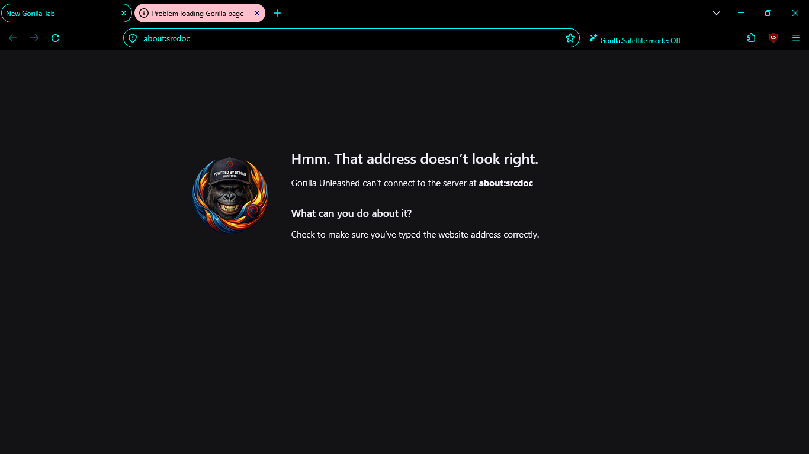

**Kept.** **Talks to:** none

#### In plain words

**What it is.** A website can place a smaller page inside its own page, in a box called a frame (an "iframe"). Usually the frame shows a page fetched from an address. A website can also write the frame's content straight into its own page, so there is nothing to fetch. That kind of frame has no address of its own, so the browser gives it the label about:srcdoc. Think of an envelope marked "By hand" where the postal address would go: it tells the sorting office that the letter travels with its sender and is not to be posted anywhere. Try to post something to "By hand" and the post office cannot deliver it; type about:srcdoc and the browser cannot open it either. The analogy stops at the courier. Nobody carries anything: the page already holds the text, and the browser builds the frame from it on the spot. The label exists only so that the browser's security checks let the frame through.

**When you would meet it.** Never on screen, unless you type its address. It works behind the scenes on websites that use frames written this way.

**What you see.** Typing the address gets an error page, because the browser refuses to open it, on purpose. The picture shows Gorilla's error page: the Gorilla logo on the left; the heading "Hmm. That address doesn’t look right."; the line "Gorilla Unleashed can’t connect to the server at about:srcdoc"; and, under "What can you do about it?", the advice to check that the address was typed correctly. The tab is titled "Problem loading Gorilla page". There are no buttons.

**Does it talk to anyone?** It contacts no one. The content of such a frame comes from the website that wrote it and loads under that website's own rules, like the rest of that website.

**What we did, and why.** Kept, unchanged. Web standards require it, and the browser's security checks look it up. Without the label, the browser would treat every frame of this kind as dangerous to load, and websites could no longer show them; a large number of websites would break. In the Gorilla threat model, the company that ships the browser, and anyone who can lean on it, is the adversary, and every channel is a door. about:srcdoc is no door: it never loads, it carries nothing, and it opens no channel to anyone.

**What it costs you.** Nothing.

**The lesson.** The web's security is built on addresses: a browser decides what a page may do by asking where it came from. Content with no address still needs a name to be checked against, so the browser keeps a name that can never be visited. This is a page registered so that it can never be loaded, and it is still essential.

#### For developers

*Line numbers are those of the source before the D-157-40 change; paths are relative to the Firefox 157 source tree.*

- **Registration:** `docshell/base/nsAboutRedirector.cpp:200-206` and `docshell/build/components.conf:28`. Hidden from about:about (register `shown: hidden`). The comment at `nsAboutRedirector.cpp:200-201` says it is registered so that it can never be loaded.
- **What uses it:** the URI given to an `<iframe>` with a `srcdoc` attribute (`dom/base/nsFrameLoader.cpp:496-499`). The docshell builds the document from the attribute text in an input-stream channel (`nsDocShell.cpp:9194-9201`); view-source handles it the same way (`nsViewSourceChannel.cpp:119-125`).
- **Never resolved:** `nsAboutProtocolHandler::NewChannel` always returns `NS_ERROR_MALFORMED_URI` for it (`nsAboutProtocolHandler.cpp:125-133`), hence the malformed-address error page in the picture. The entry exists only to supply flags.
- **Why it stays:** without the module the flags fall back to `URI_DANGEROUS_TO_LOAD` (`nsAboutProtocolHandler.cpp:44-55`) and srcdoc iframes stop loading. Code that depends on it: `nsContentSecurityManager.cpp:1821-1826`, `ClientValidation.cpp:102-104`, `ThirdPartyUtil.cpp:191` and `331`, `ReferrerInfo.cpp:281`.
- **Network and data:** none of its own. Whatever the embedding page puts in `srcdoc` loads under that page's rules.
- **Gorilla change:** none. Register: `verdict: keep`, `network: none`. Classed ESSENTIAL.

---
