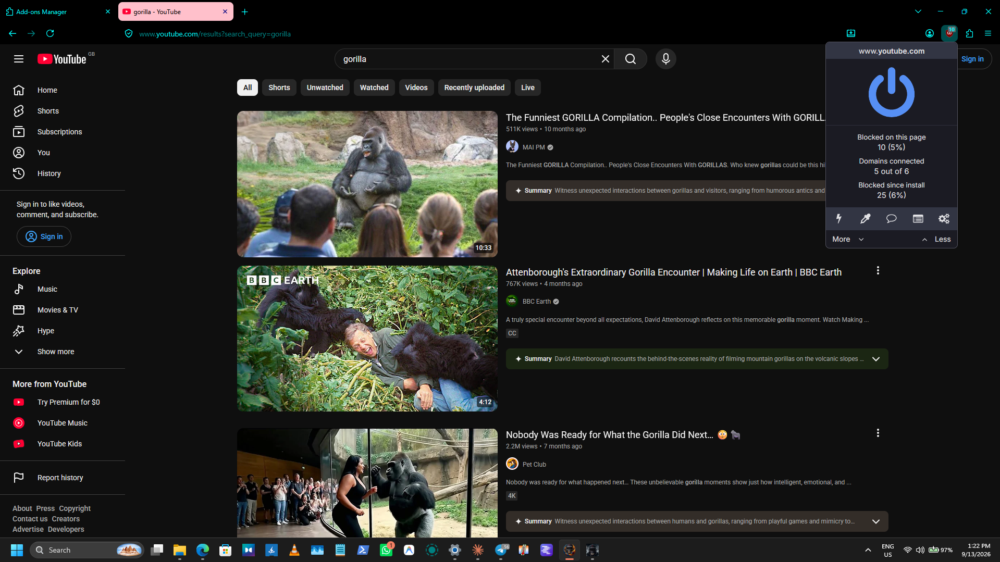
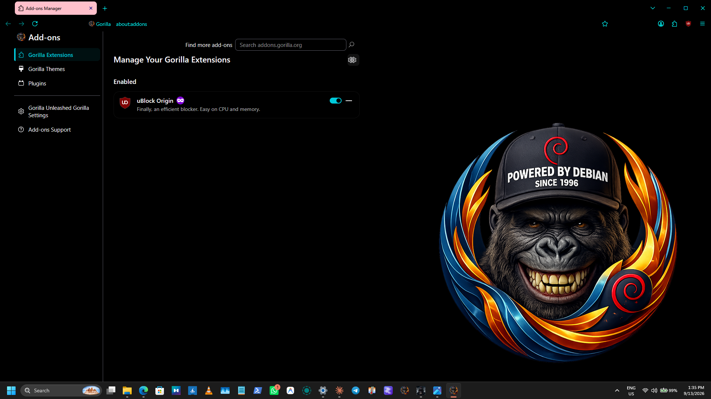
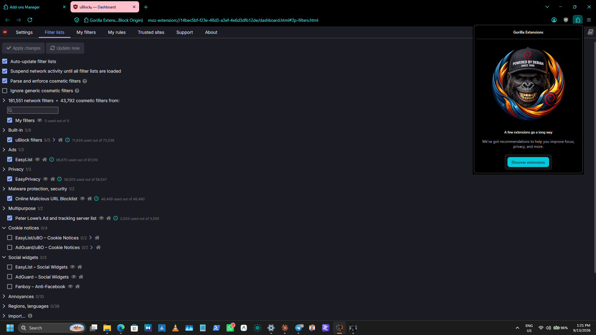
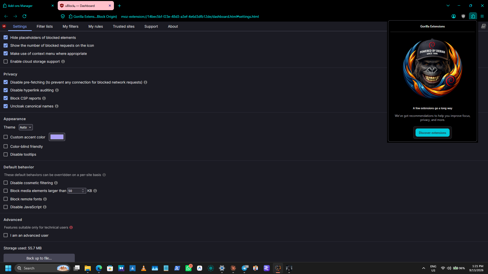
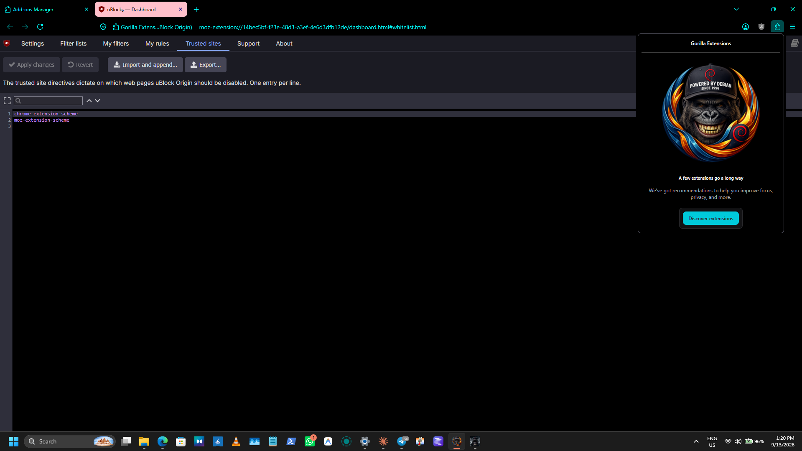
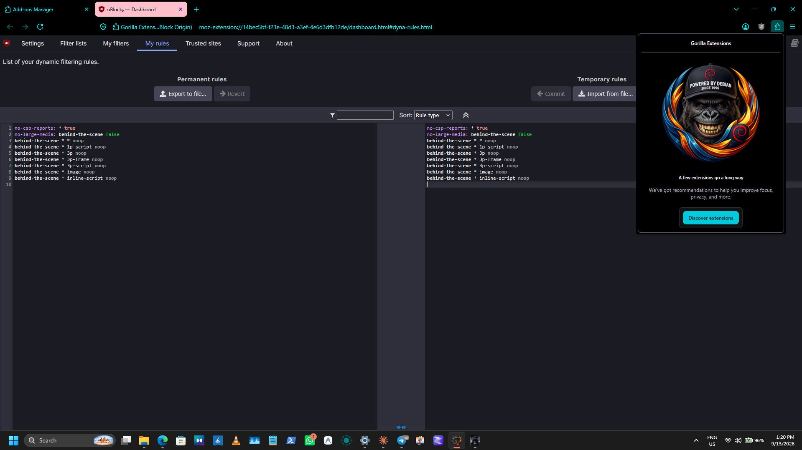
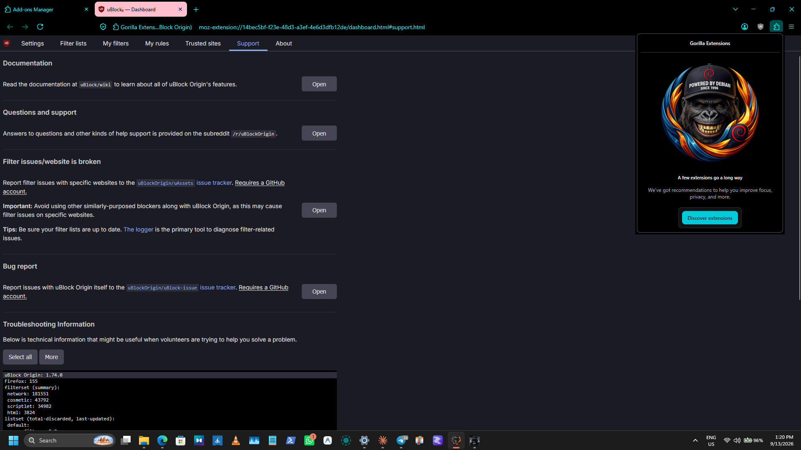
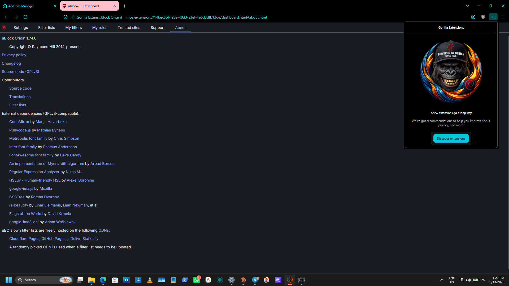

# 🛡 uBlock Origin — it is already installed

**You do not need to install anything.** uBlock Origin comes inside this
browser. It is switched on the moment you first open it, and it is already
blocking.

This page shows you where it is and what you can change. You can safely ignore
all of it — the defaults are good.

---

## Where it is

Look at the **top right of the toolbar**, next to the address bar. There is a
small dark red shield. That is uBlock Origin.

The **number on it** is how many things it blocked on the page you are looking
at right now.

Here it is on a YouTube search: **10 things blocked on this page**, and
**25 blocked since the browser was installed**. The panel opens when you click
the shield.

The big blue power button is the on/off switch **for the site you are on** —
not for the whole browser. If a website misbehaves, click the shield, press the
power button, and reload. That switches uBlock off for that one site only.

---

## Checking it is really there

Open the menu (**☰**, top right) → **Add-ons and themes**, or just press
**Ctrl+Shift+A**.

Under **Manage Your Gorilla Extensions → Enabled** you will see **uBlock
Origin**, with a blue toggle. That toggle turns it off entirely, if you ever
want to.

> **If it is not there**, you are running an older build. Download the current
> one from the Releases page — the version that includes uBlock Origin is
> **155.0.1-win64.2** or later.

---

## The settings, if you want them

Click the shield, then the **gears icon** in the panel. That opens uBlock
Origin's dashboard. Most people never need to.

### Filter lists — what it blocks

This is the interesting page. Out of the box it is running
**181,551 network filters and 43,792 cosmetic filters**, from:

| list | what it stops |
|---|---|
| uBlock filters | the built-in defaults |
| EasyList | advertising |
| EasyPrivacy | tracking |
| Online Malicious URL Blocklist | known bad sites |
| Peter Lowe's list | ad and tracking servers |

You can tick more — cookie notices, social widgets, anti-annoyance lists — but
each one costs a little memory, and on an old laptop that matters. **The
defaults are a deliberate balance**, not laziness.

**Auto-update filter lists** is on. That is the one thing in this browser that
regularly talks to the internet on your behalf, and it is what keeps the
blocking working as advertisers change tactics.

### Settings — the general options

Two worth knowing about:

- **Show the number of blocked requests on the icon** — that is the badge. Turn
  it off if you find it distracting.
- **Disable cosmetic filtering** — leave this alone. Cosmetic filtering is what
  removes the empty gap where an advert was.

### Trusted sites — the allow-list

Sites listed here have uBlock switched off. The easier way to add one is the
power button in the popup; this page just shows the list.

### My rules — advanced

Point-and-click control over what each site may load. **Genuinely advanced** —
it is easy to break websites here. If you are unsure, do not.

### Support — the page to screenshot if something breaks

Scroll to **Troubleshooting Information**. If you report a problem, this is the
text to include.

### About — who made it

uBlock Origin is by **Raymond Hill**, licensed **GPLv3**, and the source is
linked from that page. This browser ships it unmodified — the same file the
add-ons site serves, byte for byte.

---

## "A website is broken"

In order:

1. Click the shield → press the **big power button** → reload. Fixed? It was
   uBlock. Leave it off for that site.
2. Still broken? It was not uBlock. Turn it back on.

That covers almost every case.

---

## Two honest caveats

**It does not update itself.** The *filter lists* update automatically, which
is the part that matters day to day. But uBlock Origin itself is baked into the
browser, so a new version of uBlock arrives only when a new version of this
browser does.

**You cannot add other extensions.** This browser deliberately cannot install
add-ons — see
**[THE-SEALED-APPLIANCE.md](../THE-SEALED-APPLIANCE.md)**. uBlock Origin is
here because it was *built in*, not installed. That is also why nothing can
remove it behind your back.
